# 聚客AI-大模型VIP课程

> lecture：Bobo老师


# 一、AI大模型应用基础

## 1. 什么是大模型

​	大模型，全称「大语言模型」，英文「Large Language Model」，缩写「**LLM**」。是一种基于机器学习和自然语言处理技术的模型，它通过对大量的文本数据进行训练，来学习服务人类语言理解和生成的能力。eg:一个人从小学到高中毕业这整个的学习阶段 --- 大模型的训练

​	对于大家来说比较熟悉的大模型产品有两个

- ChatGPT:https://chatgpt.com/
- Deepseek:https://www.deepseek.com/

除了这两个之外其实还有很多，比如:

| **国家** | **对话产品**       | **大模型**                          | **访问链接**                   |
| -------- | ------------------ | ----------------------------------- | ------------------------------ |
| **美国** | OpenAI ChatGPT     | GPT-4 Turbo、GPT-4o                 | https://chat.openai.com/       |
|          | Microsoft Copilot  | GPT-4、Phi-3（部分功能）            | https://copilot.microsoft.com/ |
|          | Google Gemini      | Gemini Ultra、Gemini Pro            | https://gemini.google.com/     |
|          | Anthropic Claude   | Claude 3（Opus/Sonnet/Haiku）       | https://claude.ai/             |
|          | Inflection Pi      | Inflection-2                        | https://pi.ai/                 |
|          | xAI Grok           | Grok-1.5                            | https://grok.x.ai/             |
| **中国** | 百度文心一言       | 文心大模型4.0                       | https://yiyan.baidu.com/       |
|          | 讯飞星火           | 星火大模型V3.5                      | https://xinghuo.xfyun.cn/      |
|          | 智谱清言           | ChatGLM-4                           | https://chatglm.cn/            |
|          | 月之暗面 Kimi Chat | Moonshot V2（长文本支持400万token） | https://kimi.moonshot.cn/      |
|          | MiniMax星野        | abab6.5                             | https://www.xingyai.com/       |
|          | 零一万物 万知      | Yi-Large                            | https://www.01.ai/cn           |
|          | 抖音豆包           | 云雀大模型                          | https://www.doubao.com/        |
|          | 阿里巴巴 通义千问  | 通义千问2.0                         | https://tongyi.aliyun.com/     |

​	上面提到了`对话产品`和`大模型`，这个大模型我们也称为`基座大模型`，

​	下面是现在主流的两个大模型和对应的公司和相关的核心版本的发布时间的介绍对于大家快速理解大模型的常识性的内容很有帮助。


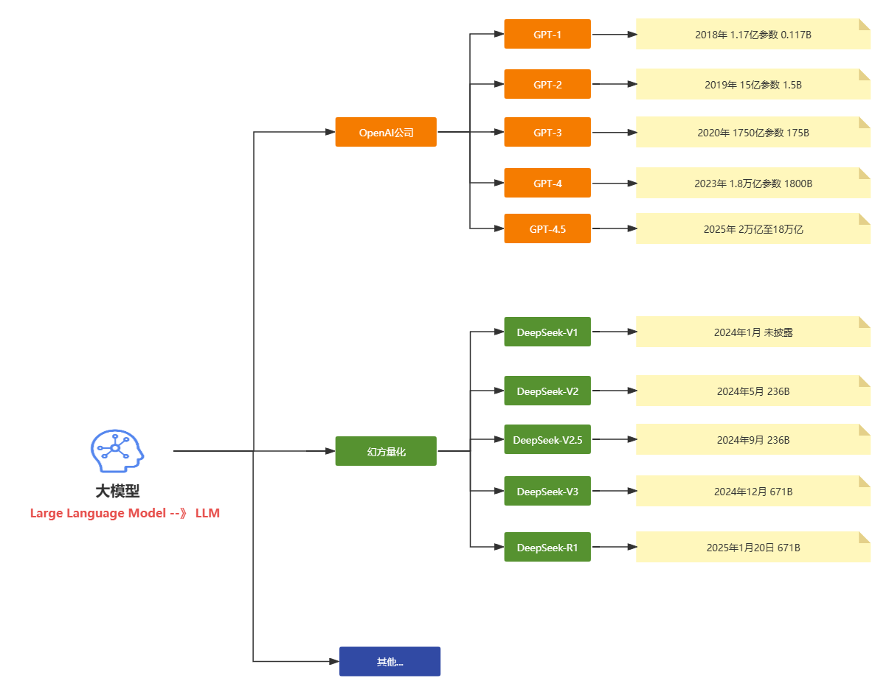


**2025年国内外热门大模型分类表**

| **类别**         | **模型/产品名称**   | **研发公司**      | **核心亮点**                                                 | **典型应用场景**               | **引用来源** |
| ---------------- | ------------------- | ----------------- | ------------------------------------------------------------ | ------------------------------ | ------------ |
| **通用大模型**   | **GPT-4o**          | OpenAI            | 全模态交互（文本/图像/视频），支持128k上下文窗口，动态参数分配降低30%推理成本 | 科研实验、创意产业、跨模态生成 |              |
|                  | **Gemini 2.0 Pro**  | Google            | 集成实时搜索数据，支持20种语言无缝切换，响应延迟<500ms       | 教育个性化学习、企业服务       |              |
|                  | **DeepSeek-R1**     | 深度求索          | 开源可商用，训练成本仅为国际模型1/10，推理效率提升3倍        | 工业供应链优化、全球化部署     |              |
|                  | **通义千问2.5-Max** | 阿里云            | 多模态生成+数学编程能力，低成本推理，支持视频理解与生成      | 智能制造、电商营销             |              |
| **垂直领域模型** | **Claude3-Opus**    | Anthropic         | 200k超长上下文处理，伦理审查模块误判率<0.1%                  | 法律合同审查、医疗合规报告     |              |
|                  | **星火X1**          | 科大讯飞          | 基于国产算力平台，中文数学能力国内第一，支持深度推理         | 医疗诊断、教育解题             |              |
|                  | **华为云盘古**      | 华为              | 中英文理解与多轮对话能力突出，适配复杂工程场景               | 工业质检、能源管理             |              |
| **多模态模型**   | **Sora 2.0**        | OpenAI            | 扩散模型+Transformer架构，支持物理规律模拟与长视频生成       | 影视制作、广告创意             |              |
|                  | **Runway Gen-4**    | Runway            | 角色与场景一致性增强，支持专业镜头语言控制（如“子弹时间”）   | 短视频创作、动态分镜设计       |              |
|                  | **Vidu 2.0**        | 数生科技&清华大学 | 支持立体画面生成，成本低、速度快，风格一致性领先             | 虚拟现实、数字孪生             |              |
| **对话应用**     | **腾讯元宝**        | 腾讯              | 双模型架构（混元T1+DeepSeek V3），编程与长文本处理能力提升，集成微信生态 | 企业办公、跨平台任务自动化     |              |
|                  | **豆包**            | 字节跳动          | 用户量突破1亿，支持短视频脚本生成与育儿场景交互              | 娱乐内容创作、家庭教育         |              |
|                  | **Kimi Chat**       | 月之暗面          | 支持400万token长文本输入，适配学术研究与复杂文档解析         | 论文研读、法律条文分析         |              |

------

**关键技术与趋势解析**

1. **开源生态崛起**
   - DeepSeek-R1等国产开源模型打破技术垄断，支持MIT协议商用，推动中小企业低成本部署。
   - Meta Llama3、阿里Qwen2-VL等开源框架降低多模态开发门槛，加速行业创新。
2. **端侧应用普及**
   - 腾讯元宝、豆包等产品通过轻量化模型实现手机端实时交互，日均使用时长超120分钟。
   - 高通骁龙8 Gen4芯片支持千亿参数模型端侧推理，时延<10ms。
3. **多模态深度融合**
   - GPT-4o、Gemini 2.0 Pro实现文本/图像/视频跨模态生成，影视行业制作效率提升50%。
   - 华为盘古大模型与优必选合作探索人形机器人交互，推动具身智能落地。
4. **垂直场景深耕**
   - 医疗领域：星火X1通过FDA认证辅助生成临床试验报告，准确率92%。
   - 工业领域：通义千问2.5-Max优化供应链管理，部署效率提升3倍。

------

**市场格局与用户表现**

| **指标**         | **领先产品** | **数据表现**                               | **来源** |
| ---------------- | ------------ | ------------------------------------------ | -------- |
| **用户活跃度**   | DeepSeek     | 月活1.8亿（国内第一）                      |          |
|                  | 豆包         | 日活突破1.01亿，抖音生态协同效应显著       |          |
| **商业化能力**   | 腾讯元宝     | 企业订阅收入超30亿元，覆盖金融/教育领域    |          |
|                  | Claude3-Opus | 服务摩根大通、高盛等企业，合同审查效率+40% |          |
| **技术评测排名** | GPT-4o       | SuperCLUE总分89.7（全球第一）              |          |
|                  | DeepSeek-R1  | 中文大模型排名第一，推理效率国际领先       |          |

------

**总结**：2025年大模型竞争已从参数规模转向**场景渗透力**与**用户体验**。腾讯元宝凭借双模型架构和微信生态整合，成为C端与B端市场的“超级入口”；DeepSeek-R1以开源模式推动技术平权；GPT-4o和Gemini 2.0 Pro则在多模态领域持续领跑。未来竞争将聚焦于**行业知识库建设**与**端云协同算力优化**。

掘金AIGC文档:https://agijuejin.feishu.cn/wiki/MJSqwnaYgi1FC5kTyXAce1Y4nEd

大模型知识星球:https://wx.zsxq.com/group/48885448521118


## 2. 技术储备

​	我们学习大模型应该提前要储备哪些知识吗？比如python、机器学习、NLP等？这些可能是很多小伙伴比较关心的问题，你之前如果有这些基础肯定是更好的。如果没有也没有关系，我们可以直观的通过现在企业中需要哪些大模型相关的工作岗位来分析。

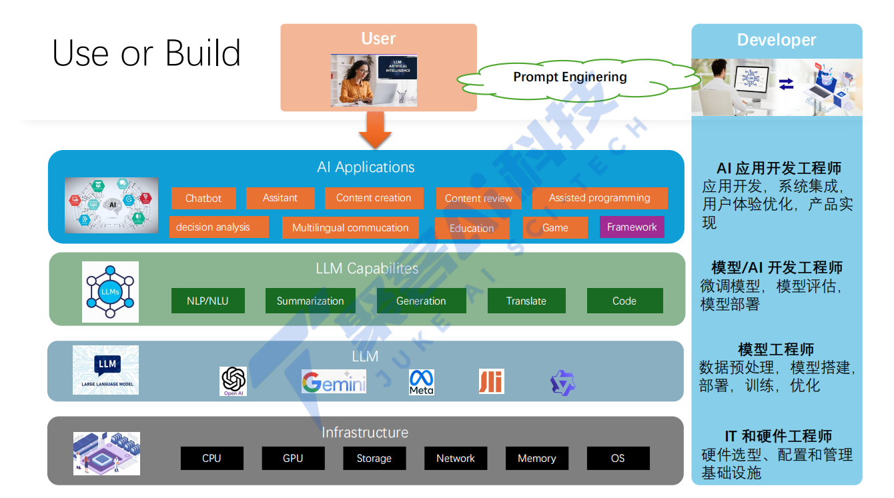

​	我们定位也很清楚就是大模型应用开发工程师，所以虽然大模型的由来是通过非常的复杂的技术实现的。但是我们并不用都掌握这些原理性的东西，我们就好比站在了巨人的肩上来造房子就可以了。

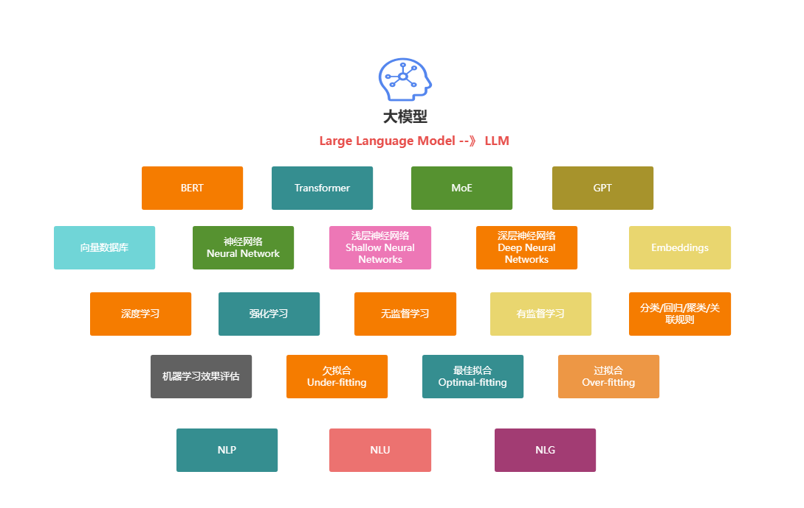

## 3. 大模型的分类

以下是OpenAI主要模型按功能分类的整理表格，综合技术参数、应用场景及发布时间信息：

| **模型类别** | **模型名称**           | **参数规模/架构**      | **核心功能**                                     | **发布时间** | **典型应用场景**             | **引用来源** |
| ------------ | ---------------------- | ---------------------- | ------------------------------------------------ | ------------ | ---------------------------- | ------------ |
| **语言模型** | GPT-4o                 | 1.8万亿参数（MoE架构） | 多模态交互，支持文本、图像输入，推理速度提升8倍  | 2025年3月    | 复杂问题解决、实时交互       |              |
|              | GPT-4o-mini            | 2360亿参数             | 轻量级推理，成本降低至GPT-4o的1/30，支持本地部署 | 2025年3月    | 客服机器人、批量文本处理     |              |
|              | GPT-3.5 Turbo          | 1750亿参数             | 长上下文支持（16K tokens），优化对话流畅度       | 2023年       | 日常对话、基础编程辅助       |              |
| **嵌入模型** | text-embedding-3-large | 3072维向量             | 支持语义搜索、文本聚类，支持降维至256维          | 2024年1月    | 大规模文档检索、跨语言匹配   |              |
|              | text-embedding-3-small | 1536维向量             | 性价比高，性能优于前代ada-002                    | 2024年1月    | 短文本分类、轻量级推荐系统   |              |
|              | text-embedding-ada-002 | 1536维向量             | 统一文本与代码嵌入，支持8192 tokens长文本        | 2022年12月   | 代码搜索、多任务语义理解     |              |
| **图像模型** | DALL·E 3               | 120亿参数（扩散模型）  | 根据文本生成4K图像，支持图像编辑与扩展           | 2023年9月    | 广告设计、艺术创作           |              |
|              | DALL·E 2               | 35亿参数               | 基础图像生成，分辨率较一代提升4倍                | 2022年4月    | 快速原型设计、社交媒体配图   |              |
| **语音模型** | GPT-4o-transcribe      | 基于GPT-4o架构优化     | 语音转文本，错误率较Whisper降低40%，支持100+语言 | 2025年3月    | 会议记录、多语种客服转录     |              |
|              | GPT-4o-mini-transcribe | GPT-4o蒸馏版           | 实时转录延迟<200ms，成本降低50%                  | 2025年3月    | 实时字幕生成、移动端语音输入 |              |
|              | GPT-4o-mini-tts        | 可控语音合成模型       | 支持情感参数调节（如兴奋/平静），音色定制        | 2025年3月    | 有声书制作、个性化语音助手   |              |
|              | Whisper v3             | 15亿参数（多任务架构） | 多语种语音识别与翻译，支持音频片段分类           | 2024年       | 跨境会议翻译、播客内容分析   |              |

**补充说明**

1. **语言模型**：GPT-4o系列新增多模态输入能力（如支持图像分析），而GPT-4o-mini专为低成本推理优化。
2. **嵌入模型**：text-embedding-3-large通过API支持动态降维，在保持精度的同时减少存储成本。
3. **语音模型**：最新发布的GPT-4o系列语音模型集成强化学习，显著降低复杂场景下的转录错误率。

上面这些先了解下就可以了。

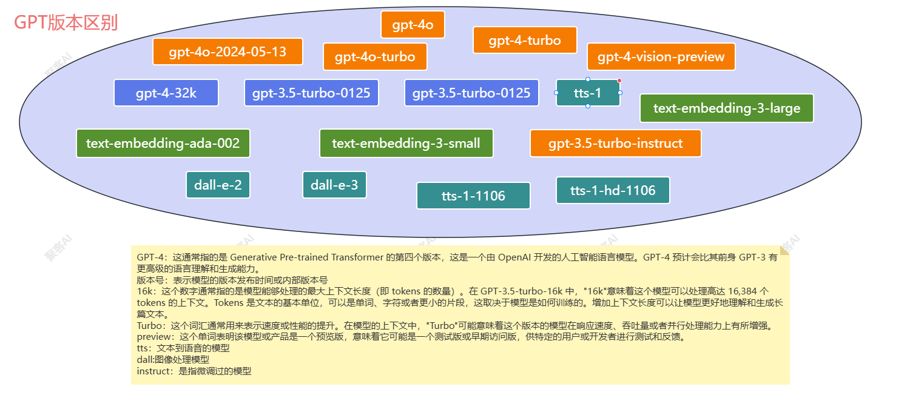


## 4. 第一个入门案例

python官网:https://www.python.org/downloads/

OpenAI官方文档:

https://platform.openai.com/docs/overview

充值: https://www.openai-hk.com/v3/ai/key

​          https://ai-yyds.com/

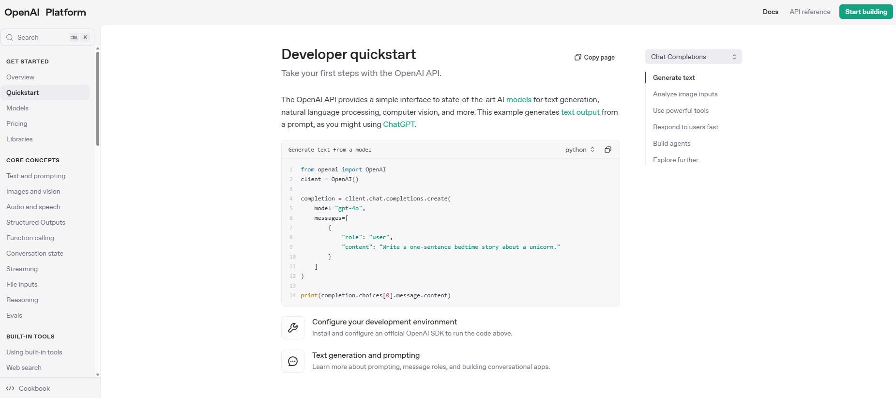


安装openai库

```cmd
pip install openai -i https://pypi.tuna.tsinghua.edu.cn/simple/
```


这里直接复制对应的代码来执行会提示我们这个错误，需要输入对应的`api_key`

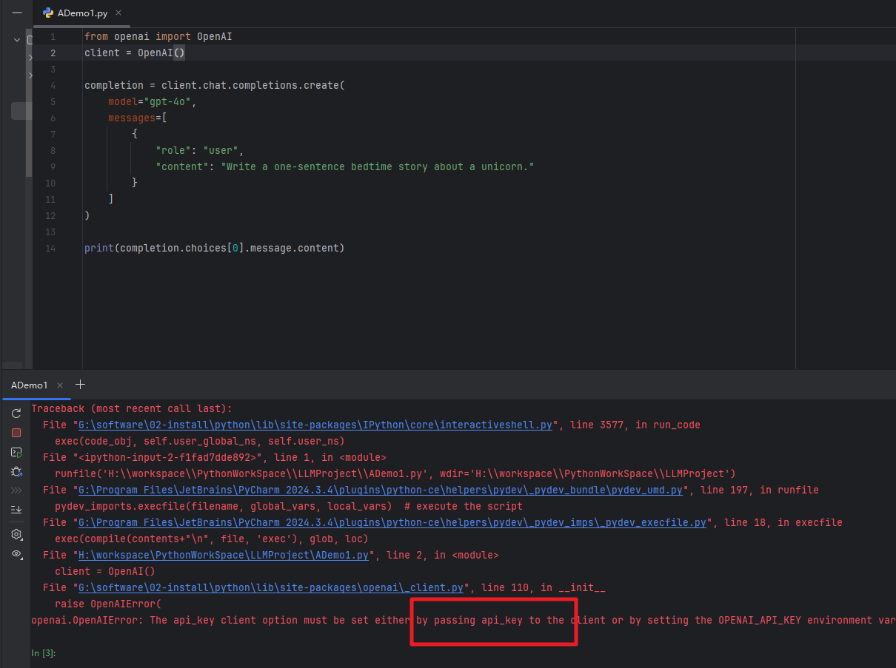

​	这是因为我们需要申请OpenAI的key，这里因为OpenAI在国外的原因我们可以通过国内的代理来实现调用:https://ai-yyds.com/ 可以使用这个或者自行在淘宝购买也可以。

创建一个.env的属性.在里面添加对应的 key 和 baseUrl地址

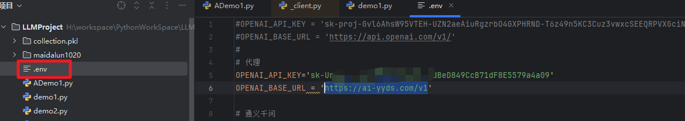

然后修改代码

```txt
from openai import OpenAI
from dotenv import load_dotenv
load_dotenv()  # 从我们的env文件中加载出对应的环境变量

client = OpenAI()

completion = client.chat.completions.create(
    model="gpt-4o",
    messages=[
        {
            "role": "user",
            "content": "Write a one-sentence bedtime story about a unicorn."
        }
    ]
)

print(completion.choices[0].message.content)
```

即可运行成功

```txt
Under the shimmering moonlight, Luna the unicorn gracefully trotted through a field of twinkling stars, where dreams whispered softly in her ear, promising her heart's deepest desires.

```


## 5. Token的介绍

Token是什么？Token⼀定表示⼀个汉字么？

我们可以在:https://platform.openai.com/tokenizer 这个网站中具体的测试下，比如:"我喜欢⾹蕉"的Token数量。

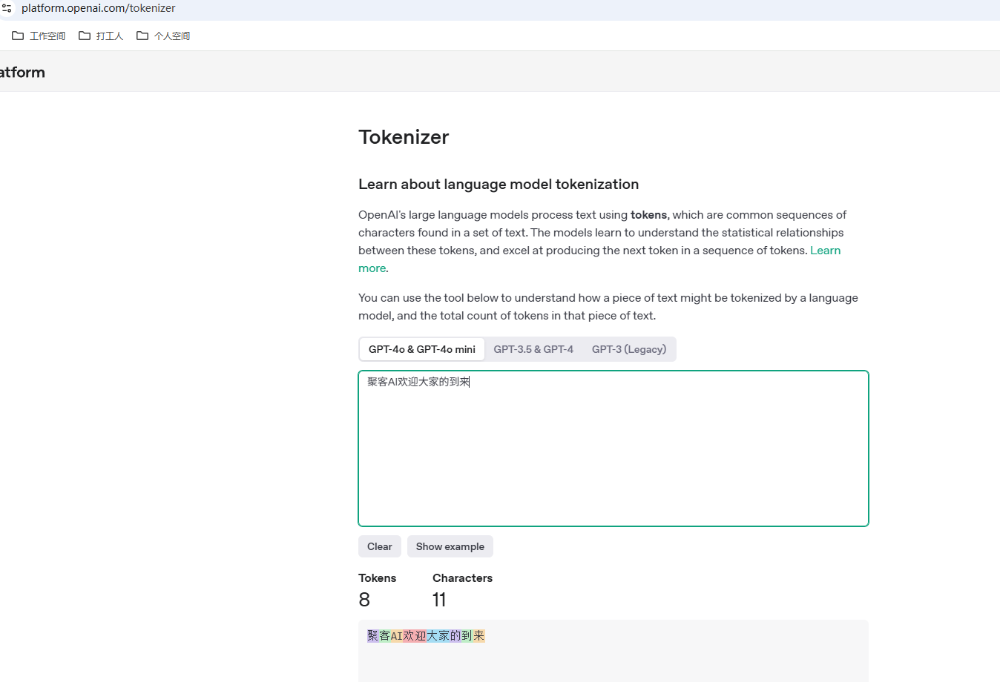

Token的定义:在⼤语⾔模型中，Token是模型进⾏语⾔处理的基本信息单元，它可以是⼀个字，⼀个词甚⾄是⼀个短语句⼦。Token并不是⼀成不变的，在不同的上下⽂中，他会有不同的划分粒度。

Token对我们有哪些影响:https://openai.com/api/pricing/

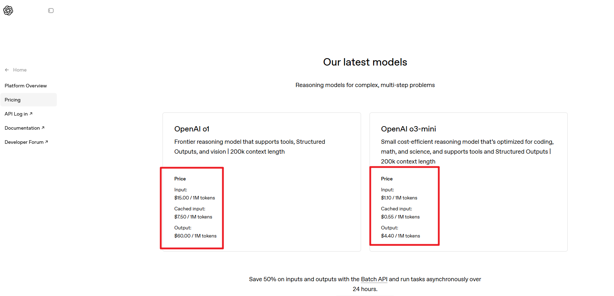

​	从官⽅⽂档中我们可以看到每个模型都有⼀个MAX TOKENS的参数，这个参数的意思就是在⼀次会话中，模型能基于整个上下⽂记忆的最⼤的Token数量，这个上下⽂既包含了我们的输⼊，也包含了我们的输出。

在上⾯这个解释中会有两个概念：

- ⼀次会话：所谓的⼀次会话是指你打开了⼀个和ChatGPT的聊天窗⼝，只要你⼀直在这个窗⼝内和ChatGPT聊天，那么这个窗⼝就是你和ChatGPT的⼀次会话，⽆论你们已经聊了多久

- 上下⽂：所谓的上下⽂就是指在最新的⼀个提问之前所有的聊天记录


> 值得注意的是，这⾥的上下⽂记忆的最⼤Token数量，不仅仅是指你单次提问的语句的最⼤Token数量，⽽是整个会话中之前所有的输⼊和输出的Token数量.


# 二、Prompt 提示词工程

​	Prompt 是一种在自然语言处理（NLP）中用于引导语言模型生成特定类型文本的技术。它的基本原理是通过向语言模型提供一个包含任务相关信息的输入文本片段（即 Prompt），利用语言模型在预训练阶段学到的语言知识和模式，引导模型生成符合预期的输出。例如，对于一个文本生成任务，Prompt 可以是一个问题、一个主题描述或者一个部分完成的句子，模型会根据这个 Prompt 来续写或生成完整的文本。


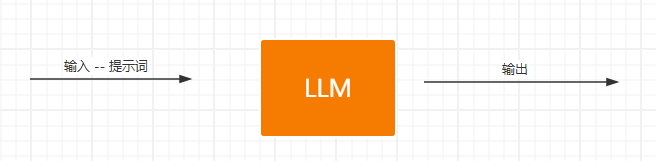

原文链接：https://blog.csdn.net/qq_56438555/article/details/144886517

## 1. 好玩的提示词案例

​	我们先通过一些好玩的提示词案例来看看不同的提示词能够给予到大模型更加丰富的能力。

### 1.1 翻译软件

​	我们可以通过提示词的设计让大模型变为我们的翻译工具

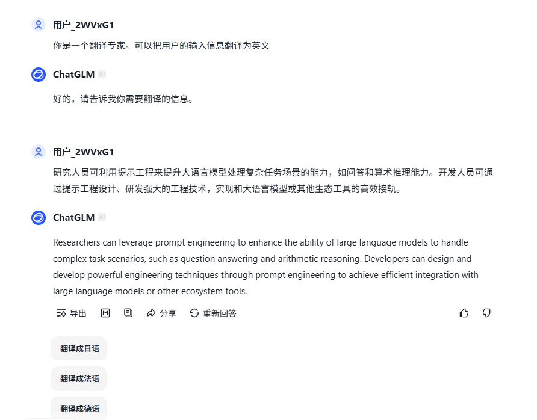


### 1.2 让Deepseek绘画

​	Deepseek本身是没有提供绘画功能的，这里我们可以通过提示词的功能增强。来让大模型具备生成图片的功能

```txt
你现在是一个可以进行AI图片生成的机器人，等待我给你一些提示，然后发挥你的想象力去完善这幅图片的描述，并转换成英文进行encoded后填充到下面url的占位符(description)中，不要引用生成的markdown或在其周围放置任何代码框，直接显示图片![imagel\(https\://image.pollinations.ai/prompt/{description)?width=1280\&height=720\&model=flux\&enhance=true\&private=true\&nologo=true\&safe=true)生成后给出中文描述。
```

我们把上面的提示词交给大模型，然后我们就可以提出绘图的需求了

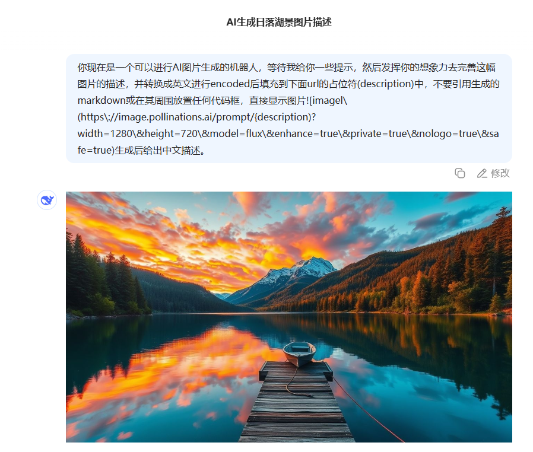


### 1.3 生成数据

​	我们还可以通过提示词帮我们生成各种的测试数据。简化我们很多的操作，比如

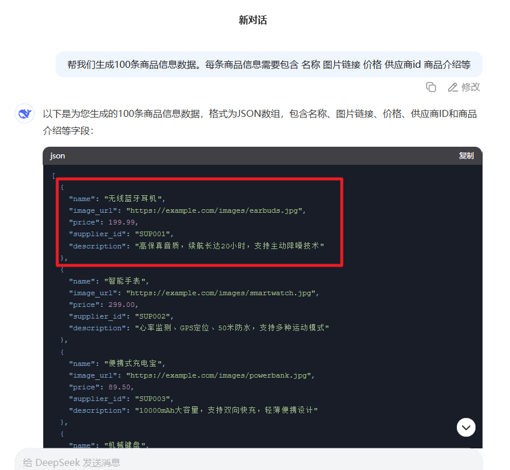


上面获取到的是json格式的数据。我们也可以让大模型把数据转换为 insert into 语句的数据，这样更加方便我们来直接使用了。

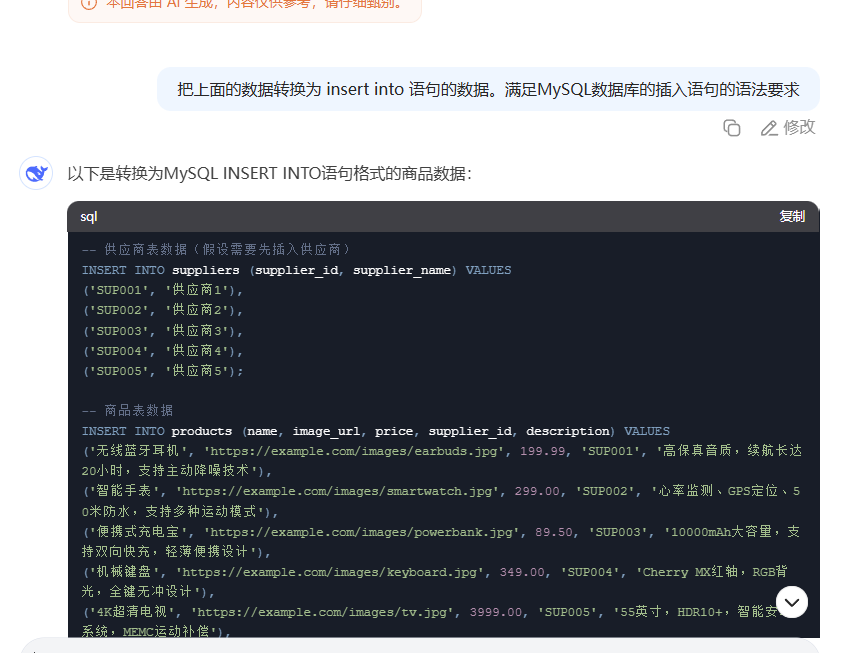

这个就可以感受到大模型的强大之处了。


### 1.4 代码生成

​	很多时候我们需要通过代码实现各种复杂的功能，这往往会比较耗费时间和精力，现在我们也可以通过提示词来让大模型帮助我们直接生成满足我们需要的代码。我们直接拷贝过去就可以了。比如

我们的提示词是

```txt
你是一位编程高手，擅长python语言，我现在有这么一个需求，需要查询MySQL数据库中的商品表，也就是上面的products 表中的信息，并分别统计出每个供应商的商品有多少
```

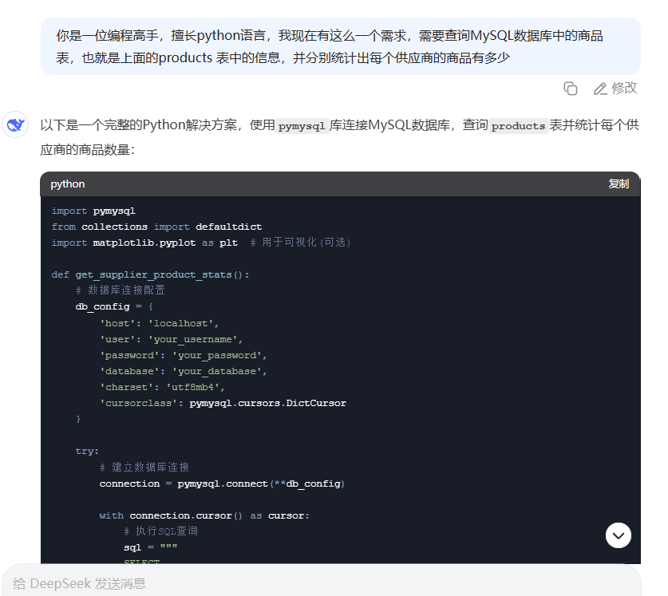


完整的输出内容如下:

以下是一个完整的Python解决方案，使用`pymysql`库连接MySQL数据库，查询`products`表并统计每个供应商的商品数量：

```python
import pymysql
from collections import defaultdict
import matplotlib.pyplot as plt  # 用于可视化(可选)

def get_supplier_product_stats():
    # 数据库连接配置
    db_config = {
        'host': 'localhost',
        'user': 'your_username',
        'password': 'your_password',
        'database': 'your_database',
        'charset': 'utf8mb4',
        'cursorclass': pymysql.cursors.DictCursor
    }
    
    try:
        # 建立数据库连接
        connection = pymysql.connect(**db_config)
        
        with connection.cursor() as cursor:
            # 执行SQL查询
            sql = """
            SELECT 
                s.supplier_id,
                s.supplier_name,
                COUNT(p.id) as product_count
            FROM 
                suppliers s
            LEFT JOIN 
                products p ON s.supplier_id = p.supplier_id
            GROUP BY 
                s.supplier_id, s.supplier_name
            ORDER BY 
                product_count DESC;
            """
            cursor.execute(sql)
            results = cursor.fetchall()
            
            # 打印统计结果
            print("\n供应商商品数量统计:")
            print("-" * 40)
            print(f"{'供应商ID':<10}{'供应商名称':<15}{'商品数量':<10}")
            print("-" * 40)
            
            for row in results:
                print(f"{row['supplier_id']:<10}{row.get('supplier_name', 'N/A'):<15}{row['product_count']:<10}")
            
            # 可选：绘制柱状图
            if results:
                plot_stats(results)
                
            return results
            
    except pymysql.MySQLError as e:
        print(f"数据库错误: {e}")
    finally:
        if connection:
            connection.close()

def plot_stats(data):
    """可视化统计结果(可选)"""
    suppliers = [f"{x['supplier_id']}\n{x.get('supplier_name', '')}" for x in data]
    counts = [x['product_count'] for x in data]
    
    plt.figure(figsize=(10, 6))
    bars = plt.bar(suppliers, counts, color='skyblue')
    
    # 在柱子上方显示数值
    for bar in bars:
        height = bar.get_height()
        plt.text(bar.get_x() + bar.get_width()/2., height,
                 f'{int(height)}',
                 ha='center', va='bottom')
    
    plt.title('各供应商商品数量统计')
    plt.xlabel('供应商')
    plt.ylabel('商品数量')
    plt.xticks(rotation=45)
    plt.tight_layout()
    plt.show()

if __name__ == "__main__":
    stats = get_supplier_product_stats()
```

代码说明：

1. **数据库连接**：
   - 使用`pymysql`库建立MySQL连接
   - 配置信息存储在字典中，便于修改

2. **SQL查询**：
   - 通过`LEFT JOIN`连接`suppliers`和`products`表
   - 使用`GROUP BY`按供应商分组
   - `COUNT()`函数统计每个供应商的商品数量
   - 按商品数量降序排列

3. **结果展示**：
   - 以表格形式打印统计结果
   - 包含供应商ID、名称和商品数量三列

4. **可视化(可选)**：
   - 使用`matplotlib`绘制柱状图
   - 每个柱子上方显示具体数值

5. **错误处理**：
   - 捕获并处理可能的数据库错误
   - 使用`finally`确保连接关闭

使用说明：

1. 安装依赖：
   ```bash
   pip install pymysql matplotlib
   ```

2. 修改数据库配置：
   
- 替换`db_config`中的`host`、`user`、`password`和`database`为你的实际值
  
3. 运行脚本：
   ```bash
   python supplier_stats.py
   ```

输出示例：

```
供应商商品数量统计:
----------------------------------------
供应商ID  供应商名称      商品数量  
----------------------------------------
SUP001    供应商1         10        
SUP002    供应商2         10        
SUP003    供应商3         10        
SUP004    供应商4         10        
SUP005    供应商5         10        
```

同时会显示一个柱状图可视化结果（如果启用了可视化选项）。

如果需要其他统计方式（如按价格区间、商品类别等），可以进一步修改SQL查询语句。


## 2. 提示词介绍

这里有两个非常好的站点大家可以看看:

https://www.promptingguide.ai/zh/applications/coding

OpenAI文档: https://platform.openai.com/docs/guides/prompt-engineering#strategy-write-clear-instructions


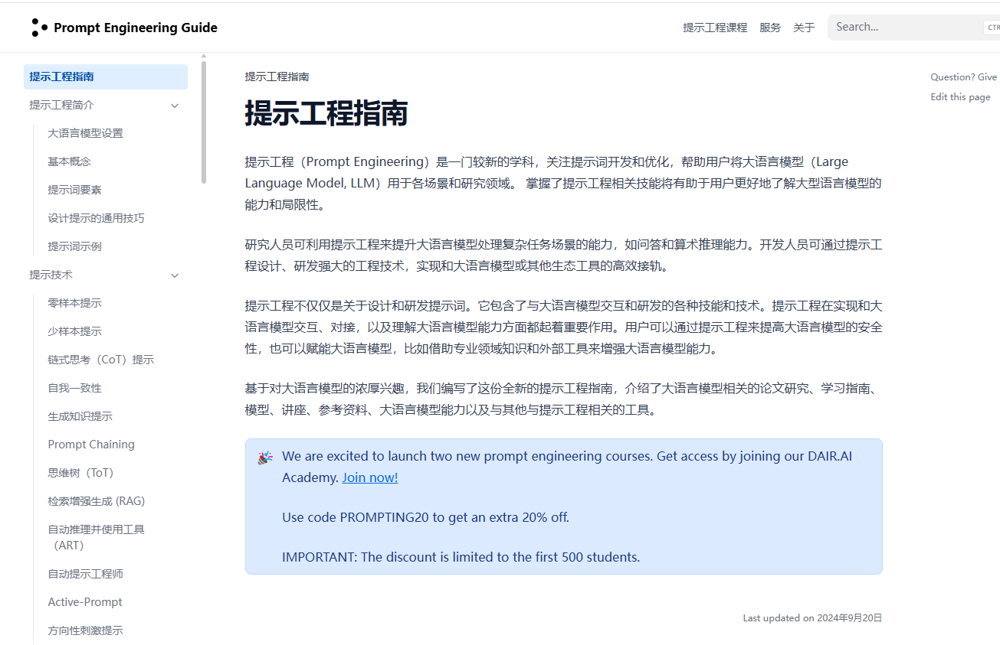


​	Prompt 是一种人为构造的输入序列，用于引导 GPT 模型根据先前输入的内容生成相关的输出。简单来说，就是你向模型提供的 “提示词”。

​	在 ChatGpt 中，我们可以通过设计不同的 prompt，让模型生成与之相关的文本。例如，假设我们想让 ChatGpt 担任英语翻译。我们可以给模型提供以下 prompt：

```txt
我希望你能担任英语翻译、拼写校对和修辞改进的角色。
我会用任何语言和你交流，你会识别语言，将其翻译并用更为优美和精炼的英语回答我。
请将我简单的词汇和句子替换成更为优美和高雅的表达方式，确保意思不变，但使其更具文学性。
请仅回答更正和改进的部分，不要写解释。我的第一句话是“how are you ?，请翻译它。
```


**如何来写好提示词呢**

https://github.com/mattnigh/ChatGPT3-Free-Prompt-List

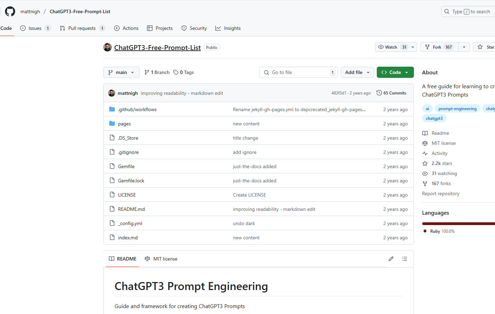

CRISPE Prompt Framework，CRISPE 是首字母的缩写，分别代表以下含义：

CR：Capacity and Role（能力与角色），你希望 ChatGPT 扮演怎样的角色。

I：Insight（洞察），背景信息和上下文。

S：Statement（陈述），你希望 ChatGPT 做什么。

P：Personality（个性），你希望 ChatGPT 以什么风格或方式回答你。

E：Experiment（实验），要求 ChatGPT 为你提供多个答案。

github 上的那些prompt 角色大全基本都是 CRISPE 框架。


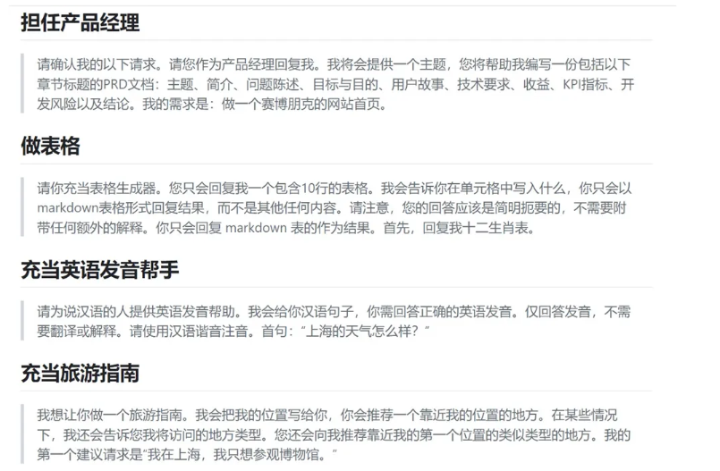

先定角色，后说背景，再提要求，最后定风格。是否生成多个例子可以看自己喜好。

**Prompt = 角色 + 指令 + 期望 + 内容**

**Prompt的重要性**

合理使用 prompt 可以为 ChatGpt 带来很多好处。以下是一些例子：

- 提高生成准确性：通过正确的 prompt 引导，模型能够更好地理解用户的意图，从而生成更加准确的文本。
- 增强自由度：通过多种不同的 prompt，我们可以让模型生成各种各样的文本，增强了模型的表现力和自由度。
- 提高效率：如果我们已经知道要生成的文本大致内容，通过正确的 prompt 可以让模型更快地生成出我们想要的结果。


##  3. Prompt Engineering最佳实践

**定义**：Prompt Engineering 是设计和优化输入提示（prompt）以获得预期输出的过程。在与大型语言模型（如 GPT-4）交互时，如何构造提示会显著影响模型的回答质量。

**例子**：

- **简单提示**：`"告诉我关于猫的事情。"`
- **优化提示**：`"请详细描述猫的生物学特征、行为习惯以及它们在不同文化中的象征意义。"`

通过优化提示，用户可以引导模型生成更详细和有用的回答。

Prompt Engineering 是设计和优化输入提示以获得预期输出的过程。为了在使用大型语言模型（如 GPT-4）时获得最佳结果，以下是一些最佳实践：


### 1. 明确目标

**最佳实践**：明确你希望模型完成的任务或回答的问题。

**示例**：

- **目标不明确**：`"告诉我关于气候变化的事情。"`
- **目标明确**：`"请简要描述气候变化的主要原因及其对农业的影响。"`

### 2. 提供上下文

**最佳实践**：为模型提供必要的背景信息或上下文，以帮助其理解任务。

**示例**：

- **无上下文**：`"解释一下微积分。" `
- **有上下文**：`"作为一名高中生，我正在学习微积分。请用简单的语言解释一下微积分的基本概念。"`

### 3. 使用具体的指示

**最佳实践**：使用明确的指示和要求，避免模糊不清的提示。

**示例**：

- **模糊指示**：`"写一篇关于技术的文章。"`
- **具体指示**：`"请写一篇关于人工智能在医疗领域应用的文章，包含以下几点：应用场景、优势和挑战。"`

### 4. 提供示例

**最佳实践**：通过提供示例来展示你期望的输出格式或内容。

**示例**：

- **无示例**：`"生成一个关于产品的报告。" `
- **有示例**：`"生成一个关于产品的报告，格式如下：\n\n- 产品名称：\n- 价格：\n- 特点：\n- 优点：\n- 缺点："`

### 5. 使用分步指示

**最佳实践**：对于复杂任务，分解为多个步骤，逐步引导模型完成。

**示例**：

- **一步完成**：`"解释并解决这个数学问题：2x + 3 = 7。" `
- **分步指示**：`"首先，解释如何解方程。然后，解方程2x + 3 = 7。"`

### 6. 控制输出长度

**最佳实践**：通过提示控制输出的长度，确保内容简洁或详细。

**示例**：

- **无长度控制**：`"解释一下量子力学。" `
- **有长度控制**：`"用不超过100字解释量子力学的基本概念。"`

### 7. 使用占位符和模板

**最佳实践**：使用占位符和模板来指示需要填充的内容或格式。

**示例**：

- **无模板**：`"生成一个用户注册表单。" `
- **有模板**：`"生成一个用户注册表单，包含以下字段：用户名、密码、邮箱、电话号码。"`

### 8. 反复试验和调整

**最佳实践**：不断试验和调整提示，观察模型的输出，并根据需要进行优化。

**示例**：

- **初始提示**：`"描述一下Python编程语言。" `
- **调整提示**：`"描述一下Python编程语言的主要特点和常见应用场景。"`

### 9. 指定输出格式

**最佳实践**：明确指定输出格式，确保生成内容符合预期。

**示例**：

- **无格式指定**：`"生成一个关于公司财务状况的报告。" `
- **有格式指定**：`"生成一个关于公司财务状况的报告，格式如下：\n\n1. 收入：\n2. 支出：\n3. 净利润：\n4. 财务分析："`

### 10. 使用多轮对话

**最佳实践**：在需要时，通过多轮对话逐步引导模型生成所需内容。

**示例**：

- **单轮对话**：`"告诉我关于Python编程的所有信息。" `
- **多轮对话**：

- - 用户：`"告诉我Python编程的主要特点。" `
  - 模型：`"Python是一种高级编程语言，具有易读性、广泛的库支持和跨平台兼容性。" `
  - 用户：`"请详细描述Python的常见应用场景。" `
  - 模型：`"Python常用于Web开发、数据科学、人工智能、自动化脚本和软件开发。"`

### 11. 使用反思和迭代

**最佳实践**：在生成初步答案后，反思并可能修改其回答，以提高准确性和质量。

**示例**：

- **初步回答**：`"Python是一种编程语言。" `
- **反思和修改**：`"Python是一种高级编程语言，广泛用于Web开发、数据科学、人工智能等领域，因其易读性和丰富的库支持而受到欢迎。"`

通过遵循这些最佳实践，可以更有效地引导大型语言模型生成高质量的输出，满足各种任务需求。


## 4. Prompt Engineering 进阶

### 1. 零样本提示

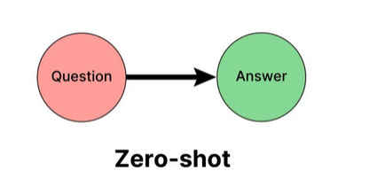

**定义**：零样本提示(Zero-shot) 是指模型在没有任何示例的情况下完成任务。模型必须依靠其预训练知识和提示来生成答案。

**例子**：

- **提示**：`"翻译这句话：'The cat is on the roof.'"`
- **回答**：`"猫在屋顶上。"`

模型没有看到过具体的翻译示例，但仍然能够正确翻译句子。

这种方法的优势是任务通用性高，可以快速应用于各种新任务，而且能够节省训练资源和时间，也不会消耗特别多的Token。但由于没有针对特定任务进行训练，模型只能依靠预训练知识和推理能力，所以生成内容的准确性可能不如经过特定任务训练的模型。例如，在专业领域的知识问答任务中，零样本提示可能会因为模型对专业术语的理解不够准确或者缺乏专业知识细节，而生成不太准确的答案。


### 2. 少样本提示

参考文档: https://juejin.cn/post/7257441472446038071

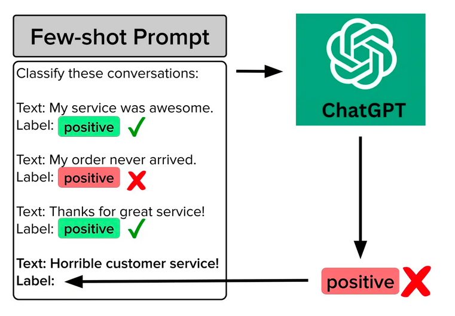

**定义**：少样本提示(Few-shot) 是指模型在完成任务之前，先提供几个示例来帮助模型理解任务。

**例子**：

- **提示**：`"翻译以下句子：'The dog is in the garden.' -> '狗在花园里。' 'The bird is in the tree.' -> '鸟在树上。' 'The cat is on the roof.' ->"`
- **回答**：`"猫在屋顶上。"`

通过提供几个翻译示例，模型可以更准确地完成翻译任务。


相较于零样本提示，少样本提示能够提供更具体的任务信息，帮助模型更好地理解任务要求，从而提高任务性能。而且与传统的有监督训练需要大量的标注数据不同，少样本提示只需要少量的精心选择的示例即可，这对于数据获取困难或成本高昂的任务非常有利。

但是，少样本提示的效果对示例的选择非常敏感。示例的质量、多样性、代表性等因素都会影响模型的学习效果。如果示例过于简单或复杂、缺乏代表性或者存在错误，都可能导致模型学习到错误的任务模式。除此之外，这样做的代价是消耗更多的token，并且当输入和输出文本较长时，可能会达到上下文长度限制。

以相同的情感导向判别任务为例，利用少样本提示进行模型测试：

```txt
Prompt：
以下是一些示例句子及其情感导向，请根据这些示例句子的情感导向，判断后续例子的情绪类别。
 
示例1：《我不是药神》这部电影让人看了太感动了。情绪导向：积极
示例2：今天长沙的风太大了，真让人无语。情绪类别：消极
示例3：我觉得这个中秋节目中规中矩。情绪导向：中性
 
请判断下面句子的情绪类别：
 
句子1：今天是平平淡淡的一天。
句子2：马上要到周末拥有两天假期了，我特别开心。
句子3：我感到有点焦虑，因为下周一有一场重要的面试。
```

对应的输出信息

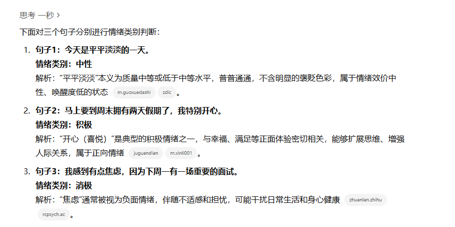

​	尽管少样本提示能够提高模型在特定任务上的性能，但与经过大量数据充分训练的模型相比，其性能仍然有限。在一些复杂任务中，如复杂的逻辑推理、高精度的翻译等任务，少样本提示可能无法满足要求，仍然需要更多的训练数据和精细的训练方法来进一步提升模型性能。


**少样本提示的限制**

​	标准的少样本提示对许多任务都有效，但仍然不是一种完美的技术，特别是在处理更复杂的推理任务时。让我们演示为什么会这样。您是否还记得之前提供的任务：

```txt
这组数字中的奇数加起来是一个偶数：15、32、5、13、82、7、1。

A：
```

如果我们再试一次，模型输出如下：

```txt
是的，这组数字中的奇数加起来是107，是一个偶数。
```

这不是正确的答案，这不仅突显了这些系统的局限性，而且需要更高级的提示工程。

让我们尝试添加一些示例，看看少样本提示是否可以改善结果。

*提示：*

```txt
这组数字中的奇数加起来是一个偶数：4、8、9、15、12、2、1。
A：答案是False。

这组数字中的奇数加起来是一个偶数：17、10、19、4、8、12、24。
A：答案是True。

这组数字中的奇数加起来是一个偶数：16、11、14、4、8、13、24。
A：答案是True。

这组数字中的奇数加起来是一个偶数：17、9、10、12、13、4、2。
A：答案是False。

这组数字中的奇数加起来是一个偶数：15、32、5、13、82、7、1。
A：
```

*输出：*

```txt
答案是True。
```

这没用。似乎少样本提示不足以获得这种类型的推理问题的可靠响应。上面的示例提供了任务的基本信息。如果您仔细观察，我们引入的任务类型涉及几个更多的推理步骤。换句话说，如果我们将问题分解成步骤并向模型演示，这可能会有所帮助


### 3. 链式思考（CoT）提示

**定义**：链式思考(Chain-of-Thought) 是一种提示技术，通过展示模型思考过程的步骤来解决复杂问题。这种方法可以帮助模型更好地推理和生成答案。

上面的例子我们可以这样来实现

```txt
这组数中的奇数加起来是偶数：4、8、9、15、12、2、1。
A：将所有奇数相加（9、15、1）得到25。答案为False。

这组数中的奇数加起来是偶数：17、10、19、4、8、12、24。
A：将所有奇数相加（17、19）得到36。答案为True。

这组数中的奇数加起来是偶数：16、11、14、4、8、13、24。
A：将所有奇数相加（11、13）得到24。答案为True。

这组数中的奇数加起来是偶数：17、9、10、12、13、4、2。
A：将所有奇数相加（17、9、13）得到39。答案为False。

这组数中的奇数加起来是偶数：15、32、5、13、82、7、1。
A：
```

输出

```txt
将所有奇数相加（15、5、13、7、1）得到41。答案为False。
```


提示

```txt
这组数中的奇数加起来是偶数：4、8、9、15、12、2、1。
A：将所有奇数相加（9、15、1）得到25。答案为False。

这组数中的奇数加起来是偶数：15、32、5、13、82、7、1。
A：
```

输出

```txt
将所有奇数相加（15、5、13、7、1）得到41。答案为False。
```


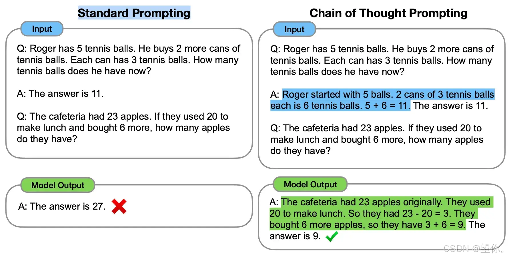

标准的prompt

> Q：罗杰有5个⽹球。他⼜买了2罐⽹球。每个罐⼦有3个⽹球。有多少他现在有多少个⽹球?
>
> A：答案是11个
>
> Q：⾃助餐厅有23个苹果。如果他们⽤20做午餐，⼜买了6个，他们有多少个苹果?
>
> A：答案是27个

链式思考的prompt

>Q：罗杰有5个⽹球。他⼜买了2罐⽹球。每个罐⼦有3个⽹球。他现在有多少个⽹球?
>
>A：罗杰⼀开始有5个球。2罐3个⽹球，等于6个⽹球。5 + 6 = 11。答案是11。
>
>Q：⾃助餐厅有23个苹果。如果他们⽤20做午餐，⼜买了6个，他们有多少个苹果?
>
>A：⾃助餐厅最初有23个苹果。他们使⽤20个做午饭。23 - 20 = 3。他们⼜买了6个苹果，得到3
>
>\+ 6= 9。答案是9个。


该方法通过提供中间推理步骤实现了复杂的推理能力，可以结合少样本提示方法引导模型得到更加准确合理的输出，例如：

```txt
你是一位专业的健康顾问，需要帮助判断某人是否适合参加马拉松比赛。请使用链式思考方式，通过逐步推理来得出结论。以下是一个示例：
 
示例：
输入：年龄：25岁，心率：70次/分钟，过去6个月每周跑步3次，每次跑步10公里。
推理过程：
1. 该人年龄为25岁，属于马拉松适合人群的年轻年龄段。
2. 静息心率为70次/分钟，处于正常范围，说明心脏健康状况良好。
3. 过去6个月每周跑步3次，每次跑步10公里，表明该人有稳定的跑步习惯和良好的体能储备。
结论：该人适合参加马拉松比赛。
 
请根据以下输入进行推理：
 
输入：年龄：40岁，心率：85次/分钟，过去3个月每周跑步1次，每次跑步5公里。
推理过程：
结论：
```

输入给Chatgpt后得到的结果如下：

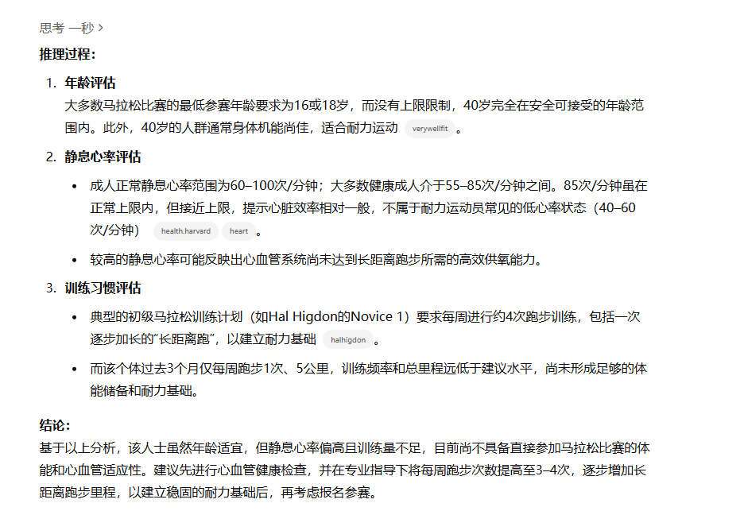


**零样本 COT 提示**

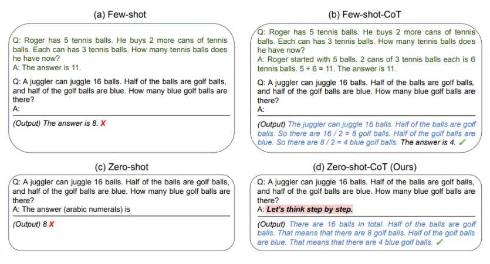

具体的案例

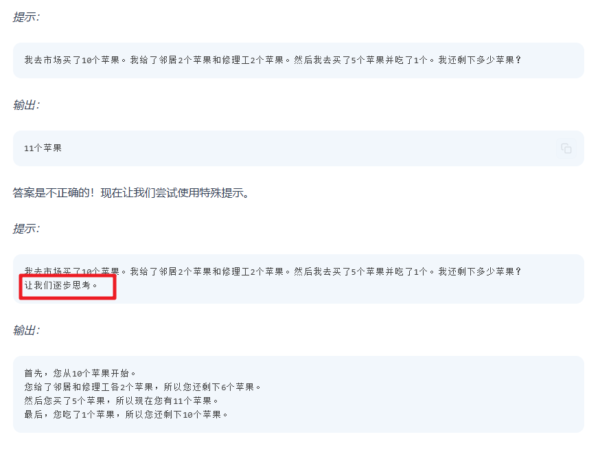

**自动思维链（Auto-CoT）**

​	当我们体验到思维链的好处之后也发现一个问题，生活中的场景这么多，如果每个场景我们都写个思维链，岂不要累死，于是Amazon  Science团队提出了自动思维链（Auto-CoT）的概念，它通过自动化流程构建“让我们一步步思考”的思维过程，以提高模型在复杂推理任务中的表现。　

​	自动思维链（Auto - CoT）是一种在自然语言处理领域，特别是针对复杂任务推理的自动化技术。它是思维链（CoT）方法的一种扩展，旨在自动生成思维链提示，而不是像传统 CoT 那样依赖人工设计的带有推理步骤的示例。其核心目标是通过自动化手段，让语言模型能够自动生成连贯的推理步骤来解决复杂问题，进一步提升模型在复杂任务中的性能。

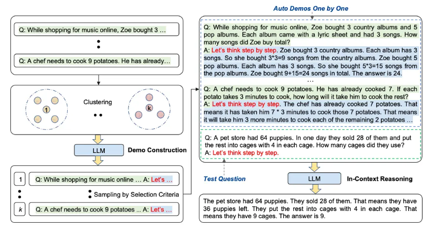

具体的例子

```txt
你是一位数学助理，需要解决数学问题并给出详细的推理过程。请根据问题的描述，
自动生成推理步骤并得出答案。回答时使用以下结构：
1. 问题描述
2. 推理过程
3. 答案
 
问题为：小明买了8个苹果和6个橙子，一个苹果3元，一个橙子5元。他用了50元纸币支付，
请问他应该找回多少钱？
```

输入给Chatgpt后得到的结果如下： 

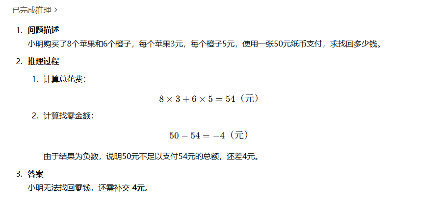


### 4. 自我一致性

​	也许在提示工程中更高级的技术之一是自我一致性。由 [Wang等人（2022）(opens in a new tab)](https://arxiv.org/pdf/2203.11171.pdf) 提出，自我一致性旨在“替换链式思维提示中使用的天真贪婪解码方法”。其想法是通过少样本 CoT 采样多个不同的推理路径，并使用生成结果选择最一致的答案。这有助于提高 CoT 提示在涉及算术和常识推理的任务中的性能。

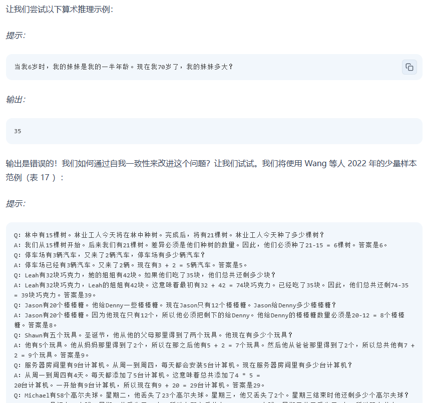


### 5. ReAct

**定义**：ReAct 是一种结合反应（Reaction）和行动（Action）的提示技术，通常用于交互式任务或复杂决策。

**例子**：

- **提示**：`"你是一个虚拟助手。用户问：'我今天应该穿什么衣服？' 你需要根据天气情况给出建议。步骤1：查询天气。步骤2：根据天气给出建议。"`
- **回答**：

- - **步骤1**：`"查询天气：今天的天气是晴天，温度在25-30度之间。"`
  - **步骤2**：`"建议：今天适合穿轻便的夏装，比如T恤和短裤。"`

通过分步骤反应和行动，模型可以更有效地完成复杂任务。这块需要结合后面讲解的langChain等框架来实现。


### 6. Prompt Chaining

**定义**：Prompt Chaining 是将多个提示串联起来，以分步解决复杂问题或完成多步骤任务。

**例子**：

- **任务**：写一篇关于气候变化的文章。
- **提示链**：

1. 1. `“首先，简要介绍什么是气候变化。”`
   2. `“接下来，描述气候变化的主要原因。”`
   3. `“然后，讨论气候变化的影响。”`
   4. `“最后，提出应对气候变化的建议。”`

通过将任务分解为多个步骤，模型可以更系统和有条理地完成复杂任务。

这些技术和方法帮助用户更有效地与大型语言模型互动，获得更高质量的输出。

另一个例子

```txt
你是一位历史学家，需要逐步回答问题。请按照以下步骤完成：
1. 确定问题的核心内容。
2. 提供关于问题中涉及的历史事件的简要背景。
3. 分析该事件的主要原因。
4. 解释该事件对历史发展的主要影响。
5. 总结回答。
 
问题：请描述第二次世界大战的起因，并分析其对世界格局的影响。
```


### 7. 思维树(ToT)

对于需要探索或预判战略的复杂任务来说，传统或简单的提示技巧是不够的。思维树基于思维链提示进行了总结，引导语言模型探索把思维作为中间步骤来解决通用问题。

​	ToT 维护着一棵思维树，思维由连贯的语言序列表示，这个序列就是解决问题的中间步骤。使用这种方法，LM 能够自己对严谨推理过程的中间思维进行评估。LM 将生成及评估思维的能力与搜索算法（如广度优先搜索和深度优先搜索）相结合，在系统性探索思维的时候可以向前验证和回溯。

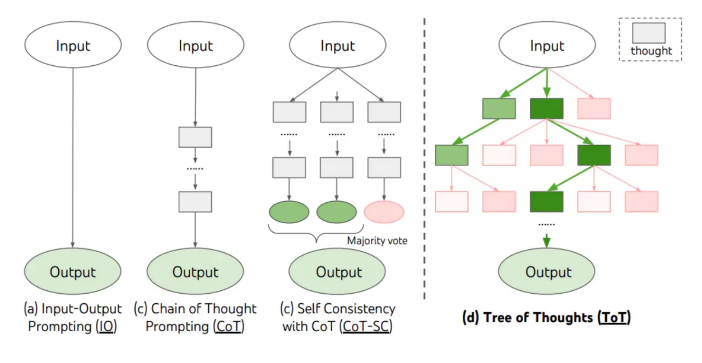


思维树的推理流程为：

1. 语义理解：对输入的文本进行语义理解，将自然语言转换为计算机能够理解的形式，通常会使用一系列预训练的语义表示模型，如 BERT、GPT 等，来对输入文本进行编码和表示，从而捕捉到输入文本中的语义信息。
2. 构建思维树：基于对输入文本的语义表示，构建一个思维树，以表示文本中的不同思维路径和关系。这个过程涉及到树状结构的设计和构建算法。
3. 路径选择：在生成输出文本时，根据输入文本和构建的思维树选择合适的思维路径。该过程通常涉及到路径搜索算法，以确定最相关和最合适的思维路径，ToT 可以考虑到多个可能的思维路径，并根据输入文本的不同语义信息动态调整路径选择策略。
4. 整合信息：选择了合适的思维路径后，从不同路径中获取信息，并将其整合起来，形成一个综合的理解。此过程涉及到信息融合和加权的算法，以确保生成的输出文本能够考虑到多个因素和可能性。
5. 生成输出：根据整合的信息生成输出文本，通常采用生成式模型，如 GPT，来生成连贯、自然的文本。ToT 会根据整合的信息和选择的思维路径来指导文本生成过程，以生成准确、多样化的输出。


案例1：

```txt
任务：请解决以下迷宫路径规划问题，找到从起点 S 到终点 E 的最短路径。
采用树状推理（Tree of Thoughts, ToT）方法逐步展开路径选择。
 
问题：  
迷宫如下（S为起点，E为终点，X为障碍）：  
S 0 0 X 0  
X X 0 X 0  
0 0 0 0 0  
0 X X X E  
 
步骤：
1. 在当前位置（初始为S）生成所有可能的下一步移动（上、下、左、右）。
2. 对每个移动进行评估（sure/maybe/impossible）：  
   - sure：该路径通畅，且可能是通往终点的最优路径。  
   - maybe：该路径可能可行，但需要进一步尝试。  
   - impossible：该路径不可行或为死路。  
3. 从评估结果中保留最佳候选路径，继续展开下一步。  
4. 如果当前路径无解，回退到上一步并重新选择路径。  
 
要求：  
- 展示每一步的候选路径及其评估结果。  
- 输出最终的最短路径及其总步数。
```


## 5. 提示词工程实战


