# 1 项目架构文档 — LLM-Algo 智能问答系统

> **项目定位**：基于大语言模型（LLM）的公安情报智能问答系统，支持多轮对话、意图识别、数据库查询、知识图谱分析、Excel 数据分析、以图搜图/搜档、布控管理等警务场景。

---

## 1.1 目录

1. [系统总览](#1-系统总览)
2. [目录结构](#2-目录结构)
3. [核心流程](#3-核心流程)
4. [各层详解](#4-各层详解)
   - [4.1 Web 服务层](#41-web-服务层)
   - [4.2 LLM 客户端层](#42-llm-客户端层)
   - [4.3 编排调度层（Works）](#43-编排调度层works)
   - [4.4 Chain 层](#44-chain-层)
   - [4.5 Agent 层](#45-agent-层)
   - [4.6 工具/插件层](#46-工具插件层)
   - [4.7 配置层](#47-配置层)
   - [4.8 工具函数层](#48-工具函数层)
5. [数据流详解](#5-数据流详解)
6. [关键设计模式](#6-关键设计模式)
7. [外部依赖与对接系统](#7-外部依赖与对接系统)
8. [开发指南](#8-开发指南)

---

## 1.2 系统总览

### 1.2.1 项目背景

这是一个面向公安情报分析场景的智能问答系统。一线干警可以通过自然语言向系统提问，例如"张三最近一周的活动轨迹"、"近一个月的人脸抓拍数据量"、"帮我查一下这辆车是否首次出现在这个卡口"等。系统自动理解问题意图，调度合适的数据源（知识图谱、数据库、Excel 等），经过 LLM 分析推理，以流式对话的方式给出答案。

项目的核心挑战在于：
- **多源异构数据**：需要同时对接知识图谱、关系型数据库、Excel 文件、公安各业务系统
- **公安领域特性**：大量专有术语（卡口、布控、抓拍、人像聚档等），需要领域知识注入
- **实时流式体验**：大模型推理耗时较长，必须通过流式推送让用户感知进度
- **多轮对话**：用户可能连续追问，需要理解上下文指代

### 1.2.2 整体架构分层

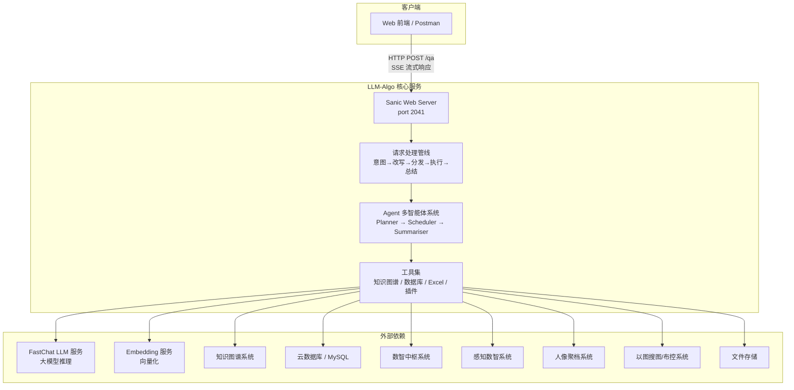

### 1.2.3 各层角色速览

从架构图可以看到，系统从上到下分为四个层次，每层各司其职：

**① 客户端层**：Web 前端或 Postman 等 HTTP 客户端，通过 `POST /qa` 接口发送 JSON 格式的多轮对话消息，通过 SSE（Server-Sent Events）协议接收流式响应。

**② Web 服务层（Sanic Server）**：基于 Python 异步框架 Sanic 构建的 HTTP 服务，负责请求解析、LLM 客户端初始化、以及 SSE 流式推送。这是系统的"大门"，所有外部请求都从这里进入。

**③ 核心业务逻辑层**：这是系统最复杂的部分，内部又分为三层管线：
- **编排管线（Pipeline）**：将请求分解为意图识别→问题改写→文件处理→API分发→Agent对话等一系列有序阶段，类似工厂流水线
- **Agent 多智能体系统**：采用 Planner→Scheduler→Summariser 三层架构，让 LLM 在"思考→行动→观察"的 ReAct 循环中逐步解决问题
- **工具集（Tools）**：将知识图谱、数据库、Excel 等外部能力封装为标准的 LangChain Tool，供 Agent 调用

**④ 外部依赖层**：包括 FastChat 大模型推理服务、Embedding 向量化服务，以及多个公安业务系统（知识图谱、云数据库、数智中枢、感知数智、人像聚档、以图搜图/布控等）。

整体采用 **管线（Pipeline）模式** + **Agent 多智能体架构**，在确定性的流程编排中嵌入 LLM 的推理能力，兼顾效率和灵活性。

---

## 1.3 目录结构

项目目录按照"**关注点分离**"的原则组织，每个目录承载一个明确的架构职责。下面逐一说明各目录的定位：

```
llm-algo/
├── main.py                     # Web 服务入口（Sanic）
├── config/                     # 配置层
│   ├── model_config.py         # LLM 模型参数配置
│   ├── resource_config.py      # 资源（Embedding、Sanic、文件路径等）
│   └── serving_addr_config.py  # 所有外部服务地址（KG/DB/DP等）
│
├── llms/                       # LLM 客户端层
│   ├── model_client.py         # 工厂函数 get_llm_client()
│   ├── fastchat_client.py      # FastChat HTTP 客户端（流式/非流式）
│   ├── noop_client.py          # NoOp 客户端（模拟流式输出）
│   ├── embedding_client.py     # Embedding 客户端
│   └── conversation.py         # 对话模板管理
│
├── works/                      # 编排调度层（工作单元）
│   ├── do_intent.py            # 意图分类 & API 调用分发
│   ├── do_dialogue.py          # Agent 对话执行
│   ├── do_question_rewrite.py  # 问题改写（行业术语注入）
│   ├── do_multiturn.py         # 多轮改写（当前为占位）
│   ├── do_file.py              # 文件处理（Excel/图片/音频）
│   ├── do_guide_interact.py    # 引导交互（重名消歧）
│   ├── do_id_transmit.py       # ID 转化
│   ├── do_question_recommend.py # 问题推荐
│   ├── do_chat_excel.py        # Excel 对话
│   ├── do_chat_image.py        # 图片处理（人像聚档/以图搜图）
│   ├── do_tdi_query.py         # 感知数智查询
│   ├── do_dp_monitor.py        # 布控管理
│   └── do_component_selector.py # 前端组件选择
│
├── chains/                     # LangChain Chain 层
│   ├── intent_classification/  # 意图分类链（Few-shot + Zero-shot）
│   ├── dialogue/               # 对话链（多轮改写 + Agent 执行 + 总结）
│   ├── api_calling/            # API 调用链（解析→执行→重试）
│   ├── database_qa/            # 数据库问答链（SQL查询+算子计算+总结）
│   ├── pandas/                 # Pandas DataFrame 分析链
│   ├── excel/                  # Excel 分析 Agent 封装
│   ├── extraction/             # 信息提取（表格数据提取）
│   ├── extract_name/           # 实体名称提取
│   ├── rewrite_question/       # 问题改写链
│   ├── task_decomposition/     # 任务分解链
│   ├── trend_analysis/         # 趋势分析链
│   └── question_recommendation/ # 问题推荐链
│
├── agents/                     # Agent 层
│   ├── conversational/         # 对话式 Agent 基类（LangChain ConversationalAgent）
│   ├── planner/                # Planner Agent（规划下一步动作）
│   ├── scheduler/              # Scheduler Agent（执行循环，调度工具）
│   ├── summariser/             # Summariser Agent（总结答案）
│   └── utils/                  # Agent 工具加载
│       ├── load_api_tools.py   # 加载 API 插件工具（kg, dic）
│       ├── load_sql_tools.py   # 加载 SQL 查询工具（db_sql）
│       └── load_file_tools.py  # 加载文件处理工具（chat_excel）
│
├── plugins/                    # 插件系统
│   ├── tools.py                # 插件工具加载器（RunPlugin + load_tools_by_plugin_names）
│   ├── data_model.py           # 数据模型
│   └── ...                     # 各插件实现（kg, dic 等）
│
├── lib/                        # 库函数
│   ├── tools/                  # 工具函数
│   │   └── chat_excel.py       # Excel 交互（pandas agent）
│   ├── fastchat/               # FastChat 相关
│   └── plugins/                # 插件内部实现（KG 各 API 调用）
│
├── utils/                      # 工具函数层
│   ├── callbacks.py            # StreamingCallbackHandler（SSE 流式核心）
│   ├── constant.py             # 全局常量（意图枚举、状态码、提示文案）
│   ├── schema.py               # ResponseData 数据结构
│   ├── messages_utils.py       # 消息处理工具（SSE 协议、消息筛选）
│   ├── globals.py              # 全局变量
│   └── utils.py                # 通用工具（文件下载、时间提取、DataFrame 转换等）
│
├── messages/                   # 消息序列化
│   └── serialize_messages.py   # Chat History 序列化
│
├── data/                       # 数据目录
│   └── upload_folder/          # 文件上传存储
│
└── doc/                        # 文档
    └── usage.md                # 使用说明
```

**几个关键的目录理解要点**：

- **works/  vs  chains/ 的区别**：`works/` 是"编排层"，负责把多个 Chain/Agent 组合成一个完整的工作流；`chains/` 是"能力层"，每个 Chain 封装一个独立的 LLM 能力（意图分类、API 调用、SQL 查询等）。你可以把 `works/` 理解为**经理**，`chains/` 理解为**员工**。
- **agents/  vs  chains/ 的区别**：`agents/` 中的 Agent 具备"循环决策能力"（Thought→Action→Observation），而 `chains/` 中的 Chain 通常是"单次调用"（输入→LLM→输出）。
- **plugins/  vs  agents/utils/ 的关系**：`plugins/` 定义了插件的数据模型和执行器，`agents/utils/` 负责将这些插件加载为 LangChain 可用的 Tool 对象。

---

## 1.4 核心流程

### 1.4.1 一次完整请求的处理管线

理解整个系统的关键，是理解一次请求从进场到离场经历的各个阶段。下面的时序图展示了完整的处理过程，我将逐一解释每个阶段做了什么、为什么需要这个阶段。

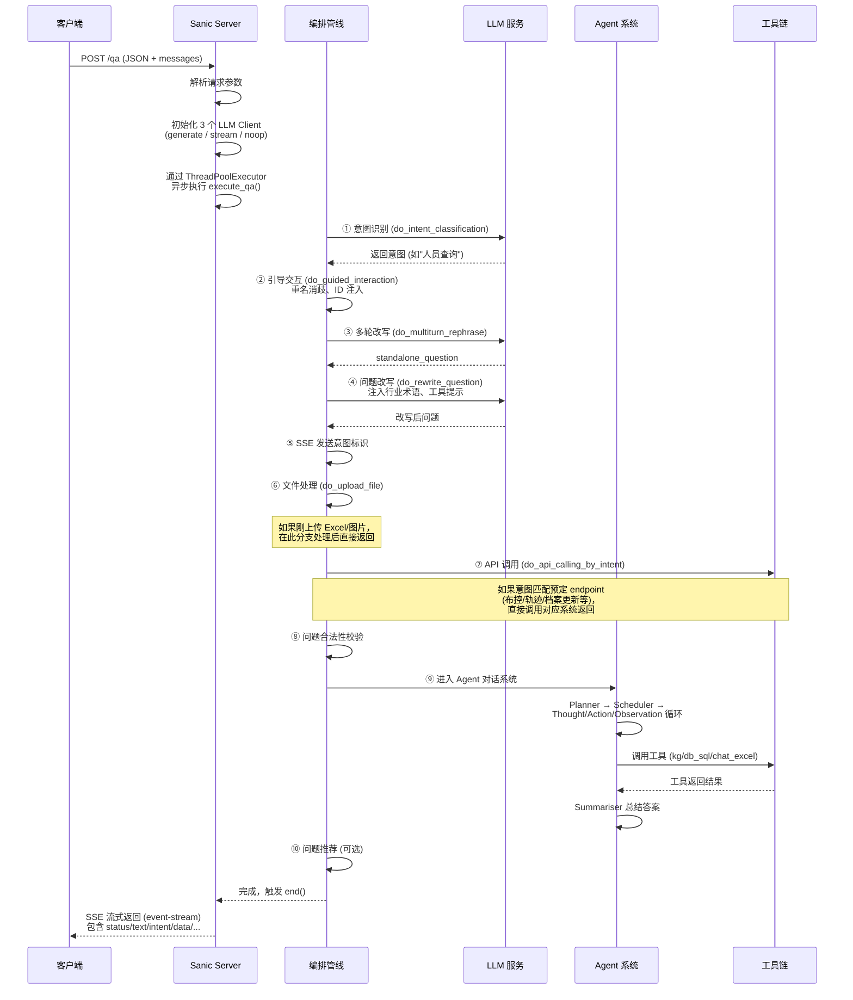

**阶段详解（逐个说明每个步骤的含义）：**

| 阶段 | 模块 | 做什么 | 为什么需要 |
|------|------|--------|-----------|
| ① 意图识别 | `do_intent_classification` | 用 Few-shot 分类判断用户意图（人员查询？轨迹？布控？） | 不同意图走不同处理路径，这是后续所有决策的起点 |
| ② 引导交互 | `do_guided_interaction` | 检查问题中的人名是否重名，若重名则让用户选择具体哪位 | 公安场景中重名率极高（如"张三"），必须消歧才能准确查询 |
| ③ 多轮改写 | `do_multiturn_rephrase` | 将带上下文指代的问句转为独立问句（如"他的轨迹"→"张三的轨迹"） | 多轮对话中用户常使用代称，需要结合历史记录消除歧义 |
| ④ 问题改写 | `do_rewrite_question` | 注入行业术语解释，告诉 LLM 某个词对应哪个工具 | LLM 不理解"卡口""布控"等公安术语，需要引导它调用正确的工具 |
| ⑤ 发送意图 | `streaming_handler.send_intent` | 将识别到的意图通过 SSE 推送给前端 | 前端可以根据意图选择不同的 UI 组件展示结果 |
| ⑥ 文件处理 | `do_upload_file` | 检查是否刚上传了文件（Excel/图片/音频），若是则走文件处理分支 | 文件上传后需要先解析内容，后续对话才能基于文件数据进行 |
| ⑦ API 调用 | `do_api_calling_by_intent` | 对于能确定的意图（布控、轨迹等），直接调用对应的后端系统 | 减少不必要的 LLM 调用，提高响应速度和可靠性 |
| ⑧ 合法性校验 | `is_question_valid` | 检查问题是否包含中文字符或字母数字 | 过滤掉完全无意义的输入 |
| ⑨ Agent 对话 | `do_agent_dialogue` | 进入 Planner→Scheduler→Summariser 的 ReAct 循环 | 这是系统的核心智能环节，LLM 在此逐步推理并调用工具获取信息 |
| ⑩ 问题推荐 | `do_question_recommend` | 根据当前问答内容，推荐 3-5 个用户可能想追问的问题 | 提升交互体验，引导用户深入使用 |

### 1.4.2 SSE 流式响应结构

大模型推理通常需要几秒到十几秒，如果让前端一直等待，用户体验极差。因此系统采用 **SSE（Server-Sent Events）** 协议，将处理过程中的各类信息分段推送。下图的 StreamingCallbackHandler 是流式推送的核心：

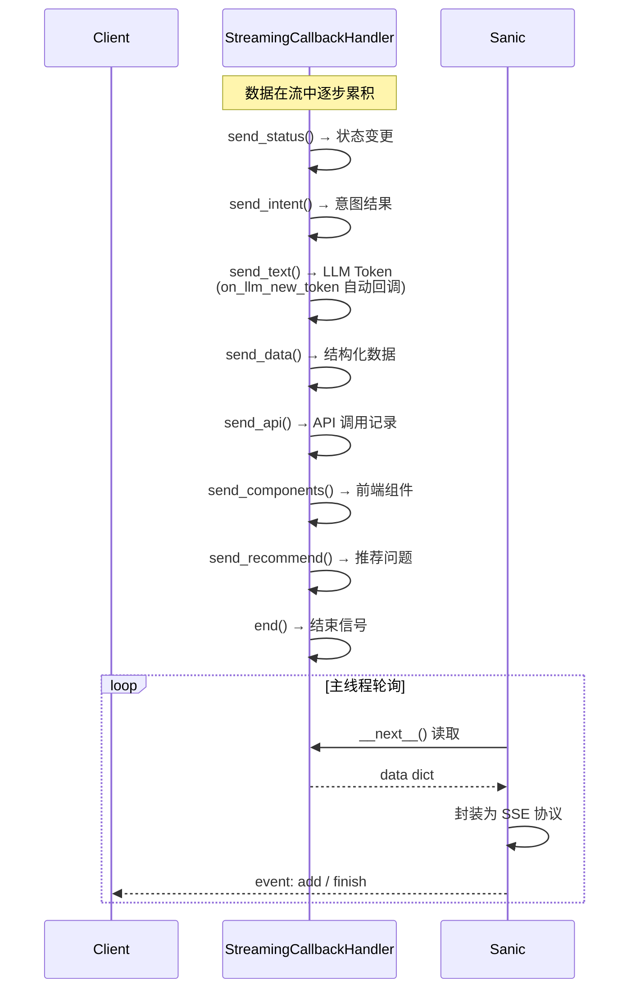

**SSE 推送的数据类型说明：**

| 类型 | 触发时机 | 示例内容 | 前端用途 |
|------|----------|----------|----------|
| `status` | 每个处理阶段开始/结束 | `{"text":"正在分析问题","stage":"start"}` | 显示处理进度条或状态标签 |
| `intent` | 意图识别完成后 | `"人员查询"` | 前端可以据此高亮对应功能模块 |
| `stream` | LLM 生成 token 时 | `"张三的轨迹信息如下："` | 逐字显示对话内容 |
| `data` | 工具返回结构化数据后 | `[{表头}, [值], ...]` | 渲染表格、图表等可视化组件 |
| `source_api` | 调用外部系统时 | `{"endpoint":"/search","input":...}` | 调试或追溯数据来源 |
| `components` | 请求结束时 | `["chart","table"]` | 前端选择展示组件 |
| `recommend` | 请求结束（可选） | `["可以再问...","也可以查..."]` | 显示推荐问题列表 |

**需要注意的是**，`send_text()` 由 `on_llm_new_token` 回调自动触发，而其他 send 方法需要手动调用。`end()` 必须在每次请求结束时最后调用，否则前端的 SSE 迭代永远不会终止。

---

## 1.5 各层详解

### 1.5.1 Web 服务层

**入口文件**：[main.py](main.py)

Web 服务层是系统的"大门"，负责 HTTP 协议层面的交互。它基于 Sanic 异步框架实现——选择 Sanic 而非 Flask/Django，是因为它原生支持异步和 SSE 流式响应，非常适合大模型场景。

#### 1.5.1.1 请求格式说明

```
POST /qa
Content-Type: application/json

{
    "user_id": "DefaultUser",
    "chat_id": "DefaultChat",
    "domain": "",
    "messages": [                     // 多轮对话消息列表
        {"role": "user", "content": "你好！"},
        {"role": "assistant", "content": "你好！有什么可以帮你的？"},
        {"role": "user", "content": "张三最近的活动轨迹"}
    ],
    "model_args": { ... },            // 非流式推理的模型参数
    "stream_model_args": { ... }      // 流式推理的模型参数
}
```

`messages` 字段的设计借鉴了 OpenAI Chat API 的格式，支持多轮对话历史。每条消息可选的 `accessory` 字段用于携带附件路径（如上传的 Excel 文件地址）。

#### 1.5.1.2 SSE 响应格式

```
event: add
data: {"type": "stream", "content": "正在分析..."}

event: add
data: {"type": "intent", "content": "人员查询"}

event: finish
data: {"type": "stream", "content": "最终答案"}
```

#### 1.5.1.3 关键机制详解

| 机制 | 说明 |
|------|------|
| **三 LLM 客户端** | 系统初始化了三个 LLM 客户端：`fastchat_llm`（非流式，用于意图分类改写等）、`fastchat_stream`（流式，用于对话生成）、`noop_llm`（模拟流式，用于直接输出预定义答案） |
| **ThreadPoolExecutor** | Sanic 是异步框架，但 LLM 调用是同步的。通过 `app.loop.run_in_executor(executor, ...)` 将同步调用扔到线程池执行，避免阻塞事件循环 |
| **SSE 流式** | 主协程通过 `for new_value in streaming_handler` 迭代器轮询 `Queue`，每收到一个数据就通过 `response.write()` 推送给前端 |
| **超时控制** | `StreamingCallbackHandler` 的 `__next__()` 方法有 `timeout` 参数。如果队列在超时时间内没有新数据，返回 `{"is_timeout": True}`，主协程计数达到 20 次后强制终止 |

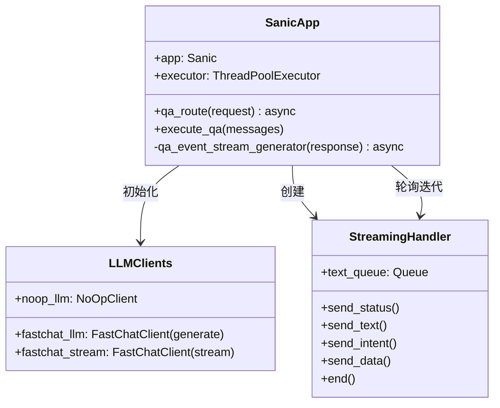

#### 1.5.1.4 main.py 中需要注意的设计细节

1. **Sanic 的 START_METHOD 设置为 "fork"**（第 21-22 行），这是为了在多 worker 模式下正确处理资源
2. **异常处理的"双保险"**：`execute_qa` 内部有自己的 try-except（第 225 行），外层的 `qa_route` 也有 try-except（第 262 行），确保任何异常都不会导致服务崩溃
3. **短路返回机制**：多个阶段的 `if ... return` 构成了"短路"——一旦某个阶段完成了请求的完整处理，就直接结束，不再继续后续阶段
4. **代码中被注释的 `do_agent_chat_history`**（第 163 行）表明原本有基于 Agent 的聊天记录筛选功能，当前未启用

---

### 1.5.2 LLM 客户端层

**目录**：[llms/](llms/)

LLM 客户端层是系统与大模型交互的"翻译官"。它屏蔽了底层 HTTP 通信细节，为上层提供统一的 LLM 调用接口。

#### 1.5.2.1 工厂模式设计

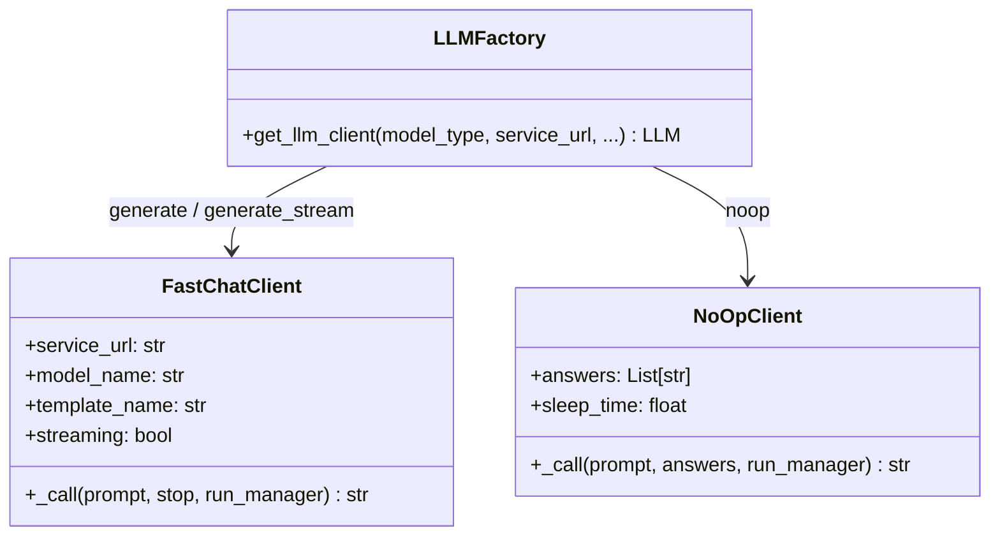

`get_llm_client()` 工厂函数根据 `model_type` 参数创建对应的客户端实例：

| 类型 | 类 | 用途 | streaming |
|------|-----|------|-----------|
| `generate` | FastChatClient | 非流式单次推理（意图分类、多轮改写、API 参数生成等） | False |
| `generate_stream` | FastChatClient | 流式推理（对话内容生成，逐 token 推送） | True |
| `noop` | NoOpClient | 模拟流式输出 / 直接返回预定义答案 | True |

#### 1.5.2.2 FastChatClient — 与大模型通信的核心

FastChatClient 通过 HTTP POST 请求连接远端的 FastChat Worker 服务。其 `_call()` 方法的核心逻辑：

1. **模板注入**：如果设置了 `template_name`（如 "DH-BDM-Chat"），会使用对应的对话模板对 prompt 进行包裹，添加 system/user/assistant 等角色标记
2. **参数合并**：将 `model_kwargs`（temperature、top_p 等）与调用时传入的参数合并
3. **请求发送**：向 FastChat Worker 的 `/worker_generate_stream` 或 `/worker_generate` 端点发 POST 请求
4. **流式处理**：如果是 streaming 模式，逐 chunk 解析返回的 token，通过 `run_manager.on_llm_new_token()` 回调触发 `StreamingCallbackHandler.send_text()`

**对话模板的工作原理**：不同的 LLM 需要不同的对话格式（如 Vicuna 需要 "USER: ... ASSISTANT: " 前缀，Qwen 需要 "<|im_start|>user\n...<|im_end|>"）。`conversation.py` 中注册了多种模板，通过 `template_name` 指定使用哪个。这个设计让系统可以灵活切换不同的底层模型。

#### 1.5.2.3 NoOpClient — 不"说话"的 LLM

NoOpClient 是一个**假 LLM**，它不发起任何 HTTP 请求。它的 `_call()` 方法直接返回预定义的 `answers` 列表中的随机一项（或者直接返回 prompt 本身）。它有什么用？

- **模拟流式输出**：将预定义答案逐字通过 `on_llm_new_token` 推送，模拟 LLM 在"思考"和"输出"
- **即时应答**：对于"对不起，我无法回答这个问题"这类固定回复，不需要真的调用大模型，直接走 NoOpClient 即可
- **前端体验优化**：在处理耗时操作（如文件上传解析）时，通过 NoOpClient 输出状态信息，让用户感知系统正在工作

---

### 1.5.3 编排调度层（Works）

**目录**：[works/](works/)

编排调度层是系统的"项目经理"——它不自己干活，但知道活应该怎么派、派给谁、什么顺序派。它将请求分解为多个有序的执行阶段，每个阶段由对应的 `do_xxx` 模块负责。这种设计的好处是：每个模块职责单一、易于测试、方便扩展。

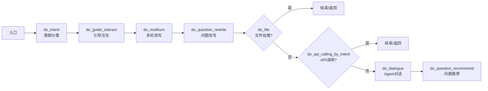

**注意图中的两个菱形判断节点**：它们代表了"短路返回"机制。如果上传了文件（Excel/图片），`do_upload_file()` 处理完成后直接返回，不再走后续的 Agent 流程。同样，如果意图能直接匹配到某个 API 调用（如布控），`do_api_calling_by_intent()` 执行后也直接返回。这种设计大幅减少了大模型的不必要调用，提高了响应速度。

#### 1.5.3.1 do_intent.py — 意图分类与分发

**核心职责**：理解用户想做什么，然后决定怎么做。

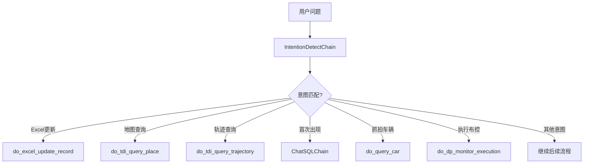

`do_intent.py` 的工作分为两步：

**第一步：意图识别**（`do_intent_classification`）
通过 `IntentionDetectChain`（详见 4.4 节）分析用户问题的意图。系统预定义了约 19 种意图，涵盖人员查询、轨迹查询、布控管理、数据分析等公安业务场景。

**第二步：意图分发**（`do_api_calling_by_intent`）
根据识别到的意图，选择对应的处理函数。这是一个 `if-elif` 分发器，每种意图对应一个专门的执行函数。这种"意图路由"模式的好处是：
- 不同意图的复杂逻辑相互隔离
- 可以针对特定场景做深度优化（如布控有专门的参数校验）
- 新增意图只需添加一个 elif 分支

**代码中值得注意的点**：
- 意图 `"首次出现"` 是注释中写的**定制需求**，它走的是 ChatSQLChain（数据库问答链）来处理
- 档案更新（`INTENT_EXCEL_UPDATE_RECORD`）和 Excel 普通查询是分开的，因为更新涉及写操作，需要更谨慎的处理

#### 1.5.3.2 do_dialogue.py — Agent 对话核心编排

这是系统最复杂的编排模块，它组装了完整的 Agent 三层架构（详见 4.5 节）：

```python
# 伪代码流程
planner = PlannerAgent(llm, tools)          # 规划：决定下一步动作
scheduler = SchedulerAgentExecutor(planner)  # 执行：Thought→Action→Observation 循环
summariser = SummariserAgent(stream_llm)    # 总结：将中间结果汇总为最终答案
dialogue_chain = DialogueChain(scheduler, summariser)
result = dialogue_chain.invoke(inputs)
```

`do_dialogue.py` 中还有一个重要但容易被忽略的职责：**执行结果的二次处理**（第 65-102 行）。Agent 执行完成后，它会遍历 `intermediate_steps`，对于知识图谱（kg）和数据中枢（dic）的 API 调用结果，重新调用对应的插件执行器，获取原始的结构化数据并通过 `streaming_handler.send_data()` 推送给前端。这意味着前端不仅能收到 LLM 总结的文字答案，还能收到原始的表格数据，用于渲染图表等可视化组件。

#### 1.5.3.3 do_question_rewrite.py — 行业术语注入

这是**公安领域适配**的关键组件。大模型在通用语料上训练，并不理解公安领域的专有词汇。`do_rewrite_question()` 函数在问题末尾动态追加"解释说明"，告诉 LLM 某个词的含义和对应的工具：

```python
# 示例：如果检测到"卡口"关键词
question += "[解释说明：卡口表示在道路上部署监控设备的关卡，可以通过'kg'工具查询车辆信息。]"
```

这种"Prompt Engineering"手段相比微调模型，成本低、见效快。代码中通过三种方式触发注入：
1. **基于意图**：某些意图自动注入对应的工具说明（如 `INTENT_QUERY_DIC_INFO` 注入 dic 工具说明）
2. **基于关键词**：加载 `kg_keywords.json` 中的行业词典，匹配到关键词就注入对应说明
3. **基于上下文**：如果问题涉及 Excel，注入 chat_excel 工具说明

#### 1.5.3.4 do_guide_interact.py — 引导交互（重名消歧）

公安场景中，重名是一个非常实际的问题。"查询张三"——是哪个张三？刑侦支队的张三还是治安大队的张三？`do_guided_interaction` 的职责就是处理这种歧义。

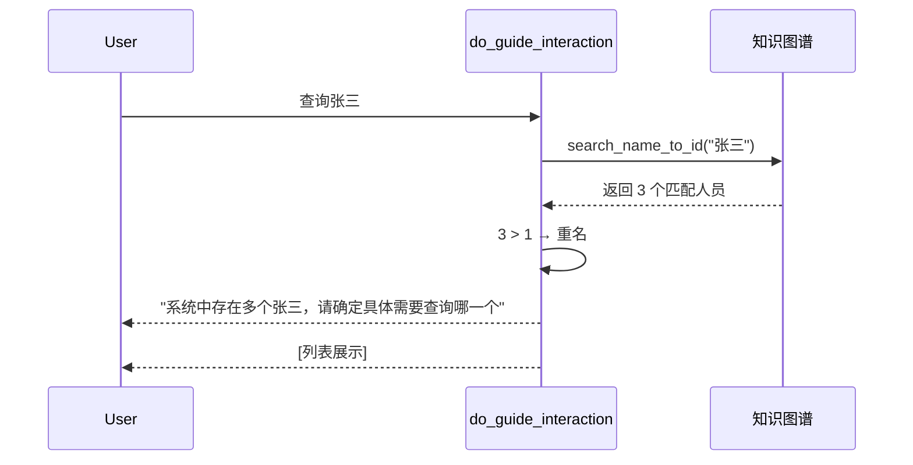

它的工作逻辑：
1. 先用 LLM 从问题中提取姓名（通过 `chains/extract_name`）
2. 查询知识图谱，看该姓名对应了多少个人员
3. 如果只有 1 个，将身份证号注入问题文本中，后续 Agent 查询时直接使用精确 ID
4. 如果有多个，中断正常流程，向用户展示所有匹配人员，让用户选择

这个设计体现了系统在"用户体验"上的考量——与其让 Agent 模模糊糊地查询然后给出不确定的结果，不如提前让用户明确意图。

---

### 1.5.4 Chain 层

**目录**：[chains/](chains/)

Chain 层是 LangChain 框架的核心概念。一个 Chain 封装了一个"LLM + Prompt"的完整调用，可能还包含额外的逻辑（如向量检索、数据后处理）。每个 Chain 是独立可测试的能力单元。

#### 1.5.4.1 意图分类链 — IntentionDetectChain

**文件**：[chains/intent_classification/base.py](chains/intent_classification/base.py)

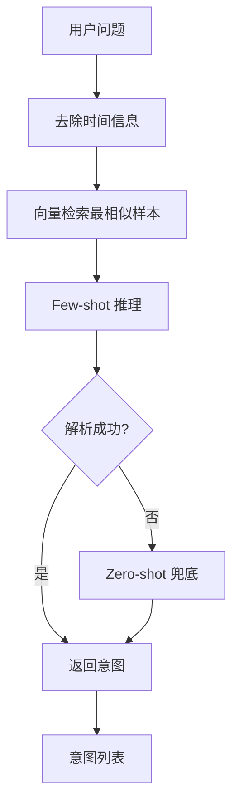

这是一个**双链结构**，设计得非常精妙：

**主链（Few-shot）** 的工作过程：
1. 从问题中去除时间信息（"今天"、"上周"等时间词会干扰相似度匹配）
2. 用 Embedding 模型将处理后的问题向量化
3. 在向量库中检索最相似的 5 个历史样本（每个样本标注了对应的意图）
4. 将这些样本作为示例注入 Few-shot Prompt，让 LLM 参考这些示例判断当前问题的意图

**备链（Zero-shot）**：
- 当 Few-shot 链解析失败时使用（代码中实际已注释掉，因为 Zero-shot 效果不佳）
- 不带示例直接让 LLM 推理意图
- 如果也失败，最终返回兜底意图 `"其他"`

**为什么 Few-shot 效果好于 Zero-shot？** 意图分类是一个边界模糊的问题。"查询张三的活动轨迹"和"查询张三的同行人员"的边界在哪里？通过检索实际案例作为参考，LLM 能更准确地把握不同意图的细微差别。同时，向量检索确保每次都能找到与当前问题最相关的历史案例，而不是在 Prompt 中硬编码固定示例。

**关键参数**：`k=5`（检索 TOP-5 相似样本），`intentions` 列表包含所有已知意图类型 + `"其他"`。

#### 1.5.4.2 对话链 — DialogueChain

**文件**：[chains/dialogue/base.py](chains/dialogue/base.py)

这是 Agent 对话的主 Chain，它将 Scheduler（执行者）和 Summariser（总结者）组合在一起：

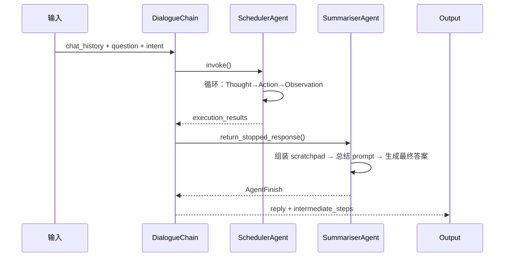

DialogueChain 的 `_call()` 方法在调用 Scheduler 之前，从 `run_manager.handlers` 中查找 `StreamingCallbackHandler` 实例（第 133-137 行）。这个查找逻辑贯穿整个系统——Chain 本身不创建回调处理器，而是从上级调用者传递过来的管理器链中查找。这是一种**依赖注入**风格的设计，避免了全局状态。

**DialogueChain 的一个关键细节**：它把 `question` 作为 Scheduler 的 `input` 输入，同时把 `PRE_DETERMINED_ACTION_KEY` 也透传进去（第 158-161 行）。这样 Scheduler 可以根据 intent 的预映射直接选择工具，跳过 LLM 规划（详见 6.2 节）。

#### 1.5.4.3 API 调用链 — APICallingChain

**文件**：[chains/api_calling/base.py](chains/api_calling/base.py)

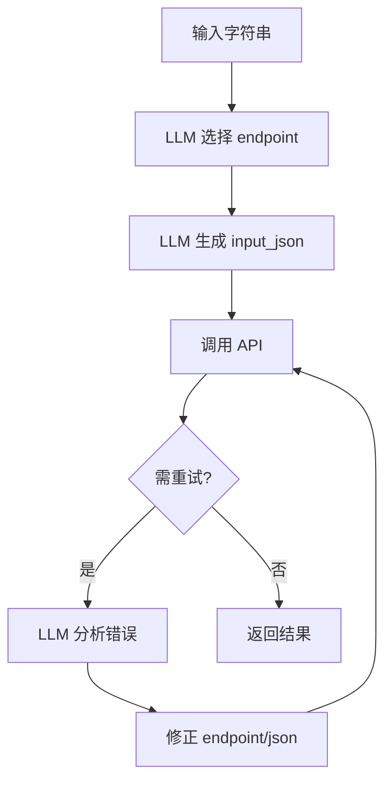

APICallingChain 的目标是将用户的自然语言描述转化为结构化的 API 调用。它的核心是**三段式 Prompt**：

| Prompt 模板 | 用途 |
|-------------|------|
| `SYSTEM_PROMPT` + `USER_PROMPT` | 基础调用：从输入中提取 endpoint 和参数 |
| `RETRY_PROMPT` | 重试：分析之前的错误，修正调用 |
| `STOP_PROMPT` | 停止判定：判断返回结果是否有效 |

**重试机制**：
- 使用 `backoff` 库实现指数退避重试（最大 10 次，最长 20 秒）
- 每次失败后，将错误信息追加到 `trial_history`，在下一次调用中作为上下文传给 LLM
- `retry_times` 参数控制最大重试次数（默认 1 次，即不重试）

**Endpoint 模糊匹配**：使用 `fuzzywuzzy` 库，当 LLM 生成的 endpoint 名称不完全匹配时，自动找到最相似的可用 endpoint。这增强了系统对 LLM 输出不稳定的容错能力。

#### 1.5.4.4 数据库问答链 — ChatSQLChain

**文件**：[chains/database_qa/base.py](chains/database_qa/base.py)

这是处理"数据统计类"问题的核心组件，也是系统中最复杂的 Chain。它解决了"如何用大模型实现自然语言到 SQL 的转换"这一经典问题。

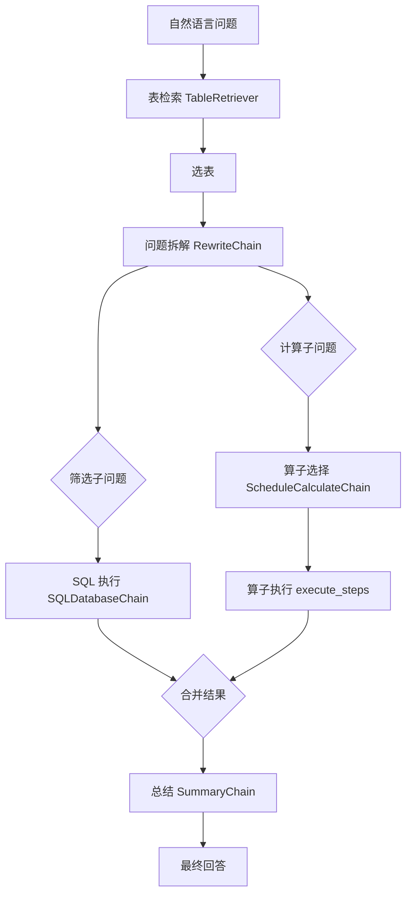

ChatSQLChain 的处理策略是"分而治之"——它将一个复杂的数据问题拆解为"数据筛选"和"数据计算"两个子问题：

**数据筛选（SQL 查询）**：把自然语言中的筛选条件（如"近一个月"、"早上 9 点到 10 点"、"人脸抓拍数据"）转化为 SQL 查询语句，从数据库中查出原始数据。

**数据计算（算子执行）**：对查出的数据应用分析算子。系统预定义了 15+ 种算子：

| 算子 | 说明 | 示例场景 |
|------|------|----------|
| `count` | 计数 | "有多少条记录？" |
| `sort` | 排序 | "按时间排序" |
| `top_k` / `bottom_k` | Top-K / Bottom-K | "最多的三种类型是？" |
| `most_common` / `least_common` | 最/最少出现 | "出现最频繁的车辆是？" |
| `aggregate` | 聚合 | "平均抓拍次数是多少？" |
| `filter_value` / `filter_between` | 值/范围过滤 | "只看浙A开头的车辆" |
| `period_counts` | 时间分组统计 | "每天的数据量是多少？" |
| `yoy_growth_rate` | 同比增长率 | "比去年同期增长了多少？" |
| `pop_growth_rate` | 环比增长率 | "比上个月增长了多少？" |
| `trend_analysis` | 趋势分析 | "最近一周的变化趋势如何？" |
| `first_appearance` | 首次出现分析 | "这辆车是不是第一次出现？" |

**为什么需要问题拆解？** 用户的问句往往同时包含筛选条件和计算要求。如果不拆解，LLM 生成的 SQL 很容易混淆 WHERE 子句和聚合函数。通过 `RewriteChain` 先将问题分解为 `step1`（筛选）和 `step2`（计算），再分别处理，成功率显著提高。

**总结链（SummaryChain）**：最后一步将 SQL 查询结果和算子计算结果综合起来，生成用户友好的自然语言答案。这个过程也会处理一些展示逻辑，比如数据量过大时只展示前 N 条并告知用户总数。

---

### 1.5.5 Agent 层

**目录**：[agents/](agents/)

Agent 层是系统的"大脑"，基于 LangChain 的 Agent 框架实现。它采用了三层架构，每层有明确的职责边界。

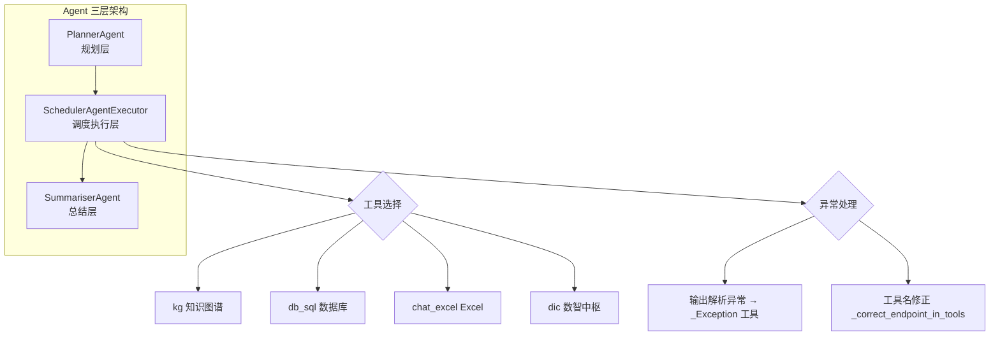

#### 1.5.5.1 为什么需要三层 Agent 架构？

标准 LangChain 的 Agent 框架通常只有两层（Agent + AgentExecutor），但本项目增加了一个 Summariser 层。原因在于：

- **Planner** 负责"规划"——给定当前状态和可用工具，决定下一步做什么
- **Scheduler** 负责"执行"——执行工具调用、处理异常、管理循环
- **Summariser** 负责"总结"——当 Agent 循环结束后，将中间结果整合为最终的、用户友好的答案

分离 Summariser 的好处是：**规划时用更"理性"的参数（temperature=0.1），总结时用更"创造性"的参数（temperature=0.8）**。这在代码中体现为 Planner 使用 `fastchat_llm`（非流式、低温），而 Summariser 使用 `fastchat_stream`（流式、高温）。

#### 1.5.5.2 PlannerAgent

**文件**：[agents/planner/base.py](agents/planner/base.py)

PlannerAgent 继承自 `ConversationalAgent`（详见下文），核心方法是 `plan()`：

```python
def plan(self, intermediate_steps, callbacks=None, **kwargs):
    full_inputs = self.get_full_inputs(intermediate_steps, **kwargs)
    full_output = self.llm_chain.predict(callbacks=callbacks, **full_inputs)
    return self.output_parser.parse(full_output)
```

它的工作可以概括为：**"看看已经做了什么，决定下一步做什么"**。`intermediate_steps` 是所有已经执行过的（Action, Observation）对，Planner 将它们组装成 scratchpad，连同用户问题一起发给 LLM，由 LLM 决定下一步的 Action（选择哪个工具、输入什么参数），或者决定结束（AgentFinish）。

**一个特别的设计**是 `get_full_inputs()` 中对 `chat_history` 的处理（第 27-29 行）：它将 HumanMessage / AIMessage 列表转换为纯文本字符串。这是为了避免 LangChain 的消息格式与 Agent prompt 模板冲突。

#### 1.5.5.3 SchedulerAgentExecutor

**文件**：[agents/scheduler/base.py](agents/scheduler/base.py)

这是 Agent 循环的"发动机"，继承自 LangChain 的 `AgentExecutor`。它的核心是 `_call()` 方法中的 while 循环：

```python
while self._should_continue(iterations, time_elapsed):
    # 1. 调用 planner 获取下一步动作
    output = self.agent.plan(intermediate_steps, **inputs)
    # 2. 如果返回 AgentFinish 则结束
    if isinstance(output, AgentFinish):
        return output
    # 3. 执行工具调用
    observation = tool.run(tool_input)
    # 4. 记录中间步骤
    intermediate_steps.append((action, observation))
```

**Scheduler 相对于标准 AgentExecutor 的核心增强：**

**① 预确定动作（pre_determined_action）**：这是系统性能优化的关键。如果意图已经能确定映射到某个工具（如"人员查询"映射到 `(kg, /search)`），Scheduler 直接创建对应的 AgentAction，**跳过 LLM 的规划调用**。这避免了每次都需要 LLM"思考"去选工具，大幅减少了不必要的 LLM 调用次数和响应时间。

**② 输入后处理（_post_process_inplace）**：在执行工具前，对 LLM 生成的工具输入做"修正"。最常见的场景是——用户问题中提到"张三"，但 Agent 调用知识图谱时只传了"张三"没传身份证号。后处理函数会在工具输入中注入身份证号信息（如将"张三"替换为"张三(330621...)"）。

**③ 工具名修正（_correct_endpoint_in_tools）**：LLM 偶尔会生成不精确的工具名（如生成 `/search` 而不是 `kg`）。修正函数尝试通过正则匹配和描述匹配来找到正确的工具。

**④ SSE 状态推送**：在执行各个阶段（"正在选择工具"、"正在调用知识图谱"等）主动向 streaming_handler 推送状态更新，让前端能实时展示处理进度。

**⑤ 异常处理**：当 LLM 输出无法解析时，捕获 `OutputParserException`，创建一个特殊的 `_Exception` 工具输入，让 LLM 在下一轮思考时"看到"解析错误并自我修正。

#### 1.5.5.4 SummariserAgent

**文件**：[agents/summariser/base.py](agents/summariser/base.py)

SummariserAgent 是"收尾者"。当 Scheduler 的循环结束后（无论是正常结束还是达到最大迭代次数），Summariser 接手处理：

1. **组装 scratchpad**：将所有中间步骤的 Thought、Action、Observation 拼接成一个完整的上下文
2. **查询补充信息**：通过知识图谱查询人员档案信息，作为总结的补充材料
3. **调用总结 prompt**：使用专门的总结模板（`conclusion_prompt`），让 LLM 基于所有的中间结果生成最终答案
4. **特殊情况处理**：
   - 如果中间步骤的状态码是 200（成功）但无需总结，直接输出原始结果
   - 如果状态码非成功，输出预设的异常提示
   - 如果 `return_stopped_response()` 的参数中没有中间步骤但有最终输出，直接返回该输出

**一个实用的设计细节**：当迭代次数超限但 LLM 已经输出了一些内容时（`early_stopping_method="generate"`），Summariser 会尝试将这些零散输出整理成完整的答案，而不是直接丢弃。

#### 1.5.5.5 ConversationalAgent — Agent 基类

**文件**：[agents/conversational/base.py](agents/conversational/base.py)

这是一个通用的对话式 Agent 基类，PlannerAgent 和 SummariserAgent 都继承自它。它基于 LangChain 的 `ConversationalAgent` 实现，主要做了一件事：**使用 Jinja2 模板引擎渲染 Prompt**（第 88 行的 `template_format="jinja2"`）。这意味着 prompt 模板中可以使用 Jinja2 的循环、条件判断等高级语法，比 LangChain 默认的 f-string 模板更灵活。

---

### 1.5.6 工具/插件层

**目录**：[agents/utils/](agents/utils/)、[plugins/](plugins/)

工具层是 Agent 与外部世界交互的"桥梁"。Agent 不直接调用外部系统，而是通过 LangChain Tool 的抽象接口进行调用。这样 Agent 无需关心底层通信细节（HTTP、SQL、文件 IO），只需关注"选哪个工具、传什么参数"。

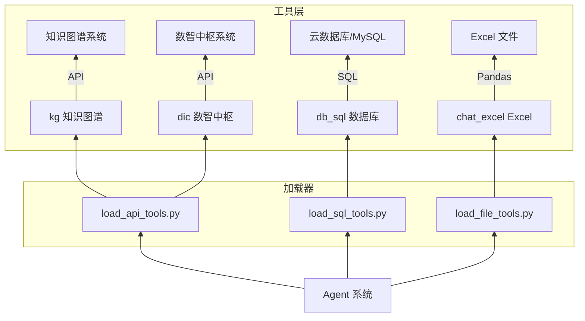

| 工具名 | 类型 | 加载方式 | 加载时机 | 功能 |
|--------|------|----------|----------|------|
| `kg` | API 插件 | `plugins/tools.py` → `PluginExecutor` | 模块加载时（静态） | 知识图谱搜索/扩展/碰撞/团伙分析 |
| `dic` | API 插件 | `plugins/tools.py` → `PluginExecutor` | 模块加载时（静态） | 数智中枢数据统计 |
| `db_sql` | SQL 工具 | `load_sql_tools.py` → `ChatSQLChain` | 请求处理时（动态） | 数据库自然语言查询 |
| `chat_excel` | 文件工具 | `load_file_tools.py` → `pandas agent` | 请求处理时（动态） | Excel 数据分析对话 |

#### 1.5.6.1 静态加载 vs 动态加载

这是一个重要的架构差异：

**API 工具（kg、dic）在模块加载时静态初始化**（`agents/utils/load_api_tools.py`）。这意味着它们在整个服务生命周期中只创建一次，所有请求共享同一组工具实例。这样做是合理的，因为 API 插件的定义（endpoint、参数规范）是固定的，不依赖具体的请求上下文。

**SQL 工具在请求处理时动态加载**（`agents/utils/load_sql_tools.py`）。`load_sql_tools()` 根据当前问题的内容，通过 `table_retriever_chain` 检索相关的候选表，然后将这些表的信息注入工具的描述中。这样 Agent 在决定是否调用 db_sql 时，能「看到」当前有哪些表可用、每个表是做什么的。如果不这样做，工具描述会非常模糊，Agent 可能不知道应该查哪个表。

#### 1.5.6.2 插件工具加载机制

```python
# agents/utils/load_api_tools.py
SELECTED_PLUGINS = ["dic", "kg"]
plugin_tools = load_tools_by_plugin_names(SELECTED_PLUGINS, llm)

# plugins/tools.py
class RunPlugin:
    def run(self, user_intent):
        raw = self.plugin.run(user_intent=user_intent, llm=llm)
        return json.dumps({"api_output": ..., "api_calling_info": ...})
```

`RunPlugin` 类是一个适配器——它将 `PluginExecutor`（实际的插件执行器）包装为 LangChain Tool 所需的 `func` 接口。`run()` 方法接收用户意图字符串，返回 JSON 格式的观察结果，包含 `api_output`（API 返回的数据）和 `api_calling_info`（调用的元信息，如 endpoint、参数等）。

#### 1.5.6.3 db_sql 工具的运行时加载

```python
# agents/utils/load_sql_tools.py
def load_sql_tools(inputs, llm):
    candidate_tables = table_retriever_chain.run_select_candidates(question)
    tool_func = lambda query: run_db_sql(query, llm, embeddings, metainfos=candidate_tables)
    return [Tool(name="db_sql", func=tool_func, description=...)]
```

描述中的 `formated` 变量（第 56-58 行）将候选表的名称、描述、适用场景等信息格式化为字符串，嵌入到 Tool 的 `description` 中。这样当 Agent 读取 db_sql 的工具描述时，它就"知道"当前有哪些表可用。

---

### 1.5.7 配置层

**目录**：[config/](config/)

配置层集中管理所有可变的参数，遵循"配置与代码分离"原则。三个配置文件的分工如下：

| 文件 | 配置内容 | 典型值 |
|------|----------|--------|
| `model_config.py` | LLM 服务地址、模型名、各场景的参数 | `LLM_SERVICE_URL`, `LLM_MODEL_NAME`, `temperature` |
| `resource_config.py` | 系统资源、Embedding 模型路径、Sanic 参数、文件路径 | `APP_WORKERS=8`, `SENTENCE_TRANSFORMER_PATH` |
| `serving_addr_config.py` | 所有外部服务的地址和鉴权信息 | KG/DB/DP/TDI/DIC/SFTP/Kafka 的 IP、AK/SK |

#### 1.5.7.1 模型参数的温度设计

模型参数（特别是 `temperature`）按场景区分，这是一个重要的设计决策：

| 参数变量 | 用途 | temperature | 为什么用这个值 |
|----------|------|-------------|----------------|
| `LLM_MODEL_API_KWARGS` | API 参数提取 | 0.1 | 需要精确、确定性的输出，不允许"发挥" |
| `LLM_MODEL_FILE_KWARGS` | 文件摘要分析 | 0.1 | 需要准确描述文件内容，不允许编造 |
| `LLM_MODEL_SQL_KWARGS` | SQL 生成 | 0.2 | SQL 语句要求语法正确，稍高的温度允许一些灵活性 |
| `LLM_MODEL_KWARGS` | 非流式通用（意图分类等） | 0.8 | 需要一定的多样性来覆盖不同的表达方式 |
| `LLM_MODEL_STREAM_KWARGS` | 流式对话生成 | 0.8 | 对话需要自然流畅，较高的温度让回答更丰富 |

**核心原则**：凡是涉及"精确提取"或"确定性任务"的场景使用**低温（0.1-0.2）**，凡是涉及"生成创造"或"对话"的场景使用**常温（0.8）**。

#### 1.5.7.2 外部服务地址的密码安全

`serving_addr_config.py` 中包含了数据库密码、AK/SK 等敏感信息。在当前项目中这些是硬编码的，生产环境建议通过环境变量或密钥管理服务来注入。

---

### 1.5.8 工具函数层

**目录**：[utils/](utils/)

工具函数层提供整个系统的基础设施能力。最重要的两个模块是 `StreamingCallbackHandler` 和 `constant.py`。

#### 1.5.8.1 StreamingCallbackHandler — 流式回调核心

**文件**：[utils/callbacks.py](utils/callbacks.py)

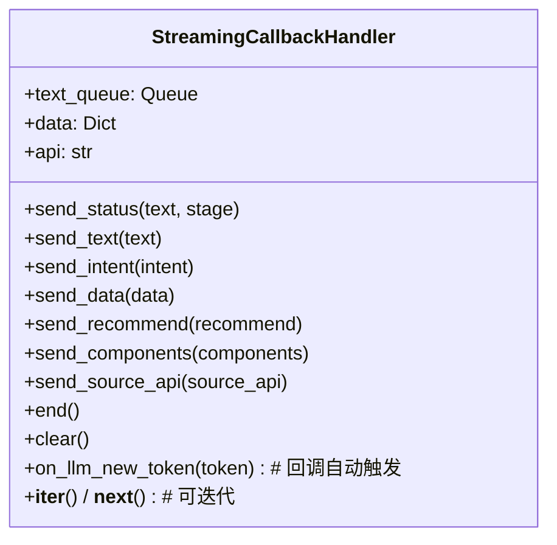

StreamingCallbackHandler 是连接"LLM 处理线程"和"SSE 推送协程"的桥梁。它的工作机制是"生产者-消费者"模式：

**生产者（LLM 处理线程）**：在处理过程中调用各种 `send_xxx()` 方法，将数据放入 `text_queue`（一个线程安全的 Queue）。`send_text()` 由 LangChain 的 `on_llm_new_token` 回调自动触发（每次 LLM 生成一个新 token 时调用）。`send_status()`、`send_intent()` 等则由上层代码手动调用。

**消费者（SSE 推送协程）**：Sanic 的主协程通过 `for new_value in streaming_handler` 迭代器循环，每次调用 `__next__()` 从队列中取出最新数据，封装为 SSE 协议格式，通过 `response.write()` 推送给前端。

**为什么使用 Queue 而不是直接推送？** 因为 `execute_qa()` 在 `ThreadPoolExecutor` 中运行，而 SSE 推送在 Sanic 的事件循环中运行，它们运行在不同的线程/协程中。Queue 是线程安全的，是跨线程通信的最佳选择。

**end() 方法**至关重要：它将 `end_signal` 放入队列，让迭代器触发 `StopIteration` 正常结束。如果忘记调用 `end()`，前端会一直等待（连接不关闭）。`end()` 还会自动调用 `do_frontend_component_selector()` 选择合适的前端展示组件，并将所有未完成的状态置为 "failed"。

#### 1.5.8.2 全局常量 — constant.py

**文件**：[utils/constant.py](utils/constant.py)

constant.py 是系统的事实"字典"，集中定义了 150+ 常量。主要包括：

**意图枚举（19 种）**：定义了系统能识别的所有用户意图。这是系统的"能力清单"——新增一种能力就意味着新增一个意图常量。

```python
INTENT_EXCEL_UPDATE_RECORD = "档案更新数据"
INTENT_QUERY_KG_QUERY_PERSON = "人员查询"
INTENT_QUERY_TDI_QUERY_TRAJECTORY = "轨迹信息查询"
INTENT_QUERY_DP_MONITOR_EXECUTION = "执行布控"
# ... 共 19 种
```

**Intent → Endpoint 映射**：定义了意图到工具的直接映射关系。这就是"预确定动作"优化的依据：

```python
INTENT_TO_ENDPOINT_MAP = {
    INTENT_QUERY_KG_QUERY_PERSON: ("kg", "/search"),
    INTENT_QUERY_KG_QUERY_RELATION: ("kg", "/expand_1st_degree"),
    INTENT_QUERY_DB_POLICE: ("db_sql",),
    # ...
}
```

**状态提示文案**：定义了所有 SSE 推送的状态文本。共约 40 个 STATUS_xxx 常量，覆盖了每种操作的开始、成功、失败三个阶段。例如：

```
STATUS_INTENT_CLASSIFICATION = "正在分析问题"
STATUS_INTENT_CLASSIFICATION_START_CONTEXT = "开始分析问题的意图"
STATUS_INTENT_CLASSIFICATION_SUCCESS_CONTEXT = "已经分析出问题的意图"
```

**错误提示文案**：约 15 种预设的错误回复，覆盖了各种异常场景（数据为空、查询失败、输入不合法等）。

**工具名映射**：将内部工具名映射为用户友好的中文名称，用于在状态推送中展示：

```python
TOOL_NAME_MAP = {
    "kg": "知识图谱",
    "db_sql": "云数据库",
    "chat_excel": "数据分析",
    # ...
}
```

---

## 1.6 数据流详解

### 1.6.1 消息格式流转

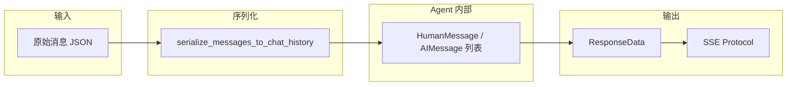

**消息格式转换路径**：

1. **输入**：客户端发送的 JSON 消息，每个消息包含 `role`（user/assistant/system）和 `content`（文本内容），可能还有 `accessory`（附件路径）和 `data`（结构化数据）
2. **序列化**：`serialize_messages_to_chat_history()` 将 JSON 消息转换为 LangChain 的 `HumanMessage` / `AIMessage` / `SystemMessage` 对象，供 Chain 和 Agent 使用
3. **Agent 内部处理**：Agent 在 `HumanMessage / AIMessage` 级别上操作 LLM
4. **输出**：最终结果通过 `ResponseData` 数据结构封装，再经 `server_sent_event_protocol()` 转换为 SSE 格式推送给前端

### 1.6.2 身份 ID 映射机制

公安场景中，姓名和身份证号的映射是一个频繁发生的需求。系统通过"问题改写 + 工具输入注入"两个层面来处理：

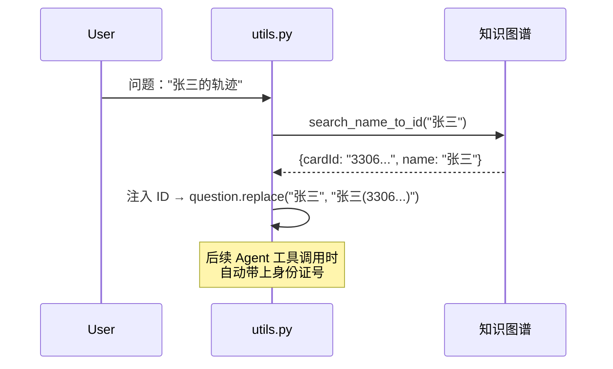

**这个机制涉及三个环节**：

1. **`do_guide_interaction` 阶段**：通过知识图谱查询，将问题中的人名替换为"姓名(身份证号)"的格式，如"张三"→"张三(330621199911110011)"
2. **`serialize_messages.py` 中的 `get_name2cardId_map_from_chat_history`**：从历史消息的 SystemMessage 中提取已出现的身份映射，维护一个 `cardId → name` 的映射表
3. **`SchedulerAgentExecutor._post_process_plugin_kg_input`**：在调用知识图谱工具前，检查工具输入中是否有已知的名称，如果有则补上对应的 ID

**为什么不在主流程中一次性做完？** 因为 ID 映射信息可能随着对话的进行而动态增加（比如用户在后续对话中提到了另一个人名），所以需要在多个环节都进行处理。

---

## 1.7 关键设计模式

### 1.7.1 管线模式 — 确定性编排 + 短路返回

请求处理被组织为**确定性的线性管线**，各阶段顺序执行，每个阶段都可能"短路"（提前结束）：

```python
# main.py 中的 execute_qa 伪码
stage_1: intent = do_intent_classification(...)
stage_2: guide_status, question = do_guided_interaction(...)
          if guide_status: return  # 短路
stage_3: standalone_question = do_multiturn_rephrase(...)
stage_4: standalone_question, intent = do_rewrite_question(...)
stage_5: if do_upload_file(...): return  # 短路
stage_6: if do_api_calling_by_intent(...): return  # 短路
stage_7: if not is_question_valid(question): return  # 短路
stage_8: dialogue_result = do_agent_dialogue(...)  # 主通路
stage_9: do_question_recommend(...)
```

**为什么用管线模式而不是"每个意图独立处理"？** 因为大部分处理阶段是共用的（意图识别、问题改写等），管线模式避免了代码重复。同时，短路返回确保了"简单问题不走复杂路径"——如果用户只是上传了一个 Excel 文件，就不需要进入 Agent 循环处理。

### 1.7.2 预确定动作优化 — 跳过 LLM 规划

当意图能确定映射到某个工具时，Scheduler 跳过 LLM 的规划步骤，直接创建 `AgentAction` 执行：

```python
# agents/scheduler/base.py:99
if pre_determined_action is None:
    output = self.agent.plan(...)           # LLM 规划——慢但灵活
else:
    output = AgentAction(tool_name, ...)    # 直接执行——快但确定
```

**这个优化有多大的效果？** 每次调用 LLM 规划需要 1-3 秒（取决于模型和服务负载），而直接创建 AgentAction 只需几微秒。对于能预确定意图的请求（布控、轨迹、档案更新等），这一步优化就能节省数秒的响应时间。

**什么情况下会触发？** 当意图在 `INTENT_TO_ENDPOINT_MAP` 中有对应条目时。这个映射表维护了"意图→(工具名, endpoint)"的对应关系。

### 1.7.3 三阶段 Agent 循环 — ReAct 模式

LangChain 标准的 ReAct（Reasoning + Acting）模式的三阶段实现：

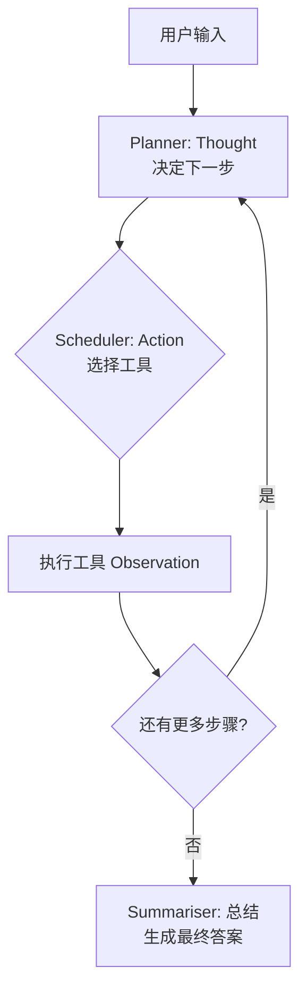

这个循环让 LLM 能够通过"思考→行动→观察"的迭代来逐步解决问题。每次循环：
1. **思考（Thought）**：Planner 分析当前状况，决定下一步行动
2. **行动（Action）**：Scheduler 调用对应的工具（知识图谱查询、数据库查询等）
3. **观察（Observation）**：工具返回结果，作为下一轮思考的输入

循环在以下条件之一满足时结束：
- Planner 返回 `AgentFinish`（表示 LLM 认为已经得到答案）
- 达到 `max_iterations`（默认 1 次）
- 达到 `max_execution_time` 限制

**为什么默认只迭代 1 次（max_iterations=1）？** 这是一个实用的权衡：多轮迭代虽然理论上能处理更复杂的问题，但会线性增加响应时间和 Token 消耗。对于大部分公安场景的问题，单次工具调用已经足够。如果确实需要多轮，可以调整参数。

### 1.7.4 NoOp 客户端的巧用

`NoOpClient` 是一个"不走网络请求的假 LLM"。它有几个巧妙的用途：

1. **模拟流式输出预定义答案**：当系统需要回复固定文案时（如"请确认您要查询哪个张三？"），通过 NoOpClient 逐字输出，让前端的流式展示保持一致的用户体验
2. **"talking" 机制**：在后台处理耗时操作时（如文件上传解析），通过 NoOpClient 输出"正在分析"等状态信息，让用户感知系统正在工作
3. **直接输出结构化数据**：当 LLM 返回的数据已经无需再加工时（如数据库查询结果），通过 NoOpClient 直接输出

---

## 1.8 外部依赖与对接系统

本项目不是一个孤立的系统，它需要与多个外部服务协同工作。下面的架构图展示了所有对接的外部系统：

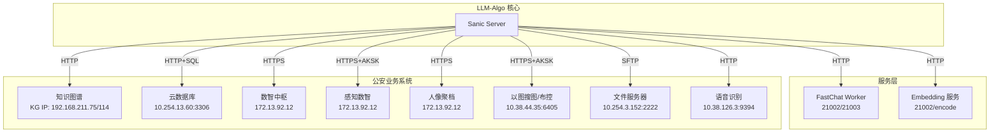

| 系统 | 协议 | 鉴权方式 | 用途 | 调用时机 |
|------|------|----------|------|----------|
| **FastChat Worker** | HTTP | 无（内网） | LLM 推理服务，提供 generate 和 generate_stream 两个端点 | 全部阶段 |
| **Embedding 服务** | HTTP | 无（内网） | 文本向量化，用于意图分类的相似度检索 | 意图分类 |
| **知识图谱 (KG)** | HTTPS | 用户名密码 | 人员/车辆/关系/团伙查询，超级搜索 | Agent 工具调用 |
| **云数据库** | HTTPS + AK/SK | 接口鉴权 | SQL 查询统计分析 | Agent 工具调用 / API 调用 |
| **MySQL** | TCP | 用户名密码 | 统计数据持久化（统计数据源） | 数据库问答链 |
| **数智中枢 (DIC)** | HTTPS | IP 白名单 | 数据类目统计 | Agent 工具调用 |
| **感知数智 (TDI)** | HTTPS + AK/SK | 接口鉴权 | 轨迹查询、地图定位 | 意图分发 |
| **人像聚档 (FVOS)** | HTTPS | 无 | 以图搜档（上传图片搜索档案） | 文件处理 |
| **DP（以图搜图/布控）** | HTTPS + AK/SK | 接口鉴权 | 以图搜图/库、布控执行/撤销/查询 | 意图分发 / 文件处理 |
| **SFTP** | SSH | 用户名密码 | 文件传输（从远程服务器下载用户上传的文件） | 文件处理 |
| **语音识别** | HTTP | 无（内网） | 语音转文字（已关闭，TODO 状态） | 意图识别前 |

**鉴权方式的多样性**：可以看到，不同的外部系统使用的鉴权方式不同——从最简单的无鉴权（内网信任）到 AK/SK（Access Key / Secret Key）、用户名密码、IP 白名单等。这也反映出系统对接的业务系统来自不同的厂商和部门，没有统一的鉴权标准。

---

## 1.9 开发指南

### 1.9.1 如何新增一个意图

系统支持 19 种意图，但实际业务中可能还需要更多。新增一个意图的流程：

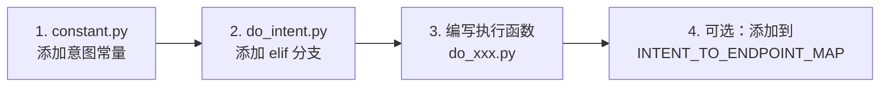

**步骤如下**：

1. **定义意图常量**：在 `utils/constant.py` 中添加 `INTENT_XXX = "xxx"`，同时如果需要状态提示，添加对应的 STATUS_xxx 常量
2. **添加分发分支**：在 `works/do_intent.py` 的 `do_api_calling_by_intent()` 函数中添加 `elif intent == INTENT_XXX:` 分支
3. **编写执行模块**：在 `works/` 目录下创建 `do_xxx.py`，实现具体的业务逻辑
4. **（可选）映射端点**：如果该意图能直接映射到某个工具端点，在 `INTENT_TO_ENDPOINT_MAP` 中添加条目，可以省去 Agent 的 LLM 规划环节

### 1.9.2 如何新增一个工具

如果 Agent 需要调用新的外部系统（如新增一个"电子围栏"系统）：

```mermaid
flowchart LR
    A[1. 实现 Tool 函数] --> B[2. agents/utils/load_xxx_tools.py<br/>注册工具]
    B --> C[3. main.py 中<br/>合并到 tools 列表]
```

**步骤如下**：

1. **实现工具函数**：实现一个接收字符串输入、返回字符串输出的函数。如果是 API 类型的工具，可以在 `plugins/` 下注册新插件，使用 `PluginExecutor` 来管理
2. **注册加载器**：在 `agents/utils/` 下创建（或修改）`load_xxx_tools.py`，将工具函数封装为 `Tool` 对象
3. **合并到主流程**：在 `main.py` 的 `execute_qa()` 中，将新工具合并到 `tools` 列表中（第 210 行），Agent 就能自动识别和使用它

### 1.9.3 本地调试

```bash
python main.py --host 0.0.0.0 --port 2041
```

**可选参数**：
- `--do_audio`：开启语音识别（需要语音服务可用）
- `--do_recommed`：开启问题推荐（每次回答后追加 3 个推荐问题）

**调试技巧**：
- 设置 `verbose=True`（各 Chain 和 Agent 默认开启），可以在控制台看到详细的 LLM 输入输出日志
- `StdOutCallbackHandler` 用绿色高亮显示关键日志，方便区分
- 如果不需要真实的 LLM 服务，可以用 NoOpClient 模拟输出（适合前端联调）

### 1.9.4 常见扩展点速查

| 场景 | 需要修改哪些文件 |
|------|------------------|
| **新增意图** | `utils/constant.py` + `works/do_intent.py` |
| **新增外部系统** | `config/serving_addr_config.py` + 编写的对接模块 |
| **调整 LLM 参数** | `config/model_config.py`（按场景区分 temperature 等） |
| **新增 Chain** | `chains/xxx/` 新建模块，在对应的 `works/` 中调用 |
| **新增 Agent 工具** | `agents/utils/load_xxx_tools.py` 或 `plugins/` 新建插件 |
| **修改前端展示文案** | `utils/constant.py` 的 STATUS_xxx 常量 |
| **调整 Sanic 服务参数** | `config/resource_config.py`（workers、timeout 等） |
| **新增引导交互逻辑** | `works/do_guide_interact.py` |

---

## 1.10 附录：关键数据流全景图

以下全景图整合了所有模块之间的数据流向，可以作为理解整个系统的"地图"：

```mermaid
graph TB
    %% 客户端
    Client[客户端] -->|POST /qa| Sanic

    %% Sanic 主入口
    subgraph Sanic [Web 服务层]
        Sanic[Sanic Server]
        QC[请求解析]
        LC[LLM 客户端初始化]
        SSE[SSE 流式输出]
    end
    Sanic --> QC
    QC --> LC
    QC --> SSE

    %% 管线执行
    subgraph Pipeline [编排管线 - execute_qa]
        direction TB
        IC[意图分类<br/>IntentionDetectChain]
        GI[引导交互<br/>do_guide_interaction]
        MR[多轮改写<br/>do_multiturn_rephrase]
        QR[问题改写<br/>do_question_rewrite]
        FU[文件处理<br/>do_upload_file]
        AP[API 调用分发<br/>do_api_calling_by_intent]
        QV[问题校验]
        AG[Agent 对话<br/>do_agent_dialogue]
        QREC[问题推荐<br/>do_question_recommend]
    end
    LC --> IC
    IC --> GI --> MR --> QR
    QR --> FU --> AP --> QV --> AG --> QREC

    %% Agent 系统
    subgraph AgentSystem [Agent 智能体系统]
        direction TB
        PL[PlannerAgent<br/>规划]
        SCH[SchedulerAgentExecutor<br/>调度循环]
        SU[SummariserAgent<br/>总结]
    end
    AG --> PL --> SCH --> SU

    %% 工具集
    subgraph Tools [工具集]
        KG[kg 知识图谱]
        SQL[db_sql 数据库]
        EXCEL[chat_excel Excel]
        DIC[dic 数智中枢]
    end
    SCH --> KG
    SCH --> SQL
    SCH --> EXCEL
    SCH --> DIC

    %% 回调流
    subgraph Callback [流式回调]
        CB[StreamingCallbackHandler]
        QUEUE[Queue]
    end
    IC --> CB
    GI --> CB
    AG --> CB
    CB --> QUEUE
    SSE -->|轮询| QUEUE

    %% 最终输出
    SU -->|reply| SSE
    Client <-->|SSE Event Stream| SSE
```

---

> **阅读建议**：如果你是第一次接触这个项目，建议按以下顺序阅读：
> 1. 先看 **第 1 节（系统总览）**，了解系统是做什么的、分几层
> 2. 然后看 **第 3 节（核心流程）**，理解一次请求的完整生命周期
> 3. 再看 **第 4.1-4.3 节**，了解 Web 服务、LLM 客户端和编排层
> 4. 最后按需阅读 **第 4.4-4.8 节** 和 **第 6 节（设计模式）**，深入理解各模块的实现细节
