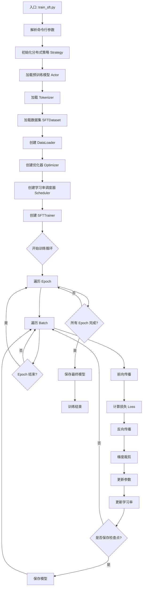
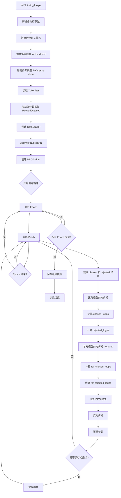

# 1 OpenRLHF 流程图与代码调用关系详解

## 1.1 📊 目录

1. [SFT（监督微调）流程](#sft-流程)
2. [DPO（直接偏好优化）流程](#dpo-流程)
3. [PPO（近端策略优化）流程](#ppo-流程)
4. [SFT vs DPO 对比](#sft-vs-dpo-对比)
5. [完整调用链路](#完整调用链路)

---

## 1.2 SFT 流程

### 1.2.1 SFT 训练流程图



### 1.2.2 SFT 代码调用关系

```
train_sft.py (主入口)
│
├─ get_strategy() ──────────────────► openrlhf/utils/strategy.py
│   └─ DeepSpeedStrategy
│       ├─ setup_distributed()        # 初始化分布式环境
│       ├─ create_optimizer()         # 创建优化器
│       └─ prepare()                  # 准备模型、优化器
│
├─ Actor() ─────────────────────────► openrlhf/models/actor.py
│   ├─ AutoModelForCausalLM          # HuggingFace 基座模型
│   └─ LoRA (可选)                   # peft.get_peft_model
│
├─ get_tokenizer() ─────────────────► openrlhf/utils/utils.py
│   └─ AutoTokenizer
│
├─ blending_datasets() ─────────────► openrlhf/datasets/utils.py
│   └─ load_dataset()                # 加载数据
│
├─ SFTDataset() ────────────────────► openrlhf/datasets/sft_dataset.py
│   ├─ __init__()
│   │   ├─ 处理数据格式
│   │   └─ 应用模板
│   ├─ __getitem__()
│   │   ├─ tokenizer.encode()
│   │   └─ 生成 input_ids, labels
│   └─ collate_fn()                  # 批处理函数
│       ├─ padding
│       └─ 生成 attention_mask
│
└─ SFTTrainer() ────────────────────► openrlhf/trainer/sft_trainer.py
    ├─ __init__()
    │   ├─ 保存模型、优化器、数据加载器
    │   └─ 初始化日志记录器（WandB/TensorBoard）
    │
    └─ fit()                          # 主训练循环
        ├─ for epoch in range(max_epochs):
        │   └─ for batch in train_dataloader:
        │       ├─ forward()           # 前向传播
        │       │   └─ model(input_ids, labels=labels)
        │       │       └─ outputs.loss  # 交叉熵损失
        │       │
        │       ├─ backward()          # 反向传播
        │       │   └─ strategy.backward(loss)
        │       │       └─ DeepSpeed 反向传播
        │       │
        │       ├─ optimizer_step()    # 更新参数
        │       │   ├─ clip_grad_norm()  # 梯度裁剪
        │       │   └─ optimizer.step()
        │       │
        │       └─ scheduler.step()    # 更新学习率
        │
        ├─ save_checkpoint()          # 保存检查点
        │   ├─ strategy.save_ckpt()   # DeepSpeed 格式
        │   └─ save_hf_ckpt() (可选)  # HuggingFace 格式
        │
        └─ evaluate() (可选)          # 评估
            └─ 与训练循环类似，但不更新参数
```

### 1.2.3 SFT 数据流

```
原始数据 (JSON/JSONL)
│
├─ 格式示例:
│   {
│     "question": "什么是深度学习？",
│     "response": "深度学习是机器学习的一个分支..."
│   }
│
↓
SFTDataset.__getitem__()
│
├─ 应用模板:
│   input_text = "User: 什么是深度学习？\nAssistant: "
│   output_text = "深度学习是机器学习的一个分支..."
│
├─ Tokenize:
│   input_ids = tokenizer.encode(input_text + output_text)
│   # [1, 2564, 235265, 2516, 603, 5271, 6044, 235336, ...]
│
└─ 生成 Labels:
    labels = input_ids.copy()
    labels[:len(prompt_ids)] = -100  # 忽略 prompt 部分的损失
    # [-100, -100, -100, ..., 5271, 6044, 235336, ...]
│
↓
collate_fn() (批处理)
│
├─ Padding:
│   将不同长度的序列填充到相同长度
│   input_ids: [batch_size, max_len]
│   labels: [batch_size, max_len]
│
└─ 生成 Attention Mask:
    attention_mask: [batch_size, max_len]
    # 1 表示有效 token，0 表示 padding
│
↓
模型前向传播
│
├─ Embedding 层:
│   embeddings = model.embed_tokens(input_ids)
│
├─ Transformer 层:
│   hidden_states = transformer_layers(embeddings, attention_mask)
│
├─ LM Head:
│   logits = lm_head(hidden_states)
│   # [batch_size, max_len, vocab_size]
│
└─ 计算损失:
    loss = CrossEntropyLoss(logits.view(-1, vocab_size), labels.view(-1))
    # 只计算 labels != -100 的位置
```

### 1.2.4 SFT 关键参数

| 参数                   | 作用                | 代码位置                       |
| -------------------- | ----------------- | -------------------------- |
| `--pretrain`         | 基座模型路径            | `Actor.__init__()`         |
| `--dataset`          | 训练数据路径            | `blending_datasets()`      |
| `--input_key`        | 输入字段名             | `SFTDataset.__init__()`    |
| `--output_key`       | 输出字段名             | `SFTDataset.__init__()`    |
| `--max_len`          | 最大序列长度            | `SFTDataset.__getitem__()` |
| `--train_batch_size` | 全局批大小             | `fit()` 循环控制               |
| `--learning_rate`    | 学习率               | `create_optimizer()`       |
| `--zero_stage`       | DeepSpeed ZeRO 级别 | `get_ds_train_config()`    |

---

## 1.3 DPO 流程

### 1.3.1 DPO 训练流程图



### 1.3.2 DPO 代码调用关系

```
train_dpo.py (主入口)
│
├─ get_strategy() ──────────────────► openrlhf/utils/strategy.py
│   └─ DeepSpeedStrategy
│
├─ Actor() (策略模型) ──────────────► openrlhf/models/actor.py
│   └─ 可训练的模型
│
├─ Actor() (参考模型) ──────────────► openrlhf/models/actor.py
│   ├─ ref_offload=True (可选)       # 卸载到 CPU 省显存
│   └─ 固定参数，不参与训练
│
├─ RewardDataset() ─────────────────► openrlhf/datasets/reward_dataset.py
│   ├─ __init__(is_dpo=True)
│   │   └─ 处理偏好数据格式
│   ├─ __getitem__()
│   │   ├─ 生成 chosen_ids, chosen_mask
│   │   └─ 生成 rejected_ids, rejected_mask
│   └─ collate_fn()
│       └─ 批处理 chosen 和 rejected
│
└─ DPOTrainer() ────────────────────► openrlhf/trainer/dpo_trainer.py
    ├─ __init__()
    │   ├─ 保存 model 和 ref_model
    │   └─ 创建 DPOLoss
    │       └─ DPOLoss(beta, label_smoothing, ipo)
    │
    └─ fit()                          # 主训练循环
        └─ for batch in train_dataloader:
            │
            ├─ concatenated_forward()  # 核心函数
            │   │
            │   ├─ 策略模型前向传播:
            │   │   ├─ chosen_logps = model(chosen_ids)
            │   │   └─ rejected_logps = model(rejected_ids)
            │   │
            │   └─ 计算 log probabilities:
            │       ├─ chosen_logps = sum(log P(token | prefix))
            │       └─ rejected_logps = sum(log P(token | prefix))
            │
            ├─ with torch.no_grad():
            │   └─ concatenated_forward(ref_model)
            │       ├─ ref_chosen_logps
            │       └─ ref_rejected_logps
            │
            ├─ loss_fn.compute_loss()  # 计算 DPO 损失
            │   │
            │   │ 公式:
            │   │ π_logratios = chosen_logps - rejected_logps
            │   │ ref_logratios = ref_chosen_logps - ref_rejected_logps
            │   │ logits = β * (π_logratios - ref_logratios)
            │   │ loss = -log(sigmoid(logits))
            │   │
            │   └─ return loss
            │
            ├─ backward()              # 反向传播
            │   └─ strategy.backward(loss)
            │
            └─ optimizer_step()        # 更新策略模型
                └─ 参考模型参数保持不变
```

### 1.3.3 DPO 核心算法

#### 1.3.3.1 DPO 损失函数

**目标函数：**

\[
\mathcal{L}_{\text{DPO}}(\pi_\theta; \pi_{\text{ref}}) = -\mathbb{E}_{(x,y_w,y_l) \sim \mathcal{D}}\left[\log\sigma\left(\beta\log\frac{\pi_\theta(y_w|x)}{\pi_{\text{ref}}(y_w|x)} - \beta\log\frac{\pi_\theta(y_l|x)}{\pi_{\text{ref}}(y_l|x)}\right)\right]
\]

其中：
- \(x\)：提示词（prompt）
- \(y_w\)：更好的回答（chosen）
- \(y_l\)：更差的回答（rejected）
- \(\pi_\theta\)：策略模型（正在训练）
- \(\pi_{\text{ref}}\)：参考模型（固定）
- \(\beta\)：温度参数，控制偏好强度
- \(\sigma\)：sigmoid 函数

**代码实现：**

```python
# openrlhf/models/loss.py
class DPOLoss:
    def compute_loss(self, chosen_logps, rejected_logps, 
                     ref_chosen_logps, ref_rejected_logps):
        # 计算 log 概率比
        pi_logratios = chosen_logps - rejected_logps
        ref_logratios = ref_chosen_logps - ref_rejected_logps
        
        # 计算 logits
        logits = self.beta * (pi_logratios - ref_logratios)
        
        # 计算损失
        if self.ipo:
            # IPO 变体
            loss = (logits - 1 / (2 * self.beta)) ** 2
        else:
            # 标准 DPO
            loss = -F.logsigmoid(logits)
        
        # Label smoothing (可选)
        if self.label_smoothing > 0:
            loss = (1 - self.label_smoothing) * loss + \
                   self.label_smoothing * (-F.logsigmoid(-logits))
        
        return loss.mean()
```

### 1.3.4 DPO 数据流

```
偏好数据 (Preference Data)
│
├─ 格式示例:
│   {
│     "prompt": "解释量子力学",
│     "chosen": "量子力学是物理学的一个分支，研究微观粒子的行为...",
│     "rejected": "量子力学很难，我不太懂"
│   }
│
↓
RewardDataset.__getitem__()
│
├─ 处理 Chosen:
│   chosen_text = prompt + chosen
│   chosen_ids = tokenizer.encode(chosen_text)
│   chosen_mask = attention_mask(chosen_ids)
│
├─ 处理 Rejected:
│   rejected_text = prompt + rejected
│   rejected_ids = tokenizer.encode(rejected_text)
│   rejected_mask = attention_mask(rejected_ids)
│
└─ 记录 prompt 长度:
    prompt_id_len = len(tokenizer.encode(prompt))
│
↓
collate_fn() (批处理)
│
├─ 批量处理:
│   chosen_ids: [batch_size, max_len_chosen]
│   chosen_mask: [batch_size, max_len_chosen]
│   rejected_ids: [batch_size, max_len_rejected]
│   rejected_mask: [batch_size, max_len_rejected]
│   prompt_id_lens: [batch_size]
│
↓
concatenated_forward()
│
├─ 拼接 chosen 和 rejected:
│   all_ids = torch.cat([chosen_ids, rejected_ids], dim=0)
│   # [2*batch_size, max_len]
│
├─ 模型前向传播:
│   logits = model(all_ids)
│   # [2*batch_size, max_len, vocab_size]
│
├─ 计算 log probabilities:
│   log_probs = F.log_softmax(logits, dim=-1)
│   # 只计算 completion 部分（不包括 prompt）
│
├─ 分离 chosen 和 rejected:
│   chosen_logps, rejected_logps = log_probs.chunk(2)
│
└─ 求和得到序列 log 概率:
    chosen_logps = chosen_logps.sum(-1)    # [batch_size]
    rejected_logps = rejected_logps.sum(-1)  # [batch_size]
```

### 1.3.5 DPO vs SFT 关键区别

| 维度 | SFT | DPO |
|------|-----|-----|
| **数据格式** | `{question, response}` | `{prompt, chosen, rejected}` |
| **损失函数** | 交叉熵损失（预测下一个 token） | DPO 偏好损失（比较 chosen vs rejected） |
| **模型数量** | 1 个（训练模型） | 2 个（训练模型 + 参考模型） |
| **训练目标** | 模仿人类回答 | 学习人类偏好 |
| **数据需求** | 问答对 | 偏好对比数据 |
| **计算成本** | 低 | 中（需要额外的参考模型推理） |

---

## 1.4 PPO 流程

### 1.4.1 PPO 训练流程图

```mermaid
graph TD
    A[入口: train_ppo_ray.py] --> B[解析命令行参数]
    B --> C[初始化 Ray 分布式]
    C --> D[创建 vLLM 引擎组]
    D --> E[创建 Actor Model 组]
    E --> F[创建 Critic Model 组]
    F --> G[创建 Reward Model 组]
    G --> H[创建 Reference Model 组]
    H --> I[创建 PPOTrainer]
    I --> J[加载 Prompt 数据集]
    J --> K{开始训练循环}
    K --> L[===== Rollout 阶段 =====]
    L --> M[从 Prompt 数据加载批次]
    M --> N[vLLM 生成回答]
    N --> O[===== 奖励计算阶段 =====]
    O --> P[Reward Model 打分]
    P --> Q[Reference Model 计算 log probs]
    Q --> R[Actor Model 计算 log probs]
    R --> S[计算 KL 散度惩罚]
    S --> T[total_reward = reward - kl_coef * kl]
    T --> U[===== 价值估计阶段 =====]
    U --> V[Critic Model 预测价值]
    V --> W[计算 GAE 优势函数]
    W --> X[===== PPO 更新阶段 =====]
    X --> Y[构造 Experience Buffer]
    Y --> Z[for epoch in ppo_epochs:]
    Z --> AA[采样 mini-batch]
    AA --> AB[计算 Actor Loss]
    AB --> AC[更新 Actor]
    AC --> AD[计算 Critic Loss]
    AD --> AE[更新 Critic]
    AE --> AF{PPO epoch 结束?}
    AF -->|否| AA
    AF -->|是| AG[同步权重到 vLLM]
    AG --> AH{训练结束?}
    AH -->|否| L
    AH -->|是| AI[保存最终模型]
    AI --> AJ[训练结束]
```



### 1.4.2 PPO 代码调用关系（详细版）

```
train_ppo_ray.py (主入口)
│
├─ ray.init() ──────────────────────► 初始化 Ray 集群
│
├─ create_vllm_engines() ───────────► openrlhf/trainer/ray/__init__.py
│   └─ VLLMEngine.remote()
│       ├─ 创建多个 vLLM 引擎
│       └─ 用于加速文本生成
│
├─ RayActorGroup() ─────────────────► openrlhf/trainer/ray/launcher.py
│   │
│   ├─ PolicyModelActor (Actor Model)
│   │   └─ openrlhf/trainer/ray/ppo_actor.py
│   │       ├─ __init__()
│   │       │   ├─ 加载 Actor 模型
│   │       │   └─ 创建优化器
│   │       ├─ append()              # 添加 experience
│   │       └─ ppo_train()           # PPO 更新
│   │
│   ├─ CriticModelActor (Critic Model)
│   │   └─ openrlhf/trainer/ray/ppo_critic.py
│   │       ├─ __init__()
│   │       │   ├─ 加载 Critic 模型
│   │       │   └─ 创建优化器
│   │       ├─ append()
│   │       └─ ppo_train()
│   │
│   ├─ RewardModelActor (Reward Model)
│   │   └─ openrlhf/trainer/ray/launcher.py
│   │       └─ forward()             # 打分，不训练
│   │
│   └─ ReferenceModelActor (Reference Model)
│       └─ openrlhf/trainer/ray/launcher.py
│           └─ forward()             # 计算 log probs，不训练
│
└─ PPOTrainer() ────────────────────► openrlhf/trainer/ppo_trainer.py
    │
    ├─ __init__()
    │   ├─ 保存所有模型组引用
    │   ├─ 创建 KL Controller
    │   └─ 创建 ExperienceMaker
    │
    └─ fit()                          # 主训练循环
        │
        ├─ prepare_datasets()         # 准备数据
        │   └─ PromptDataset
        │
        └─ for prompts in prompts_dataloader:
            │
            ├─ ===== Rollout 阶段 =====
            │   │
            │   ├─ batch_vllm_engine_call()
            │   │   │
            │   │   ├─ vLLM 生成:
            │   │   │   ├─ 输入: prompts
            │   │   │   └─ 输出: sequences (prompt + response)
            │   │   │
            │   │   └─ 如果有 Agent:
            │   │       └─ agent_func(prompts, responses)
            │   │           └─ 自定义奖励计算
            │   │
            │   └─ rollout_samples = {
            │         "prompts": prompts,
            │         "sequences": sequences,
            │         "attention_mask": masks
            │       }
            │
            ├─ train_step(rollout_samples)
            │   │
            │   ├─ ===== Experience 制作 =====
            │   │   │
            │   │   ├─ experience_maker.make_experience_batch()
            │   │   │   │
            │   │   │   ├─ 提取 sequences:
            │   │   │   │   sequences = rollout_samples["sequences"]
            │   │   │   │
            │   │   │   ├─ Reward Model 打分:
            │   │   │   │   rewards = reward_model(sequences)
            │   │   │   │   # [batch_size]
            │   │   │   │
            │   │   │   ├─ Reference Model log probs:
            │   │   │   │   ref_log_probs = ref_model(sequences)
            │   │   │   │   # [batch_size, seq_len]
            │   │   │   │
            │   │   │   ├─ Actor Model log probs:
            │   │   │   │   actor_log_probs = actor_model(sequences)
            │   │   │   │   # [batch_size, seq_len]
            │   │   │   │
            │   │   │   ├─ 计算 KL 散度:
            │   │   │   │   kl = (actor_log_probs - ref_log_probs).sum(-1)
            │   │   │   │   # [batch_size]
            │   │   │   │
            │   │   │   ├─ 总奖励:
            │   │   │   │   total_reward = reward - kl_coef * kl
            │   │   │   │   # [batch_size]
            │   │   │   │
            │   │   │   ├─ Critic 价值估计:
            │   │   │   │   values = critic_model(sequences)
            │   │   │   │   # [batch_size, seq_len]
            │   │   │   │
            │   │   │   ├─ 计算 GAE:
            │   │   │   │   advantages = compute_gae(
            │   │   │   │       rewards=total_reward,
            │   │   │   │       values=values,
            │   │   │   │       gamma=0.99,
            │   │   │   │       lambda=0.95
            │   │   │   │   )
            │   │   │   │   # [batch_size, seq_len]
            │   │   │   │
            │   │   │   └─ 构造 Experience:
            │   │   │       experience = Experience(
            │   │   │           sequences=sequences,
            │   │   │           action_log_probs=actor_log_probs,
            │   │   │           values=values,
            │   │           advantages=advantages,
            │   │           rewards=total_reward
            │   │       )
            │   │
            │   ├─ ===== 分发 Experience =====
            │   │   │
            │   │   ├─ actor_model.append(experience)
            │   │   └─ critic_model.append(experience)
            │   │
            │   ├─ ===== PPO 更新 =====
            │   │   │
            │   │   ├─ ppo_train()
            │   │   │   │
            │   │   │   ├─ Critic 更新:
            │   │   │   │   │
            │   │   │   │   └─ for epoch in range(num_ppo_epochs):
            │   │   │   │       │
            │   │   │   │       ├─ 采样 mini-batch
            │   │   │   │       │
            │   │   │   │       ├─ 计算 Critic Loss:
            │   │   │   │       │   new_values = critic(sequences)
            │   │   │   │       │   returns = advantages + values
            │   │   │   │       │   critic_loss = 0.5 * (new_values - returns)^2
            │   │   │   │       │
            │   │   │   │       ├─ 反向传播:
            │   │   │   │       │   critic_loss.backward()
            │   │   │   │       │
            │   │   │   │       └─ 更新 Critic:
            │   │   │   │           critic_optimizer.step()
            │   │   │   │
            │   │   │   └─ Actor 更新:
            │   │   │       │
            │   │   │       └─ for epoch in range(num_ppo_epochs):
            │   │   │           │
            │   │   │           ├─ 采样 mini-batch
            │   │   │           │
            │   │   │           ├─ 计算新的 log probs:
            │   │   │           │   new_log_probs = actor(sequences)
            │   │   │           │
            │   │   │           ├─ 计算概率比:
            │   │   │           │   ratio = exp(new_log_probs - old_log_probs)
            │   │   │           │
            │   │   │           ├─ 计算 PPO Loss:
            │   │   │           │   loss1 = ratio * advantages
            │   │   │           │   ratio_clip = clip(ratio, 1-ε, 1+ε)
            │   │   │           │   loss2 = ratio_clip * advantages
            │   │   │           │   actor_loss = -min(loss1, loss2).mean()
            │   │   │           │
            │   │   │           ├─ 反向传播:
            │   │   │           │   actor_loss.backward()
            │   │   │           │
            │   │   │           └─ 更新 Actor:
            │   │   │               actor_optimizer.step()
            │   │   │
            │   │   └─ 返回训练状态
            │   │
            │   └─ ===== 同步权重 =====
            │       │
            │       └─ broadcast_to_vllm()
            │           └─ 将 Actor 权重同步到 vLLM 引擎
            │
            └─ 下一个 batch
```

### 1.4.3 PPO 核心算法

#### 1.4.3.1 GAE (Generalized Advantage Estimation)

**优势函数：**

\[
\hat{A}_t = \sum_{l=0}^{\infty} (\gamma\lambda)^l \delta_{t+l}
\]

其中 TD 误差：

\[
\delta_t = r_t + \gamma V(s_{t+1}) - V(s_t)
\]

**代码实现：**

```python
# openrlhf/trainer/ppo_utils/experience_maker.py
def compute_gae(rewards, values, gamma=0.99, lambd=0.95):
    """
    计算广义优势估计 (GAE)
    
    Args:
        rewards: [batch_size, seq_len] 奖励序列
        values: [batch_size, seq_len] 价值预测
        gamma: 折扣因子
        lambd: GAE 参数
    
    Returns:
        advantages: [batch_size, seq_len] 优势函数
    """
    batch_size, seq_len = rewards.shape
    advantages = torch.zeros_like(rewards)
    last_gae = 0
    
    # 从后往前计算
    for t in reversed(range(seq_len)):
        if t == seq_len - 1:
            next_value = 0
        else:
            next_value = values[:, t + 1]
        
        # TD 误差
        delta = rewards[:, t] + gamma * next_value - values[:, t]
        
        # GAE 递推
        advantages[:, t] = last_gae = delta + gamma * lambd * last_gae
    
    return advantages
```

#### 1.4.3.2 PPO Clip Loss

**Actor 损失函数：**

\[
L^{CLIP}(\theta) = \mathbb{E}_t\left[\min\left(r_t(\theta)\hat{A}_t, \text{clip}(r_t(\theta), 1-\epsilon, 1+\epsilon)\hat{A}_t\right)\right]
\]

其中概率比：

\[
r_t(\theta) = \frac{\pi_\theta(a_t|s_t)}{\pi_{\theta_{old}}(a_t|s_t)}
\]

**代码实现：**

```python
# openrlhf/trainer/ray/ppo_actor.py
def compute_actor_loss(self, sequences, old_log_probs, advantages):
    """
    计算 PPO Actor 损失
    
    Args:
        sequences: [batch_size, seq_len] 序列
        old_log_probs: [batch_size, seq_len] 旧策略 log 概率
        advantages: [batch_size, seq_len] 优势函数
    """
    # 新策略 log 概率
    new_log_probs = self.model.forward_actor(sequences)
    
    # 概率比
    ratio = torch.exp(new_log_probs - old_log_probs)
    
    # PPO Clip
    clip_ratio = torch.clamp(
        ratio, 
        1 - self.clip_range_ratio,  # 默认 0.2
        1 + self.clip_range_ratio
    )
    
    # 计算两个损失
    loss1 = ratio * advantages
    loss2 = clip_ratio * advantages
    
    # 取最小值并取负（因为要最大化）
    actor_loss = -torch.min(loss1, loss2).mean()
    
    return actor_loss
```

**Critic 损失函数：**

\[
L^{V}(\theta) = \mathbb{E}_t\left[(V_\theta(s_t) - V_t^{target})^2\right]
\]

其中目标价值：

\[
V_t^{target} = \hat{A}_t + V_{\theta_{old}}(s_t)
\]

**代码实现：**

```python
# openrlhf/trainer/ray/ppo_critic.py
def compute_critic_loss(self, sequences, old_values, advantages):
    """
    计算 Critic 损失
    """
    # 新价值预测
    new_values = self.model.forward_critic(sequences)
    
    # 目标价值 = 优势 + 旧价值
    returns = advantages + old_values
    
    # Value Clipping (可选)
    if self.clip_range_value > 0:
        values_clipped = torch.clamp(
            new_values,
            old_values - self.clip_range_value,
            old_values + self.clip_range_value
        )
        loss1 = (new_values - returns) ** 2
        loss2 = (values_clipped - returns) ** 2
        critic_loss = 0.5 * torch.max(loss1, loss2).mean()
    else:
        critic_loss = 0.5 * ((new_values - returns) ** 2).mean()
    
    return critic_loss
```

### 1.4.4 PPO 数据流

```
Prompt 数据
│
├─ 格式示例:
│   {"prompt": "写一首关于春天的诗"}
│
↓
===== Rollout 阶段 =====
│
├─ vLLM 生成:
│   input: "写一首关于春天的诗"
│   output: "春风吹拂柳丝长，万物复苏绿意扬..."
│   sequences: prompt + output (tokenized)
│
↓
===== 奖励计算 =====
│
├─ Reward Model:
│   reward = reward_model(sequences)
│   # 例如: reward = 0.85
│
├─ Reference Model:
│   ref_log_probs = ref_model(sequences)
│   # [seq_len] 每个 token 的 log 概率
│
├─ Actor Model:
│   actor_log_probs = actor_model(sequences)
│
├─ KL 散度:
│   kl = sum(actor_log_probs - ref_log_probs)
│   # 例如: kl = 0.15
│
└─ 总奖励:
    total_reward = 0.85 - 0.01 * 0.15 = 0.8485
│
↓
===== 价值估计 =====
│
├─ Critic Model:
│   values = critic_model(sequences)
│   # [seq_len] 每个位置的价值预测
│
└─ GAE 计算:
    advantages = compute_gae(total_reward, values)
    # [seq_len] 每个位置的优势
│
↓
===== Experience Buffer =====
│
Experience = {
    sequences: [batch_size, seq_len],
    action_log_probs: [batch_size, seq_len],
    values: [batch_size, seq_len],
    advantages: [batch_size, seq_len],
    rewards: [batch_size]
}
│
↓
===== PPO 更新 (多轮) =====
│
for epoch in range(4):  # 通常 4-8 轮
    │
    ├─ 采样 mini-batch
    │
    ├─ 更新 Critic:
    │   new_values = critic(sequences)
    │   returns = advantages + old_values
    │   loss = 0.5 * (new_values - returns)^2
    │   backward & update
    │
    └─ 更新 Actor:
        new_log_probs = actor(sequences)
        ratio = exp(new_log_probs - old_log_probs)
        loss = -min(ratio * adv, clip(ratio, 1±ε) * adv)
        backward & update
│
↓
===== 权重同步 =====
│
└─ 将更新后的 Actor 权重同步到 vLLM
```

---

## 1.5 SFT vs DPO 对比

### 1.5.1 完整对比表

| 维度 | SFT | DPO | PPO |
|------|-----|-----|-----|
| **训练阶段** | 第一步 | 第二步（可替代 RM + PPO） | 第三步 |
| **数据格式** | `{input, output}` | `{prompt, chosen, rejected}` | `{prompt}` |
| **模型数量** | 1 个 | 2 个 | 4 个 |
| **损失函数** | 交叉熵 | DPO 偏好损失 | PPO Clip 损失 |
| **训练目标** | 模仿回答 | 学习偏好 | 最大化奖励 |
| **是否需要 RM** | 否 | 否 | 是 |
| **计算复杂度** | 低 | 中 | 高 |
| **显存需求** | 低 | 中 | 高 |
| **训练稳定性** | 高 | 高 | 中 |
| **效果上限** | 中 | 高 | 最高 |
| **适用场景** | 基础对话能力 | 偏好对齐 | 复杂任务优化 |

### 1.5.2 数据需求对比

```
SFT 数据:
{
  "question": "什么是人工智能？",
  "response": "人工智能是..."
}
数据量: 10K - 100K

DPO 数据:
{
  "prompt": "什么是人工智能？",
  "chosen": "人工智能是计算机科学的一个分支...",
  "rejected": "不知道"
}
数据量: 50K - 200K

PPO 数据:
{
  "prompt": "什么是人工智能？"
}
数据量: 10K - 50K
(不需要 response，模型自己生成)
```

### 1.5.3 训练流程对比

```
SFT 流程:
数据 → 模型 → 损失 → 更新
(单模型，简单直接)

DPO 流程:
偏好数据 → 策略模型 + 参考模型 → 对比损失 → 更新策略模型
(双模型，稳定高效)

PPO 流程:
提示 → vLLM 生成 → 奖励模型打分 → Actor+Critic 更新
(四模型，复杂强大)
```

---

## 1.6 完整调用链路

### 1.6.1 模块依赖关系

```
openrlhf/
│
├─ cli/                     # 入口点
│   ├─ train_sft.py        ────┐
│   ├─ train_dpo.py        ────┤
│   └─ train_ppo_ray.py    ────┤
│                               │
├─ models/                  # 模型定义
│   ├─ actor.py            ◄───┤
│   ├─ critic.py           ◄───┤
│   ├─ reward_model.py     ◄───┤
│   └─ loss.py             ◄───┤
│                               │
├─ datasets/                # 数据处理
│   ├─ sft_dataset.py      ◄───┤
│   ├─ reward_dataset.py   ◄───┤
│   └─ prompts_dataset.py  ◄───┤
│                               │
├─ trainer/                 # 训练器
│   ├─ sft_trainer.py      ◄───┤
│   ├─ dpo_trainer.py      ◄───┤
│   ├─ ppo_trainer.py      ◄───┤
│   │                           │
│   ├─ ray/                # Ray 分布式
│   │   ├─ launcher.py     ◄───┤
│   │   ├─ ppo_actor.py    ◄───┤
│   │   ├─ ppo_critic.py   ◄───┤
│   │   └─ vllm_engine.py  ◄───┤
│   │                           │
│   └─ ppo_utils/          # PPO 工具
│       ├─ experience_maker.py  │
│       ├─ kl_controller.py     │
│       └─ replay_buffer.py     │
│                               │
└─ utils/                   # 工具函数
    ├─ strategy.py         ◄───┘
    ├─ distributed_sampler.py
    └─ utils.py
```

### 1.6.2 关键类的继承关系

```
torch.nn.Module
    │
    ├─ Actor
    │   ├─ AutoModelForCausalLM (HuggingFace)
    │   └─ LoRA Wrapper (可选)
    │
    ├─ Critic
    │   └─ AutoModel + Value Head
    │
    └─ RewardModel
        └─ AutoModel + Reward Head

DeepspeedStrategy
    ├─ setup_distributed()
    ├─ create_optimizer()
    ├─ prepare()
    └─ backward()

BaseTrainer (ABC)
    ├─ SFTTrainer
    ├─ DPOTrainer
    └─ PPOTrainer

Ray Actor
    ├─ PolicyModelActor
    ├─ CriticModelActor
    ├─ RewardModelActor
    └─ ReferenceModelActor
```

### 1.6.3 函数调用层次

```
# SFT 调用栈
main()
└─ train()
   ├─ get_strategy()
   ├─ Actor()
   ├─ SFTDataset()
   └─ SFTTrainer.fit()
       └─ for batch in dataloader:
           ├─ model.forward()
           ├─ strategy.backward()
           └─ optimizer.step()

# DPO 调用栈
main()
└─ train()
   ├─ get_strategy()
   ├─ Actor() × 2  # 策略 + 参考
   ├─ RewardDataset()
   └─ DPOTrainer.fit()
       └─ for batch in dataloader:
           ├─ concatenated_forward(model)
           ├─ concatenated_forward(ref_model)
           ├─ DPOLoss.compute_loss()
           └─ strategy.backward()

# PPO 调用栈
main()
└─ train()
   ├─ ray.init()
   ├─ create_vllm_engines()
   ├─ RayActorGroup() × 4  # Actor, Critic, Reward, Ref
   └─ PPOTrainer.fit()
       └─ for prompts in dataloader:
           ├─ vllm.generate()
           ├─ experience_maker.make_experience()
           │   ├─ reward_model.forward()
           │   ├─ critic_model.forward()
           │   └─ compute_gae()
           ├─ actor.ppo_train()
           ├─ critic.ppo_train()
           └─ broadcast_to_vllm()
```

---

## 1.7 关键文件速查表

### 1.7.1 入口文件

| 文件 | 作用 | 关键函数 |
|------|------|----------|
| `cli/train_sft.py` | SFT 训练入口 | `train()` |
| `cli/train_dpo.py` | DPO 训练入口 | `train()` |
| `cli/train_ppo_ray.py` | PPO 训练入口 | `train()` |
| `cli/train_rm.py` | RM 训练入口 | `train()` |

### 1.7.2 核心模型

| 文件 | 作用 | 关键类 |
|------|------|--------|
| `models/actor.py` | Actor 模型 | `Actor` |
| `models/critic.py` | Critic 模型 | `Critic` |
| `models/reward_model.py` | Reward 模型 | `RewardModel` |
| `models/loss.py` | 损失函数 | `DPOLoss`, `GPTLMLoss` |

### 1.7.3 训练器

| 文件 | 作用 | 关键类/函数 |
|------|------|-------------|
| `trainer/sft_trainer.py` | SFT 训练器 | `SFTTrainer` |
| `trainer/dpo_trainer.py` | DPO 训练器 | `DPOTrainer` |
| `trainer/ppo_trainer.py` | PPO 训练器 | `PPOTrainer` |
| `trainer/ray/ppo_actor.py` | PPO Actor | `PolicyModelActor` |
| `trainer/ray/ppo_critic.py` | PPO Critic | `CriticModelActor` |

### 1.7.4 数据集

| 文件 | 作用 | 关键类 |
|------|------|--------|
| `datasets/sft_dataset.py` | SFT 数据集 | `SFTDataset` |
| `datasets/reward_dataset.py` | 偏好数据集 | `RewardDataset` |
| `datasets/prompts_dataset.py` | Prompt 数据集 | `PromptDataset` |

### 1.7.5 工具函数

| 文件 | 作用 | 关键函数 |
|------|------|----------|
| `utils/strategy.py` | 分布式策略 | `get_strategy()` |
| `utils/utils.py` | 通用工具 | `get_tokenizer()` |
| `trainer/ppo_utils/experience_maker.py` | Experience 制作 | `make_experience_batch()` |
| `trainer/ppo_utils/kl_controller.py` | KL 控制器 | `AdaptiveKLController` |

---

## 1.8 调试技巧

### 1.8.1 如何追踪代码执行

**方法 1：添加打印语句**
```python
# 在关键位置添加 print
print(f"[DEBUG] sequences shape: {sequences.shape}")
print(f"[DEBUG] reward: {reward.mean().item()}")
```

**方法 2：使用断点调试**
```python
# 在需要的地方添加
import pdb; pdb.set_trace()
```

**方法 3：启用详细日志**
```bash
export NCCL_DEBUG=INFO  # DeepSpeed 日志
export RAY_LOG_LEVEL=debug  # Ray 日志
```

### 1.8.2 常见调试位置

```python
# SFT 调试点
# 1. 数据加载
datasets/sft_dataset.py:__getitem__()  # 检查数据格式

# 2. 模型前向
trainer/sft_trainer.py:fit()  # 检查 loss 值

# 3. 梯度更新
utils/strategy.py:backward()  # 检查梯度

# DPO 调试点
# 1. 偏好数据
datasets/reward_dataset.py:__getitem__()  # 检查 chosen/rejected

# 2. DPO 损失
trainer/dpo_trainer.py:concatenated_forward()  # 检查 logps

# PPO 调试点
# 1. 生成质量
trainer/ray/vllm_engine.py:generate()  # 检查生成文本

# 2. 奖励计算
trainer/ppo_utils/experience_maker.py:make_experience_batch()  # 检查 reward

# 3. PPO 更新
trainer/ray/ppo_actor.py:ppo_train()  # 检查 loss
```

---

## 1.9 总结

### 1.9.1 选择哪种训练方法？

```
场景 1: 从零开始训练聊天模型
推荐: SFT
理由: 简单、稳定、成本低

场景 2: 已有 SFT 模型，想对齐人类偏好
推荐: DPO
理由: 不需要 RM，比 PPO 简单，效果接近

场景 3: 需要最佳效果，有充足资源
推荐: PPO
理由: 效果最好，但复杂度高

场景 4: 特定任务优化（如代码生成）
推荐: PPO + 自定义奖励函数
理由: 可以精确控制优化目标
```

### 1.9.2 完整训练流水线

```
步骤 1: SFT (1-3 天)
数据: 10K-100K 问答对
目标: 基础对话能力
命令: bash train_sft.sh

步骤 2: RM (可选, 1-2 天)
数据: 50K-200K 偏好对
目标: 训练奖励模型
命令: bash train_rm.sh

步骤 3a: DPO (2-4 天)
OR
步骤 3b: PPO (3-7 天)

数据: 偏好对 (DPO) 或 提示词 (PPO)
目标: 偏好对齐
命令: bash train_dpo.sh 或 bash train_ppo.sh
```

### 1.9.3 关键要点

✅ **SFT**：简单直接，适合打基础
✅ **DPO**：稳定高效，适合快速迭代
✅ **PPO**：效果最强，适合追求极致

🔧 **调试建议**：先在小数据集和小模型上验证流程

📊 **监控指标**：loss、reward、KL、生成质量

🚀 **优化方向**：LoRA、梯度检查点、混合精度

---

希望这份文档能帮助你完全理解 OpenRLHF 的代码结构和执行流程！
