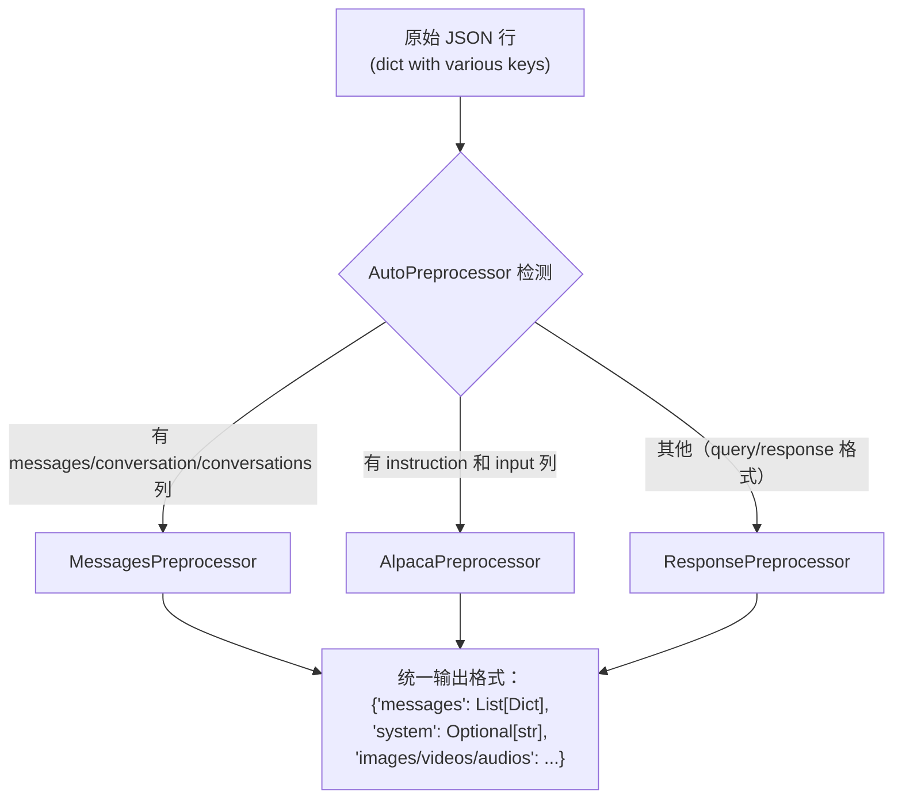
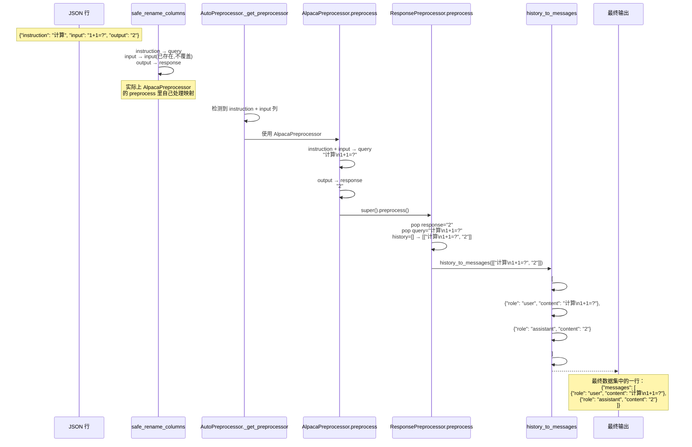
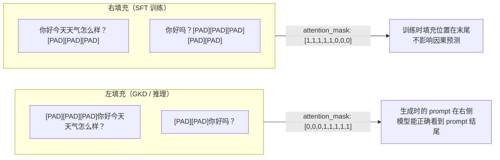
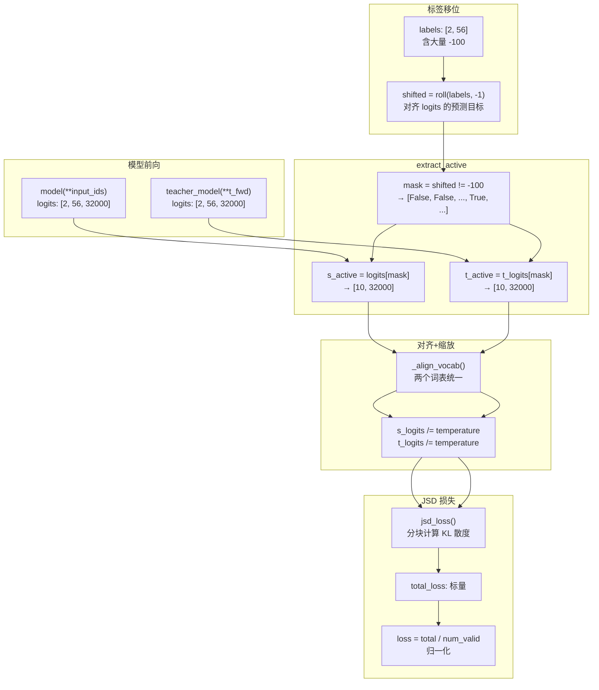
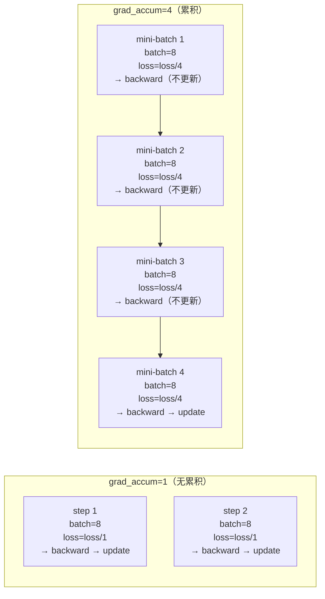
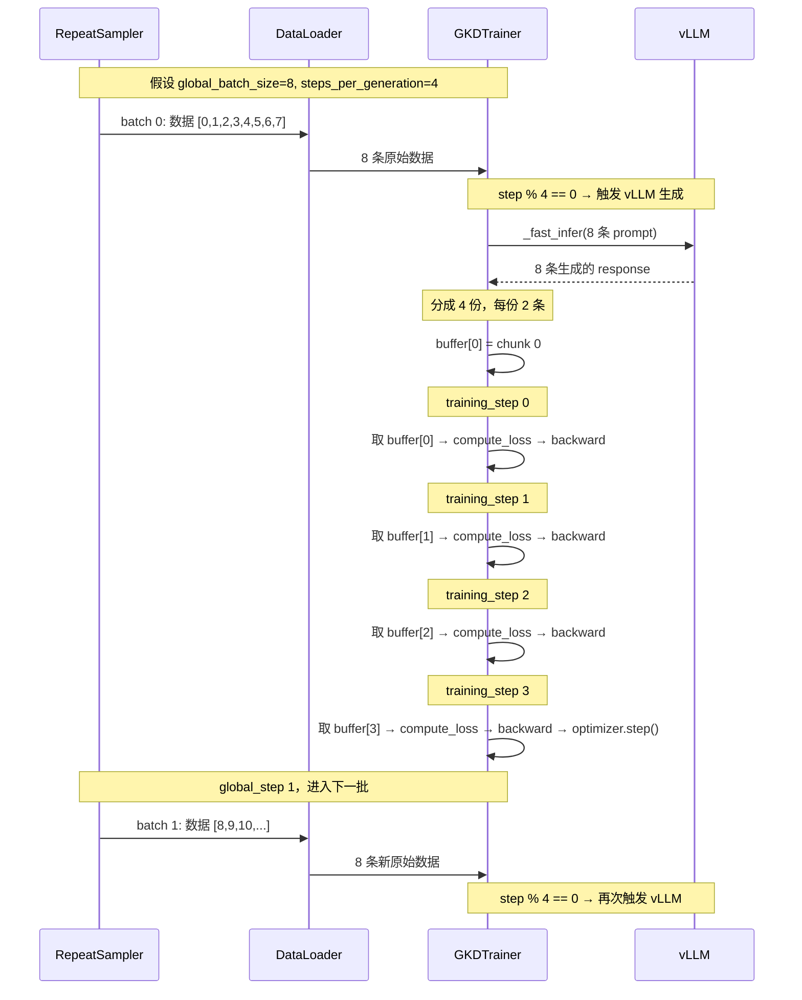
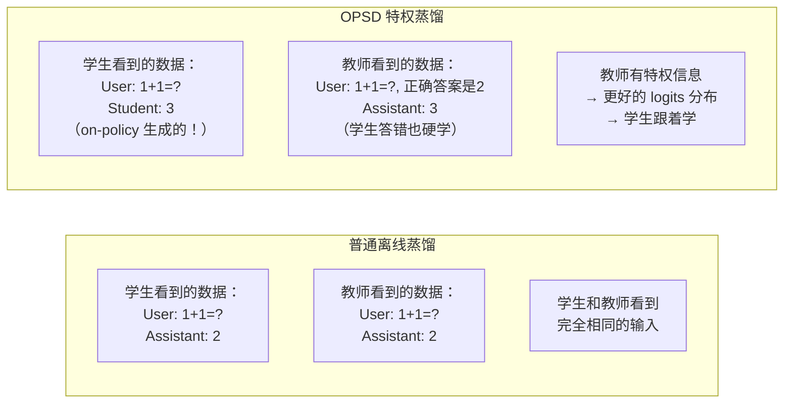

# 离线蒸馏训练流程全面梳理（进阶版）

> 本文从 **离线蒸馏训练脚本** 的视角出发，假设已有本地 JSON 格式数据集 `train.jsonl`，通过 `swift rlhf --rlhf_type gkd --dataset train.jsonl --model Qwen-7B --teacher_model Qwen-14B --lmbda 0` 启动。
>
> **目标**：追踪一条 JSON 数据行从磁盘文件到 GPU 参与损失计算的完整路径，把「掩码」、「对齐」、「标签移位」等晦涩概念讲清楚。

---

## 第一章：数据入场——JSON 如何变成 HuggingFace Dataset

### 1.1 数据加载入口

调用链：

```
SwiftSft._get_dataset()                              (sft.py:78)
  └─ args.load_dataset()                             (base_args.py:347)
       └─ load_dataset(['train.jsonl'], ...)          (loader.py:216)
```

`args.load_dataset()` 内部调用 `swift/dataset/loader.py` 的 `load_dataset()` 函数。

### 1.2 DatasetSyntax 解析

第一步，每个 dataset 名称字符串被解析为 `DatasetSyntax` 对象。

**代码位置**：`swift/dataset/dataset_syntax.py:20`

```python
@dataclass
class DatasetSyntax:
    dataset_type: Literal['path', 'repo']
    dataset_name: str
    subset: str = ''
    sample: int = -1
    hf_token: Optional[str] = None
    # ...
```

**解析规则**（`parse()` 方法，~line 56）：格式 `[hf|ms::]路径[:子集][#采样数]`

- `train.jsonl` → `dataset_type='path'`, `dataset_name='train.jsonl'`
- `hf::AI-ModelScope/alpaca-gpt4-data-zh#500` → `dataset_type='repo'`, 采样 500 条
- `my_dataset:subset_a/subset_b` → 数据集 + 子集

**判断逻辑**：如果路径在本地存在（`os.path.exists`），则 `dataset_type='path'`，否则 `dataset_type='repo'`。

### 1.3 DatasetLoader._load_dataset_path——读取本地 JSON

**代码位置**：`swift/dataset/loader.py:45-68`

```python
def _load_dataset_path(self, dataset_path, dataset_meta):
    # 1. 判断文件类型
    file_type = 'json' if dataset_path.endswith('.jsonl') else \
                'text' if dataset_path.endswith('.txt') else \
                os.path.splitext(dataset_path)[1].lstrip('.')
    
    # 2. 使用 HuggingFace datasets 库读取
    dataset = hf_load_dataset(
        file_type, 
        data_files=dataset_path,
        split='train',
        # ...
    )
    
    # 3. 应用预处理器
    dataset = dataset_meta.preprocess_func(
        dataset,
        num_proc=self.num_proc,
        load_from_cache_file=self.load_from_cache_file,
        strict=self.strict,
        enable_auto_mapping=not self.disable_auto_column_mapping,
    )
    
    # 4. 移除无用列
    dataset = RowPreprocessor.remove_useless_columns(dataset)
    
    return dataset
```

**关键理解**：HuggingFace `datasets.load_dataset('json', data_files='train.jsonl')` 把 JSON 文件的每一行解析成一个 `dict`，所有行组成一个 `datasets.arrow_dataset.Dataset` 对象。此时数据的格式完全取决于你的 JSON 结构。

**示例**：假设你的 `train.jsonl` 内容如下：

```jsonl
{"instruction": "1+1=?", "input": "", "output": "2"}
{"instruction": "2+2=?", "input": "", "output": "4"}
```

此时 HF Dataset 的结构是：
```
Dataset({
    features: ['instruction', 'input', 'output'],
    num_rows: 2
})
```

每一行是 `{'instruction': '1+1=?', 'input': '', 'output': '2'}`。

### 1.4 safe_rename_columns——列名规范化

**代码位置**：`swift/dataset/preprocessor/core.py:220-237`

在调用 `preprocess_func` 之前，会执行列名重命名：

```python
# loader.py:58-59
dataset = RowPreprocessor.safe_rename_columns(dataset, self.columns)
```

其中 `self.columns` 来自用户指定的 `--columns` 参数（可选）。之后在 `AutoPreprocessor.__call__` 内部（`core.py:566`），还有第二波重命名：

```python
dataset = RowPreprocessor.safe_rename_columns(dataset, self.columns)
```

这个 `self.columns` 是预处理器自己的默认映射。不同预处理器有不同的映射表。

> **重要**：`safe_rename_columns` 的核心逻辑是**不覆盖已有列**。即如果目标列已经存在，则跳过。

---

## 第二章：AutoPreprocessor——数据格式自动检测与标准化

### 2.1 自动检测算法

**代码位置**：`swift/dataset/preprocessor/core.py:543-568`

```python
class AutoPreprocessor:
    def _get_preprocessor(self, dataset):
        features = dataset.features  # 获取数据集的列名
        
        # 优先级 1：有 conversation/conversations/messages 列 → MessagesPreprocessor
        for key in ['conversation', 'conversations', 'messages']:
            if key in features:
                return MessagesPreprocessor(**self.kwargs)
        
        # 优先级 2：同时有 instruction 和 input 列 → AlpacaPreprocessor
        if 'instruction' in features and 'input' in features:
            return AlpacaPreprocessor(**self.kwargs)
        
        # 优先级 3：其他 → ResponsePreprocessor
        return ResponsePreprocessor(**self.kwargs)
```

**三种支持的数据格式：**



### 2.2 MessagesPreprocessor——最常见路径（messages 格式）

**代码位置**：`swift/dataset/preprocessor/core.py:433-532`

输入的 JSON 格式示例：

```json
{
  "messages": [
    {"role": "user", "content": "1+1=?"},
    {"role": "assistant", "content": "2"}
  ]
}
```

**处理流程：**

```
Step 1: 处理 rejected_messages（如果有的话）
Step 2: 修复 messages 字段（如果是 JSON 字符串则反序列化）
Step 3: 规范化 key 名称
         ├─ 'from' → 'role'
         └─ 'value' → 'content'
Step 4: 检测是否为 ShareGPT 格式
         ├─ 判断：如果消息 dict 没有 'role' 或 'content' key → ShareGPT
         └─ ShareGPT 格式：{"user": "hi", "assistant": "hello"}
               ↓ 展开为
              [{"role": "user", "content": "hi"}, {"role": "assistant", "content": "hello"}]
Step 5: 规范化角色名（to_std_messages）
         ├─ 'human' → 'user'
         ├─ 'gpt', 'bot' → 'assistant'
         ├─ 'function_call' → 'tool_call'
         └─ 'observation' → 'tool_response'
Step 6: 注入 system 消息（如果指定了 system 参数）
```

#### 完整代码（规范化的核心）：

```python
# core.py:491-505 — to_std_messages
def to_std_messages(self, messages, system):
    if messages[0]['role'] == self.system_role:
        messages[0]['role'] = 'system'
    elif system is not None:
        messages.insert(0, {'role': 'system', 'content': system})
    
    for message in messages:
        role = message['role']
        if role in self.user_roles:           # 'human' -> 'user'
            message['role'] = 'user'
        elif role in self.assistant_roles:     # 'gpt', 'bot' -> 'assistant'
            message['role'] = 'assistant'
        elif role.replace('-', '_') in self.tool_call_roles:
            message['role'] = 'tool_call'
```

#### ShareGPT 格式处理：

```python
# core.py:478-489 — sharegpt_to_messages
def sharegpt_to_messages(self, messages, system):
    """
    输入：[{"from": "user", "value": "hi"}, {"from": "assistant", "value": "hello"}]
              ↓
    输出：[{"role": "user", "content": "hi"}, {"role": "assistant", "content": "hello"}]
    """
    self._to_std_key(messages, 'user', self.user_roles)
    self._to_std_key(messages, 'assistant', self.assistant_roles)
    new_messages = []
    if system is not None:
        new_messages.append({'role': 'system', 'content': system})
    for message in messages:
        user_message = {'role': 'user', 'content': message['user']}
        assistant_message = {'role': 'assistant', 'content': message['assistant']}
        new_messages.append(user_message)
        new_messages.append(assistant_message)
    return new_messages
```

### 2.3 ResponsePreprocessor——query/response/history 格式

**代码位置**：`swift/dataset/preprocessor/core.py:368-403`

输入的 JSON 格式示例：

```json
{
  "query": "1+1=?",
  "response": "2",
  "system": "You are a helpful assistant.",
  "history": [["1+2=?", "3"], ["2+3=?", "5"]]
}
```

**列名自动映射**（`__init__` 中定义的）：

```
system_keys:   ['system', 'system_prompt']      → 'system'
query_keys:    ['query', 'prompt', 'input', 'instruction',     → 'query'
                'question', 'problem']           
response_keys: ['response', 'answer', 'output', 'targets',     → 'response'
                'target', 'answer_key', 'answers', 'solution',
                'text', 'completion', 'content']
```

也就是说，**不管你的 JSON 列名叫 `answer`、`output` 还是 `completion`**，经过 `safe_rename_columns` 后都会被映射为 `response`。

**处理流程：**

```python
# core.py:384-403
def preprocess(self, row):
    response = row.pop('response', None)
    
    # 如果 response 是列表（多选），默认取第一个
    if isinstance(response, (list, tuple)):
        response = response[0]  # 或随机选择

    history = row.pop('history', None) or []
    query = row.pop('query', None)
    system = row.pop('system', None)

    # 把当前 query/response 追加到历史末尾
    history.append([query, response])
    
    # 转换为 messages 格式
    row.update({'messages': history_to_messages(history, system)})
    return row
```

#### history_to_messages 函数

**代码位置**：`swift/template/utils.py:176-197`

```python
def history_to_messages(history, system=None, roles=None):
    """
    输入：history = [['1+2=?', '3'], ['2+3=?', '5'], ['1+1=?', '2']]
    输出：messages = [
            {'role': 'user', 'content': '1+2=?'},
            {'role': 'assistant', 'content': '3'},
            {'role': 'user', 'content': '2+3=?'},
            {'role': 'assistant', 'content': '5'},
            {'role': 'user', 'content': '1+1=?'},
            {'role': 'assistant', 'content': '2'},
          ]
    """
    messages = []
    if not roles:
        roles = [['user', 'assistant']] * len(history)
    if system is not None:
        messages.append({'role': 'system', 'content': system})
    for role, h in zip(roles, history):
        if h[0] is not None:
            messages.append({'role': role[0], 'content': h[0]})
        if h[1] is not None:
            messages.append({'role': role[1], 'content': h[1]})
    return messages
```

### 2.4 AlpacaPreprocessor——instruction/input/output 格式

**代码位置**：`swift/dataset/preprocessor/core.py:406-424`

输入的 JSON 格式示例：

```json
{
  "instruction": "计算以下数学题",
  "input": "1+1=?",
  "output": "2"
}
```

**处理流程：**

```python
# core.py:406-424
class AlpacaPreprocessor(ResponsePreprocessor):
    def preprocess(self, row):
        instruction = row.pop('instruction', None)
        input_ = row.pop('input', None)
        output = row.pop('output', None)
        
        # 组合 instruction 和 input
        row['query'] = self.concat_inst_input(instruction, input_)
        # instruction="计算以下数学题" + input="1+1=?"
        # → query="计算以下数学题\n1+1=?"
        
        if output is not None:
            row['response'] = output  # output → response
        
        return super().preprocess(row)  # 委托给 ResponsePreprocessor
```

### 2.5 数据清洗与校验（batched_preprocess）

`RowPreprocessor.__call__` 通过 `dataset.map(batched_preprocess)` 在每一行上执行以下校验：

**代码位置**：`swift/dataset/preprocessor/core.py:170-210`

```python
def batched_preprocess(self, batched_row, *, strict, ignore_max_length_error):
    batched_row = dict(batched_row)
    rows = self.batched_to_rows(batched_row)  # 解 batch 为行列表
    
    new_rows = []
    for row in rows:
        try:
            row = self.preprocess(row)        # 调用子类 preprocess
            if row is None:
                row = []                      # None = 跳过此行
            if isinstance(row, dict):
                row = [row]
            for r in row:
                self._check_objects(r)        # 校验 objects 字段
                self._check_rejected_response(r)  # 校验 rejected_response
                self._check_messages(r)       # 校验 messages 结构！
                self._cast_mm_data(r)         # 规范化多模态数据
        except Exception as e:
            if strict: raise                  # 严格模式：直接报错
            row = []                          # 宽松模式：跳过
        new_rows += row
    
    return self.rows_to_batched(new_rows)
```

#### _check_messages 校验逻辑

```python
# core.py:63-79
def _check_messages(self, row):
    messages = row.get('messages', [])
    assert len(messages) > 0 and isinstance(messages, list), f'messages: {messages}'
    for message in messages:
        assert isinstance(message, dict), f'message: {message}'
        role = message.get('role')
        assert role in {'system', 'user', 'assistant', 'tool_call', 'tool_response', 'tool'}, \
            f'role: {role}'
        content = message.get('content')
        # 系统消息 content 可为空，其他角色不能为空
        if role != 'system':
            ...
```

#### _cast_mm_data 多模态数据标准化

```python
# core.py:81-102
def _cast_mm_data(self, row):
    # 图片路径转为统一格式
    # "images/photo.jpg" → {"bytes": None, "path": "images/photo.jpg"}
    for key in ['images', 'videos', 'audios']:
        value = row.get(key)
        if isinstance(value, str):
            row[key] = [value]  # 字符串转列表
        ... 
```

### 2.6 完整示例：一条 Alpaca 格式数据的完整转换



---

## 第三章：Template.encode——从对话文本到 Token IDs

这是**数据流转中最关键的步骤**。输入是一个 `messages` 列表，输出是 `input_ids` 和 `labels`。

### 3.1 入口：encode 方法

**代码位置**：`swift/template/base.py:597-671`

```python
def encode(self, inputs, return_template_inputs=False, return_length=False):
    # 1. dict → TemplateInputs 标准化
    if isinstance(inputs, dict):
        inputs = TemplateInputs.from_dict(inputs)
    
    chosen = inputs.chosen  # StdTemplateInputs
    messages = chosen.messages  # [{'role':'user','content':'...'}, {'role':'assistant','content':'...'}]
    
    # 2. 根据 task_type 和 mode 分发
    if self.task_type == 'causal_lm':
        if self.mode in {'train', 'transformers', 'vllm', 'lmdeploy', 'sglang'}:
            encoded = self._encode_truncated(chosen)
        elif self.mode == 'rlhf':
            encoded = self._rlhf_encode(inputs)
    
    # 3. 返回结果
    encoded['lengths'] = lengths  # 序列长度
    return encoded
    # 返回：{'input_ids': [...], 'labels': [...], 'loss_scale': [...], 'lengths': [...]}
```

### 3.2 _encode_truncated——编码 + 截断

**代码位置**：`swift/template/base.py:1414-1467`

```
_encode_truncated(inputs)
  ├── _preprocess_inputs()      ← 加载图片/音频/视频
  ├── _encode(inputs)           ← 核心编码
  │     ├── _swift_encode()     ← 构建上下文列表
  │     └── _encode_context_list()  ← tokenize + 生成 labels
  ├── 检查长度 > max_length？
  │     ├── 是 → 执行截断（right/left/split/raise）
  │     └── 否 → 直接返回
  └── 返回编码结果
```

### 3.3 _swift_encode——构建上下文列表（核心）

**代码位置**：`swift/template/base.py:1260-1374`

这是最复杂的部分。它把 messages 对话列表转换成**上下文列表**——一个混合了字符串和 token 列表的数组。

#### 示例：一个 Qwen 对话的上下文列表构建

假设输入 messages：

```python
[
    {"role": "user", "content": "1+1=?"},
    {"role": "assistant", "content": "2"}
]
```

Qwen 使用 ChatML 模板。`TemplateMeta` 定义了模板的各个部分：

```python
# QwenTemplateMeta (swift/template/templates/qwen.py:26)
prefix = []                                         # 无前缀
prompt = ['<|im_start|>user\n{{QUERY}}<|im_end|>\n<|im_start|>assistant\n']
chat_sep = ['<|im_end|>\n']
suffix = ['<|im_end|>\n']
system_prefix = ['<|im_start|>system\n{{SYSTEM}}<|im_end|>\n']
default_system = 'You are a helpful assistant.'
```

**编码过程逐行追踪：**

```python
def _swift_encode(self, inputs):
    template_meta = self.template_meta
    
    # Step 1: 获取 system prompt
    system = self._get_system(inputs)
    # → 'You are a helpful assistant.'
    
    # Step 2: 检验 messages
    self._get_std_messages(inputs.messages)
    # 确保轮次为偶数对，格式正确
    
    # Step 3: 开始构建上下文列表
    res_context_list = []
    res_context_types = []
    
    # 添加 system 前缀
    self._concat_context_list(
        system_prefix, res_context_list, res_context_types, system=system)
    # → ['<|im_start|>system\nYou are a helpful assistant.<|im_end|>\n']
    
    # Step 4: 遍历对话轮次
    for i, (query_message, response_message) in enumerate(
        zip(inputs.messages[::2], inputs.messages[1::2])):
        
        # 第 0 轮（也是最后一轮）：
        # query_role='user', query='1+1=?'
        # response_role='assistant', response='2'
        
        # 构建此轮的 prompt
        context_list = prompt.copy()  # ['<|im_start|>user\n{{QUERY}}<|im_end|>\n<|im_start|>assistant\n']
        
        # 替换占位符并追加
        self._concat_context_list(
            context_list, res_context_list, res_context_types,
            query='1+1=?', response='2', system=system, round0=0)
        # → ['<|im_start|>user\n1+1=?<|im_end|>\n<|im_start|>assistant\n']
        
        # 处理 response（最后一次对话）
        # {{RESPONSE}} 单独处理：直接追加 response 内容
        # → ['2']
        # 类型 = ContextType.RESPONSE（重要！决定 loss 计算）
        
        # 追加 suffix
        # → ['<|im_end|>\n']
    
    # Step 5: 计算 loss_scale
    res_context_list, loss_scale_list = self.loss_scale(
        res_context_list, res_context_types, inputs.messages)
    
    return res_context_list, loss_scale_list, answer_len
```

#### 最终的上下文列表（字符串形式）

```
[
    '<|im_start|>system\nYou are a helpful assistant.<|im_end|>\n',   # 类型：OTHER，loss=0
    '<|im_start|>user\n1+1=?<|im_end|>\n<|im_start|>assistant\n',     # 类型：OTHER，loss=0
    '2',                                                               # 类型：RESPONSE，loss=1
    '<|im_end|>\n'                                                     # 类型：SUFFIX，loss=1（由 loss_scale 计算 + dynamic_eos）
]
```

### 3.4 _concat_context_list——占位符替换机制

**代码位置**：`swift/template/base.py:824-853`

```python
def _concat_context_list(context_list, res_context_list, res_context_type,
                         system=None, query=None, response=None, round0=None):
    round1 = str(round0 + 1) if round0 is not None else None
    round0 = str(round0) if round0 is not None else None
    
    for context in context_list:
        if isinstance(context, str):
            # 特殊处理：单独的 {{RESPONSE}} → 直接追加 response 内容
            if '{{RESPONSE}}' == context:
                res_context_list.append(response)
                res_context_type.append(ContextType.RESPONSE)
                continue
            
            # 替换其他占位符
            old_str_list = ['{{SYSTEM}}', '{{QUERY}}', '{{ROUND0}}', '{{ROUND1}}']
            new_str_list = [system, query, round0, round1]
            for (old_str, new_str) in zip(old_str_list, new_str_list):
                if new_str is not None and old_str in context:
                    context = context.replace(old_str, new_str)
        
        res_context_list.append(context)
        res_context_type.append(ContextType.OTHER)
```

**理解**：

- `{{RESPONSE}}` 如果单独作为一个 context 元素（不和其他字符串混合），会被特殊处理：**它会被替换为实际的 response 内容（如 "2"），并且标记为 `ContextType.RESPONSE`**
- `{{QUERY}}`、`{{SYSTEM}}` 等是在字符串内部通过 `str.replace()` 替换的
- `ContextType.RESPONSE` 标记至关重要——它告诉后面的 loss 计算层：**这个位置的 token 应该计算损失**

### 3.5 _encode_context_list——Tokenize + 生成 labels（核心中的核心）

**代码位置**：`swift/template/base.py:1085-1110`

```python
def _encode_context_list(self, context_list, loss_scale_list=None):
    input_ids: List[int] = []
    labels: List[int] = []
    loss_scale: List[float] = []
    
    if loss_scale_list is None:
        loss_scale_list = [0.] * len(context_list)
    
    for i, (context, loss_weight) in enumerate(zip(context_list, loss_scale_list)):
        # 如果是字符串，用 tokenizer 编码
        if isinstance(context, str):
            token_list = self._tokenize(context)  # tokenizer.encode(add_special_tokens=False)
        else:
            token_list = context  # 已经是 token 列表
        
        input_ids += token_list
        
        # 核心逻辑：根据 loss_weight 决定 label
        if loss_weight > 0.0:
            labels += token_list      # 需要学习的 token → labels = 真实 token ID
        else:
            labels += [-100] * len(token_list)  # 不需要学习的 token → labels = -100
        
        # 处理 loss_scale（如果不是二值模式）
        if not self.is_binary_loss_scale:
            loss_scale.extend([loss_weight] * len(token_list))
    
    if self.is_binary_loss_scale:
        loss_scale = None
    
    return input_ids, labels, loss_scale
```

#### 逐 token 追踪

以上面的上下文列表为例，假设 Qwen 的 tokenizer 行为：

| context 元素 | loss_weight | 分词后 token IDs | labels |
|---|---|---|---|
| `<|im_start|>system\nYou are a helpful assistant.<|im_end|>\n` | 0.0 | `[151644, 8948, ...]` | `[-100, -100, ...]` |
| `<|im_start|>user\n1+1=?<|im_end|>\n<|im_start|>assistant\n` | 0.0 | `[151644, 198, ...]` | `[-100, -100, ...]` |
| `2` | 1.0 | `[17]` | `[17]` |
| `<|im_end|>\n` | 1.0 | `[151645, 198]`  | `[151645, 198]` |

最终结果：

```
input_ids = [151644, 8948, ..., 151644, 198, ..., 17, 151645, 198]
labels    = [-100, -100, ..., -100, -100, ..., 17, 151645, 198]
            ↑ system 部分       ↑ user 部分       ↑ assistant 部分（参与 loss 计算）
```

**这就是掩码的由来**：`-100` 就是 HuggingFace 的"忽略索引"（ignore_index），模型在计算交叉熵损失时会自动跳过 `-100` 的位置。只有 assistant response 部分的 token 才参与损失计算。

### 3.6 另外两个重要的后处理

#### _add_dynamic_eos——让 EOS 也参与学习

**代码位置**：`swift/template/base.py:1112-1126`

```python
@staticmethod
def _add_dynamic_eos(input_ids, labels, loss_scale, suffix_tokens_id):
    """
    扫描 labels，找到被设为 -100 的 suffix（EOS）区域，
    将其 labels 恢复为真实 token ID，使其参与 loss 计算。
    """
    for i in range(1, len(labels)):
        # 找到模式：非-100 → -100 的边界
        if labels[i-1] >= 0 and i < len(labels) and labels[i] == -100:
            start = i
        # 找到模式：-100 → 非-100 或序列结束
        elif start > 0 and labels[i-1] == -100 and (i == len(labels) or labels[i] >= 0):
            length = i - start
            if length >= len(suffix_tokens_id) and \
               input_ids[start:start+len(suffix_tokens_id)] == suffix_tokens_id:
                labels[start:start+len(suffix_tokens_id)] = suffix_tokens_id
                if loss_scale and loss_scale[start:start+len(suffix_tokens_id)] == [0]*len(suffix_tokens_id):
                    loss_scale[start:start+len(suffix_tokens_id)] = [1]*len(suffix_tokens_id)
```

**为什么需要这个**：通常 `suffix`（如 `['<|im_end|>\n']`）的 `loss_weight` 会被设置为 1.0，所以它们已经会参与 loss 计算。但是有些模板的 EOS 出现在 `suffix` 之后，需要动态调整。

#### labels[0] = -100——第一个 token 永远不参与 loss

```python
# base.py:1505
encoded['labels'][0] = -100
```

**原因**：在因果语言模型中，第一个 token 没有"之前的 token"作为上下文来预测它，所以永远不会对它计算 loss。

### 3.7 验证和校验

`_encode` 的最后还有两步关键校验（`base.py:1476-1512`）：

1. **`_swift_prepare_inputs(inputs)`**：合并连续同角色的消息（例如连续两个 user 消息会被合并成一个）
2. **`_simplify_context_list()`**：合并相邻的、具有相同 `loss_scale` 的字符串，减少 tokenize 调用次数

---

## 第四章：Data Collator——批处理与填充

### 4.1 从 List[Dict] 到 Tensor

假设我们有一个 batch 包含 3 个样本：

```
样本 A：input_ids 长度 42
样本 B：input_ids 长度 56
样本 C：input_ids 长度 38
```

**`_data_collator`** 的流程（`base.py:1845-1960`）：

```python
def _data_collator(self, batch, *, padding_to=None):
    # 1. 确定 padding 方向
    padding_side = self.padding_side if self.is_training else 'left'
    
    # 2. 收集 input_ids、labels、position_ids 等
    input_ids = [b['input_ids'] for b in batch]
    labels = [b['labels'] for b in batch]
    
    # 3. 生成 attention_mask（全 1 序列）
    attention_mask = [torch.ones(len(ids)) for ids in input_ids]
    
    # 4. 生成 position_ids
    position_ids = [torch.arange(len(ids)) for ids in input_ids]
    
    # 5. 填充到最大长度
    max_len = max(len(ids) for ids in input_ids)  # = 56
    for key in ['input_ids', 'labels', 'attention_mask', 'position_ids']:
        values = res[key]
        padded = []
        for v in values:
            pad_len = max_len - len(v)
            if padding_side == 'right':  # 右填充
                v = pad(v, (0, pad_len), value=pad_value)
            else:  # 左填充（GKD 模式）
                v = pad(v, (pad_len, 0), value=pad_value)
            padded.append(v)
        res[key] = stack(padded)  # [3, 56]
```

### 4.2 左填充 vs 右填充



**各填充值（`base.py:1893`）**：

| key | pad_value |
|-----|-----------|
| `input_ids` | `pad_token_id`（如 0） |
| `attention_mask` | 0 |
| `labels` | -100 |
| `position_ids` | 0 |
| `loss_scale` | 0.0 |

特别地，`labels` 的填充值是 `-100`，和 prompt 部分的 `-100` 标签意义一致——这些位置的 token 不参与 loss 计算。

---

## 第五章：GKD 蒸馏的损失计算

### 5.1 数据的第二次"掩码"——extract_active

当数据到达 `compute_loss` 时，模型前向产生了 logits：

```python
# gkd_trainer.py:333-346（离线模式分支）
outputs_student = model(**model_inputs)    # student_logits: [B, S, V]
outputs_teacher = teacher_model(**t_fwd)   # teacher_logits: [B, S, V]

loss = self._compute_jsd_loss(outputs_student.logits, teacher_out, inputs['labels'])
```

`_compute_jsd_loss` 做了关键的第一件事：**移位**。

#### 5.1.1 为什么需要移位（shifted_labels）

```python
# gkd_trainer.py:149-163
def _compute_jsd_loss(self, student_logits, teacher_output, labels):
    shifted_labels = torch.roll(labels, shifts=-1, dims=1)
    # ...
    total, num_valid = gkd_loss(student_logits, teacher_output, 
                                 shifted_labels, self.beta, self.temperature)
```

**原因图解**：

```
在因果语言模型中：
    
logits[:, 0, :]  ← 根据 input_ids[:, 0] 预测 input_ids[:, 1]
logits[:, 1, :]  ← 根据 input_ids[: ,:2] 预测 input_ids[:, 2]
logits[:, 2, :]  ← 根据 input_ids[:, :3] 预测 input_ids[:, 3]

但 labels 是和 input_ids 对齐的：
labels[:, 0] ← 对应 input_ids[:, 0] 的目标（即它自己）
labels[:, 1] ← 对应 input_ids[:, 1] 的目标

我们需要的是：
logits[:, i] 的 目标 = labels[:, i+1] = input_ids[:, i+2]

所以：shifted_labels = roll(labels, -1)
→ shifted_labels[:, 0] = labels[:, 1]  ← logits[:,0] 的目标
→ shifted_labels[:, 1] = labels[:, 2]  ← logits[:,1] 的目标
→ shifted_labels[:, -1] = labels[:, 0] ← 卷绕回来的多余项，但 labels[0] 是 -100，不影响
```

**标准 HuggingFace 模型**的交叉熵损失内部已经做了这个移位（`shift_labels=True` 是默认值），但在 GKD 的自定义损失中需要显式手动完成。

#### 5.1.2 extract_active——提取有效 token 位置

**代码位置**：`swift/rlhf_trainers/gkd_loss.py:165-202`

```python
def extract_active(student_logits, teacher_output, labels):
    # 标准路径（非 OPSD）
    mask = labels != -100           # 形状 [B, S]，True=有效位置
    n_valid = mask.sum()
    
    # 如果是 topk 模式，还要排除全 -inf 的位置
    if teacher_output.is_topk_mode:
        uncovered = torch.isinf(teacher_output.topk_logprobs).all(dim=-1)
        if uncovered.any():
            mask = mask & ~uncovered
    
    # 使用布尔索引过滤
    return student_logits[mask], teacher_output.select(mask), n_valid
    # student_logits[mask] 结果形状：[N, V]，其中 N = mask 中 True 的个数
```

**输出直观理解**：

```
输入：
    student_logits: [2, 56, 32000]    ← batch=2, 序列长=56, 词表=32000
    labels:         [2, 56]            ← 含大量 -100
    
    labels[0] = [-100, -100, -100, ..., 17, 151645, 198, -100, -100]
                ↑prompt               ↑response              ↑padding
    
    mask = labels != -100
         = [False, False, False, ..., True, True, True, False, False]
    
    假设 response 占用 10 个 token，padding 占用 6 个 token
    
输出：
    student_logits[mask]: [10, 32000]  ← 只保留 10 个有效 token 的 logits
    teacher_output.select(mask):       ← 同样只保留 10 个位置
    num_valid = 10
```

**至此，原始 `[B, S, V]` 的张量被压缩成了 `[N, V]`，其中 N 是所有样本中有效 token 的总数。**

### 5.2 词表对齐（_align_vocab）

如果学生和教师模型的词表大小不同，需要进行对齐：

```python
# gkd_loss.py:146-157
def _align_vocab(student_logits, teacher_logits):
    stu_vocab = student_logits.shape[-1]
    tea_vocab = teacher_logits.shape[-1]
    
    if stu_vocab == tea_vocab:
        return student_logits, teacher_logits
    
    if stu_vocab < tea_vocab:
        # 学生词表小 → 用 0 填充到教师词表大小
        # 填充部分用教师的 logits 填充（因为这些 token 学生没有）
        student_logits = F.pad(student_logits, (0, tea_vocab - stu_vocab), 'constant', 0)
        student_logits[..., stu_vocab:] = teacher_logits[..., stu_vocab:]
    else:
        # 教师词表小 → 用 0 填充到学生词表大小
        teacher_logits = F.pad(teacher_logits, (0, stu_vocab - tea_vocab), 'constant', 0)
        teacher_logits[..., tea_vocab:] = student_logits[..., tea_vocab:]
    
    return student_logits, teacher_logits
```

### 5.3 温度缩放 + JSD 损失

```python
# gkd_loss.py:253-256
s_logits = s_active / temperature
t_logits = t_active / temperature

total = jsd_loss(s_logits, t_logits, beta, lsf, kdf, chunk_size)
```

`jsd_loss` 分块计算（`chunk_size=512`），避免一次性 softmax 整个大张量导致 OOM：

```python
# gkd_loss.py:84-138
def jsd_loss(s_logits, t_logits, beta, log_softmax_fn, kl_div_fn, chunk_size=512):
    N = s_logits.size(0)
    total = 0
    
    for start in range(0, N, chunk_size):
        end = min(start + chunk_size, N)
        s_log = log_softmax_fn(s_logits[start:end])
        t_log = log_softmax_fn(t_logits[start:end])
        
        if beta == 0:
            # 前向 KL：KL(student || teacher)
            jsd = kl_div_fn(s_log, t_log)
        elif beta == 1:
            # 反向 KL：KL(teacher || student)
            jsd = kl_div_fn(t_log, s_log)
        else:
            # JSD：混合分布
            m_log = logsumexp([s_log + log(1-β), t_log + log(β)])
            jsd = β * KL(m || t) + (1-β) * KL(m || s)
        
        total += jsd.sum()  # 所有有效 token 的 loss 求和
    
    return total  # 未归一化的总损失
```

### 5.4 完整的损失计算数据流



---

## 第六章：用完整的示例串联所有概念

### 6.1 一条数据的一生

下面以一个具体的例子，展示一条 JSON 数据经过完整流程的每一步状态变化。

#### 原始 JSON 行

```json
{"messages": [{"role": "user", "content": "1+1=?"}, {"role": "assistant", "content": "2"}]}
```

#### Step 1: 加载为 HF Dataset 行

```
状态：Python dict
{
  'messages': [
    {'role': 'user', 'content': '1+1=?'},
    {'role': 'assistant', 'content': '2'}
  ]
}
```

#### Step 2: MessagesPreprocessor 标准化

因为在 JSON 中已经是标准的 messages 格式，所以 MessagesPreprocessor 只需要验证并规范化角色名（这里已经是 user/assistant，无需修改）。

```
状态：不变（已验证通过）
{
  'messages': [
    {'role': 'user', 'content': '1+1=?'},
    {'role': 'assistant', 'content': '2'}
  ]
}
```

#### Step 3: batched_preprocess 校验

`_check_messages` 验证每条消息的 role 合法、content 不为空。通过后保存在数据集中。

#### Step 4: LazyLLMDataset 包装

```
Dataset 包装为 LazyLLMDataset，encode_func = template.encode
__getitem__ 时才触发编码（懒加载）
```

#### Step 5: template.encode() 编码

##### 5a. 构建上下文列表

```
['<|im_start|>system\nYou are a helpful assistant.<|im_end|>\n',  loss=0
 '<|im_start|>user\n1+1=?<|im_end|>\n<|im_start|>assistant\n',   loss=0
 '2',                                                              loss=1
 '<|im_end|>\n']                                                   loss=1
```

##### 5b. Tokenize

```
假设 Qwen 系列 tokenizer：
'<|im_start|>system\nYou are a helpful assistant.<|im_end|>\n'
  → [151644, 8948, 198, 1334, 527, 264, 9632, 10850, 13, 151645, 198]

'<|im_start|>user\n1+1=?<|im_end|>\n<|im_start|>assistant\n'
  → [151644, 198, ...]

'2' → [17]

'<|im_end|>\n' → [151645, 198]
```

##### 5c. 生成 input_ids 和 labels

```
input_ids = [151644, 8948, ..., 151644, 198, ..., 17, 151645, 198]
labels    = [-100,   -100,  ..., -100,   -100, ..., 17, 151645, 198]
             ↑system 部分       ↑user 部分      ↑assistant响应（学习！）
```

#### Step 6: Data Collator 批处理

假设 batch_size=2，另一个样本较长（60 token），填充后：

```
input_ids: [2, 60]    ← 左填充 pad_token_id
labels: [2, 60]       ← 左填充 -100
attention_mask: [2, 60]  ← 左侧 0（pad），右侧 1（真实 token）
position_ids: [2, 60]
```

#### Step 7: 前向传播

```
模型输入：input_ids
模型输出：logits [2, 60, 32000]  （batch=2, seq=60, vocab=32000）

教师模型同样输出：teacher_logits [2, 60, 32000]
```

#### Step 8: _compute_jsd_loss

```
labels: [2, 60] → roll(-1) → shifted_labels: [2, 60]
（每个 label 左移一位，与 logits 预测目标对齐）

mask = shifted_labels != -100
→ 假设有效 token 共 22 个
→ [2, 60] → [22] （展平了）

s_active = student_logits[mask] → [22, 32000]
t_active = teacher_logits[mask] → [22, 32000]

# 温度缩放
s_logits = s_active / 1.0  # 假设 temperature=1.0
t_logits = t_active / 1.0

# JSD（beta=0.5）
jsd_loss(s_logits, t_logits, beta=0.5)
```

#### Step 9: loss.backward()

```
总损失 = JSD 标量
反向传播 → 梯度 → optimizer.step() → 学生模型参数更新一次
```

---

## 第七章：掩码（Mask）机制总结

在整个流程中，有三种不同的"掩码"概念：

### 7.1 标签掩码（Label Mask）

| 位置 | labels 的值 | 含义 | 创建位置 |
|---|---|---|---|
| prompt token | -100 | 不参与 loss 计算 | `_encode_context_list()` |
| response token | 真实 token ID | 参与 loss 计算 | `_encode_context_list()` |
| padding token | -100 | 不参与 loss 计算 | `_data_collator()` 的 pad_value |

**HuggingFace 的交叉熵损失**内部会调用 `ignore_index=-100`，自动跳过所有 `-100` 位置。

### 7.2 注意力掩码（Attention Mask）

| 位置 | attention_mask 的值 | 含义 |
|---|---|---|
| 真实 token | 1 | 模型可以看到这个位置 |
| padding token | 0 | 模型不能看到这个位置（被 mask 掉） |

### 7.3 有效位置掩码（Active Mask）

在 `extract_active()` 中创建：

```python
mask = labels != -100
```

这实际上是把"标签掩码"复用了一次——但这是在标签移位（`roll(labels, -1)`）之后，所以它筛选的是**对齐 logits 后的有效预测位置**。

### 7.4 三层掩码的关系图示

```mermaid
flowchart LR
    subgraph "原始序列"
        T1["[BOS]"] 
        T2["今天"]
        T3["天气"]
        T4["[SEP]"]
        T5["不错"]
        T6["[EOS]"]
        T7["[PAD]"]
        T8["[PAD]"]
    end
    
    subgraph "Label Mask"
        L1["-100"]
        L2["-100"]
        L3["-100"]
        L4["-100"]
        L5["1876"]
        L6["102"]
        L7["-100"]
        L8["-100"]
    end
    
    subgraph "Attention Mask"
        A1["1"]
        A2["1"]
        A3["1"]
        A4["1"]
        A5["1"]
        A6["1"]
        A7["0"]
        A8["0"]
    end
    
    subgraph "移位后 Active Mask"
        S1["-100"]
        S2["-100"]
        S3["-100"]
        S4["1876"]  ← roll 后 T4 的 label 变成 T5
        S5["102"]   ← roll 后 T5 的 label 变成 T6
        S6["-100"]  ← roll 后 T6 的 label 变成 T1（卷绕）
        S7["-100"]
        S8["-100"]
        AM1["False"]
        AM2["False"]
        AM3["False"]
        AM4["True"]  ← 有效
        AM5["True"]  ← 有效
        AM6["False"] ← 卷绕回来的是 -100
        AM7["False"]
        AM8["False"]
    end
    
    T1 --> L1
    T2 --> L2
    T3 --> L3
    T4 --> L4
    T5 --> L5
    T6 --> L6
    T7 --> L7
    T8 --> L8
    
    T1 --> A1
    T2 --> A2
    T3 --> A3
    T4 --> A4
    T5 --> A5
    T6 --> A6
    T7 --> A7
    T8 --> A8
```

---

## 第八章：HFTrainer 训练循环详解

虽然前文已经追踪到 `compute_loss` 返回 loss，但还需要理解**整个训练循环**如何让 loss 驱动参数更新。

### 8.1 GKD 的完整训练循环调用链

```mermaid
sequenceDiagram
    participant SwiftMixin as SwiftSft.train()
    participant Trainer as HFTrainer.train()
    participant Loop as inner_training_loop
    participant Dataloader as DataLoader
    participant GKD as GKDTrainer

    SwiftMixin->>Trainer: trainer.train(resume_checkpoint)
    
    Note over Trainer: 外层循环：max_steps 或 num_epochs
    
    loop 每个 global_step
        Loop->>Dataloader: next(train_dataloader)
        Dataloader-->>Loop: raw_batch (List[Dict])
        
        Loop->>GKD: _prepare_inputs(raw_batch)
        Note right of GKD: 决策数据源、编码、<br/>可能的 vLLM 生成、<br/>教师 API 请求
        
        GKD-->>Loop: prepared_batch (Dict[str, Tensor])
        
        loop gradient_accumulation_steps 次（内层）
            Loop->>GKD: training_step(model, batch, num_items_in_batch)
            
            GKD->>GKD: _prepare_inputs() ← 取缓冲中的数据
            GKD->>GKD: compute_loss(model, inputs)
            
            Note over GKD: 前向：model(**inputs)<br/>教师前向：teacher_model(**t_fwd)<br/>JSD Loss
            
            GKD-->>Loop: loss_scalar
            
            Note over Loop: loss = loss / grad_accum_steps<br/>loss.backward()
        end
        
        Loop->>Loop: optimizer.step() ← 参数更新
        Loop->>Loop: lr_scheduler.step()
        Loop->>Loop: optimizer.zero_grad()
        
        Loop->>Loop: logging/saving/eval 回调
    end
```

### 8.2 gradient_accumulation_steps 的作用



**为什么需要这个机制**：受限于 GPU 显存，`per_device_train_batch_size` 不能太大。通过梯度累积，可以用多个小 batch 的梯度累加后一次性更新，**等效于更大的有效 batch size**。

**在 GKD 中的影响**：每次 `training_step` 调用时，`_prepare_inputs` 中的 `_step` 计数器会递增。对于 `DataSource.STUDENT`（on-policy）模式，每 `steps_per_generation` 步才触发一次 vLLM 生成。

### 8.3 num_items_in_batch 的作用（HF 4.47+）

这是 HuggingFace Trainer 4.47+ 引入的新机制：

```python
# 在 training_step 中
loss = self.compute_loss(model, inputs, num_items_in_batch=num_items_in_batch)
```

**`num_items_in_batch` 的含义**：当前 batch 中非 padding 的 token 总数。

**它如何影响 loss 计算**：

```
旧方式（HF < 4.47）：
  loss = outputs.loss  # 已经在模型内部按非 -100 token 数求了平均
  
新方式（HF >= 4.47）：
  loss = outputs.loss * num_valid_in_this_batch / (num_items_in_batch * grad_accum_steps)
  
  其中 num_items_in_batch 是所有 gradient_accumulation 步骤中非 padding token 的总和
  目的是确保 loss 的归一化在不同 batch 大小下保持一致
```

**在 GKD 中的处理**：`GKDTrainer.compute_loss()` 的签名不直接使用 `num_items_in_batch`，因为 GKD 的损失是自己计算的（JSD），不是模型的 `outputs.loss`。GKD 的 `_compute_jsd_loss` 内部通过 `total / num_valid` 自行归一化。

---

## 第九章：`_prepare_inputs` 缓冲机制深度解析

这是 GKD Trainer 中**最容易误解但最重要的设计模式**。

### 9.1 为什么需要缓冲

```python
# gkd_trainer.py:560-568
if mode == 'train':
    if self._step % steps_per_generation == 0 or self._buffered_inputs is None:
        self._buffered_inputs = _prepare_input(inputs)
    inputs = self._buffered_inputs[self._step % steps_per_generation]
    self._step += 1
```

**设计动机**：在 on-policy（`DataSource.STUDENT`）模式下，学生模型需要通过 vLLM 生成回答。一次 vLLM 推理可能耗时数秒到数十秒（取决于 batch size 和序列长度）。如果每个训练 step 都等待 vLLM，训练速度会极慢。

**解决方案**：一次生成，多次复用。

### 9.2 数据分割机制

`_prepare_input` 内部会调用 `split_by_mini_batches`，把数据均匀分成 `steps_per_generation` 份：

```python
# rollout_mixin.py:116-130
def _split_data_by_steps(inputs, steps):
    """把 inputs 列表分成 steps 个大小均衡的块"""
    chunk_size = len(inputs) // steps
    remainder = len(inputs) % steps
    chunks = []
    start_idx = 0
    for i in range(steps):
        current_chunk_size = chunk_size + (1 if i < remainder else 0)
        end_idx = start_idx + current_chunk_size
        chunks.append(inputs[start_idx:end_idx])
        start_idx = end_idx
    return chunks
```

**示意图（steps_per_generation=4，总数据 17 条）：**

```
原始 inputs: [0, 1, 2, 3, 4, 5, 6, 7, 8, 9, 10, 11, 12, 13, 14, 15, 16]
                          ↓ 分成 4 份
chunk[0]: [0, 1, 2, 3, 4]   ← step 0 用
chunk[1]: [5, 6, 7, 8]      ← step 1 用
chunk[2]: [9, 10, 11, 12]   ← step 2 用
chunk[3]: [13, 14, 15, 16]  ← step 3 用
```

### 9.3 RepeatSampler 的配合

```python
# gkd_trainer.py:126-134
def _get_train_sampler(self, train_dataset=None):
    return RepeatSampler(
        data_source=train_dataset or self.train_dataset,
        mini_repeat_count=1,
        batch_size=self.args.generation_batch_size,
        repeat_count=self.args.steps_per_generation,  # 重复 steps_per_generation 次
        shuffle=True,
        seed=self.args.seed,
    )
```

**RepeatSampler** 确保 DataLoader 每次取出**同一批**数据，连续重复 `steps_per_generation` 次后，才移动到下一批。

#### 完整时间线



### 9.4 离线模式（lmbda=0）下的缓冲行为

当 `lmbda=0` 时，`_prepare_input` 走的是 `DataSource.DATASET` 分支：

```python
if data_source == DataSource.STUDENT and self.args.use_vllm:
    # ...（vLLM 代码略）
else:
    # 离线模式：不走 vLLM，只编码
    input_chunks = self.split_by_mini_batches(inputs)
    results = [
        self._build_encoded_inputs(model, chunk_inputs, data_source=data_source)
        for chunk_inputs in input_chunks
    ]
```

此时 `_prepare_input` 的开销只是 template.encode + data_collator，非常快。但缓冲机制仍然生效——一次编码的结果被拆分后复用 `steps_per_generation` 次。

---

## 第十章：完整训练 Step 数值示例

这一节用一个具体的数值例子，展示一个训练 step 中所有 tensor 的形状和值。

### 10.1 超参数

| 参数 | 值 |
|------|-----|
| `per_device_train_batch_size` | 2 |
| `max_length` | 512 |
| `vocab_size` | 32000 |
| `temperature` | 1.0 |
| `beta` | 0.5 |
| `lmbda` | 0（离线） |

### 10.2 DataLoader 输出

经过 `_data_collator` 后，进入 `_prepare_inputs` 的 tensor 形状：

```
input_ids:      [2, 512]    ← torch.int64, batch=2, seq=512（含填充）
labels:         [2, 512]    ← torch.int64, 含大量 -100
attention_mask: [2, 512]    ← torch.int64, 0=填充, 1=真实
position_ids:   [2, 512]    ← torch.int64, [0,1,2,...,len-1]
```

### 10.3 labels 的掩码分布

```
batch 0 labels: [-100, -100, -100, ..., 1024, 2031, 17, -100, -100]
                   ↑prompt 23个   ↑响应 19个 ↓padding 470个

batch 1 labels: [-100, -100, ..., 486, 1520, 92, -100, -100]
                   ↑prompt 31个   ↑响应 25个 ↓padding 456个
```

### 10.4 学生模型前向

```python
outputs_student = model(**model_inputs)
# logits: [2, 512, 32000]
# 注意：最后一个位置的 logits 是对应下一个 token 的预测
```

### 10.5 教师模型前向

```python
outputs_teacher = teacher_model(**t_fwd)
# teacher_logits: [2, 512, 32000]（假设词表相同）
```

### 10.6 _compute_jsd_loss

```python
shifted_labels = torch.roll(labels, shifts=-1, dims=1)
# [2, 512] → 每行左移一位
# batch 0: [-100, -100, ..., 2031, 17, -100, -100, -100]
#                               ↑ 原来 labels[0] 的 -100 卷绕到末尾
```

**extract_active 过滤**：

```
mask = shifted_labels != -100
# batch 0: 19 个 True（对应原始 response 的 19 个有效 token）
# batch 1: 25 个 True
# 总计: N = 44

s_active = student_logits[mask]  # [44, 32000]
t_active = teacher_logits[mask]  # [44, 32000]
# 展平了 batch 维度，只剩有效 token 维度
```

**JSD 损失计算**：

```python
# 温度缩放（temperature=1.0 时不变）
s_log = log_softmax(s_active)    # [44, 32000]
t_log = log_softmax(t_active)    # [44, 32000]

# beta=0.5: JSD 混合
m_log = logsumexp([s_log + log(0.5), t_log + log(0.5)])
jsd = 0.5 * KL(m_log || t_log) + 0.5 * KL(m_log || s_log)
# 对 44 个有效位置求和
# 结果: 标量，如 2.345
```

### 10.7 反向传播

```python
loss = total_jsd / 44  # 归一化：2.345 / 44 = 0.0533
loss.backward()         # 为所有学生模型参数计算梯度
```

### 10.8 参数更新

```
optimizer.step() 后：
  - 学生模型参数：theta_new = theta_old - lr * gradient
  - 教师模型参数：不变（no_grad 且 eval 模式）
  - 学习率调度器：lr = lr_scheduler.step()
```

---

## 第十一章：OPSD——特权信息蒸馏

OPSD（On-Policy Self-Distillation）是 GKD 的一种特殊模式，核心思想是**给教师模型额外的"特权信息"**，让学生在 on-policy 生成的回答上学习教师的 logits 分布。

### 11.1 普通蒸馏 vs OPSD



**核心差异**：
- **普通蒸馏**：学生和教师在**同一份标准答案**上计算 JSD
- **OPSD**：学生 **自己生成** 回答（可能错），教师在**加了提示（正确答案）** 的输入上做前向，产生更好的 logits 分布

### 11.2 数据集格式要求

OPSD 要求在数据集中有一个额外的 `teacher_prompt` 字段：

```json
{
  "messages": [
    {"role": "system", "content": "你是一个数学助手"},
    {"role": "user", "content": "1+1=?"}
  ],
  "teacher_prompt": "1+1=?\n\n参考解题思路：\n将1和1相加得到2。"
}
```

**`teacher_prompt`** 是特权信息——除了原始问题，还包含了参考解题思路或正确答案的提示。

### 11.3 build_opsd_teacher_data 的工作原理

```python
# gkd_loss.py:265-289
def build_opsd_teacher_data(inputs, strip_assistant=False):
    # 检查所有输入都有 teacher_prompt
    if not all('teacher_prompt' in d and d['teacher_prompt'] for d in inputs):
        return None
    
    result = []
    for data in inputs:
        item = {k: v for k, v in data.items() if k != 'teacher_prompt'}
        messages = [dict(m) for m in data.get('messages', [])]
        
        if strip_assistant and messages and messages[-1]['role'] == 'assistant':
            messages.pop()  # 删除原有的 assistant 回答
        
        # 从后往前找，替换最后一个 user 消息的内容为 teacher_prompt
        for msg in reversed(messages):
            if msg['role'] == 'user':
                msg['content'] = data['teacher_prompt']
                break
        
        item['messages'] = messages
        result.append(item)
    return result
```

**具体转换**：

```
输入数据:
  messages = [
    {"role": "user", "content": "1+1=?"},
    {"role": "assistant", "content": "3"}  ← 被 strip_assistant 删除
  ]
  teacher_prompt = "1+1=?\n\n参考思路：1+1=2"

教师输入:
  messages = [
    {"role": "user", "content": "1+1=?\n\n参考思路：1+1=2"}  ← 替换了原始 user 内容
  ]
  （等待学生 on-policy 生成的回答追加到末尾）
```

### 11.4 训练中的数据流

```mermaid
sequenceDiagram
    participant Data as 原始数据
    participant GKD as GKDTrainer
    participant Student as 学生模型
    participant Teacher as 教师模型
    
    Note over Data: messages + teacher_prompt
    
    GKD->>Data: 读取数据
    GKD->>GKD: _build_encoded_inputs(DataSource.STUDENT)
    
    Note over GKD: 1. 学生通过 vLLM 生成回答
    GKD->>Student: _fast_infer(prompt)
    Student-->>GKD: 学生回答: "3"
    
    Note over GKD: 2. 为学生编码（prompt + 自己生成的回答）
    GKD->>GKD: _prepare_batch_inputs(generated_inputs)
    
    Note over GKD: 3. 构建教师的 OPSD 输入
    GKD->>GKD: _build_opsd_teacher_data(inputs)
    Note right of GKD: 替换 user 消息为 teacher_prompt<br/>追加学生生成的回答 "3"
    
    Note over GKD: 4. 编码教师的输入
    GKD->>GKD: _prepare_batch_inputs(teacher_data)
    → encoded_inputs['_opsd_teacher_inputs'] = 编码结果
    
    Note over GKD,Teacher: 5. compute_loss
    GKD->>Student: model(model_inputs) — 学生前向
    Student-->>GKD: student_logits [B, S, V]
    
    Note over GKD: 6. opsd_teacher_labels 来自编码的教师输入
    GKD->>Teacher: model(teacher_fwd_inputs) — 教师（学生）前向
    Teacher-->>GKD: teacher_logits [B, S, V]
    
    Note over GKD: 7. extract_active 用双掩码
    GKD->>GKD: student_mask = labels != -100
    GKD->>GKD: teacher_mask = opsd_labels != -100
    Note right of GKD: 教师和学生的有效 token 数必须相同<br/>（因为教师看到的是学生的回答）
    
    Note over GKD: 8. JSD 损失
    GKD->>GKD: jsd_loss(s_active, t_active, beta=0.5)
```

### 11.5 OPSD vs 普通离线模式的对比

| 维度 | 普通离线（lmbda=0） | OPSD（lmbda=1） |
|------|-------------------|-----------------|
| 学生回答来源 | 数据集提供 | 学生自己生成 |
| 回答质量 | 固定的标准答案 | 可能错误，但更接近学生当前水平 |
| 教师输入 | 和 student 相同 | 特权信息（teacher_prompt） |
| 适用场景 | 教师 > 学生（标准蒸馏） | 学生 = 教师（自蒸馏） |
| 需要额外数据 | 不需要 | 需要 teacher_prompt 列 |
| 损失计算 | 单掩码对齐 | 双掩码对齐（student_mask & teacher_mask） |

---

## 第十二章：实用调试技巧

### 12.1 配置 profiling 观察每一步的时间

GKD Trainer 自带 profiling 工具，在 `swift/rlhf_trainers/utils.py:602-631`：

```python
@contextmanager
def profiling_context(trainer, name):
    """记录某个代码块的执行时间到 wandb/swanlab"""
    start_time = time.perf_counter()
    yield
    end_time = time.perf_counter()
    duration = end_time - start_time
    profiling_metrics = {f'profiling/Time: {name}': duration}
    # 记录到 wandb/swanlab...
```

`profiling_decorator` 装饰器会自动包装方法：

```python
@profiling_decorator
def compute_loss(self, model, inputs, ...):  # compute_loss 的执行时间会被记录
```

**使用方法**：在命令行添加 `--report_to wandb`，然后在 wandb 中查看 `profiling/` 前缀的指标。

### 12.2 使用 JsonlWriter 记录生成结果

```python
# gkd_trainer.py:729
self.jsonl_writer = JsonlWriter(os.path.join(self.args.output_dir, 'completions.jsonl'))
```

生成的 on-policy 完成结果会被写入 `output_dir/completions.jsonl`。可以用 `cat` 或 Python 读取检查：

```bash
cat output/completions.jsonl | python -c "import sys,json; [print(json.loads(l)['completion'][0]) for l in sys.stdin]"
```

### 12.3 验证 loss 是否合理

在调试时，可以打印 loss 的数值来验证训练是否正常：

```python
# 在 compute_loss 中手动添加（仅调试用）：
loss_val = loss.item()
logger.info(f'Step {self.state.global_step}, Loss: {loss_val:.4f}, '
            f'Data Source: {data_source}')
```

或者在训练命令中设置更小的 `--logging_steps 1`，让每次 logging 都输出 loss。

### 12.4 常见问题排查

| 现象 | 可能原因 | 排查方法 |
|------|---------|---------|
| loss 为 0 | `num_valid == 0`，所有位置都被 mask | 检查 `labels` 是否全为 -100 |
| loss 为 NaN | logits 中包含 NaN | 检查温度是否过小或过大 |
| loss 不下降 | 教师与学生差距太小（自蒸馏） | 尝试 `--beta 1`（反向 KL） |
| 梯度爆炸 | loss 过大 | 检查 `temperature` 和 `beta` |
| 显存 OOM | teacher + student 同时加载 | 开启 `--offload_teacher_model` |
| vLLM 生成慢 | 学生生成过长序列 | 减小 `--max_completion_length` |
| 教师 API 无返回 | 服务器未开启或 URL 错误 | 检查 `--teacher_model_server` |

---

## 第十三章：三种典型 GKD 配置场景全解析

### 13.1 场景一：纯离线蒸馏（fast.sh 两阶段）

```bash
# 阶段 1：教师预采样（一次性的）
swift infer --model Qwen-14B --infer_backend vllm \
    --val_dataset train.jsonl --result_path new_dataset.jsonl

# 阶段 2：训练（lmbda=0）
swift rlhf --rlhf_type gkd \
    --model Qwen-7B \
    --teacher_model Qwen-14B \
    --dataset new_dataset.jsonl \
    --lmbda 0        # ← 关键：纯离线
```

**数据流**：
```
阶段 1: 原始 JSON → 教师 vLLM 生成 → new_dataset.jsonl（含教师回答）
阶段 2: new_dataset.jsonl → 学生 forward + 教师 forward → JSD loss
```

**特点**：教师只运行一次，后续训练不再需要教师生成，速度快。

### 13.2 场景二：在线蒸馏（full.sh seq_kd）

```bash
swift rlhf --rlhf_type gkd \
    --model Qwen-7B \
    --teacher_model Qwen-14B \
    --dataset train.jsonl \
    --seq_kd true     # ← 关键：sequential KD，教师生成回答
```

**数据流**：
```
原始 JSON → DataLoader 取数据
  → 随机选择数据源：
    ├─ lmbda 概率 → STUDENT：学生自己生成（on-policy）
    └─ (1-lmbda) 概率 → 检查 seq_kd：
          ├─ True → TEACHER：教师生成（sequential KD）
          └─ False → DATASET：用数据集标注
  → 学生 forward + 教师 forward → JSD loss
```

**特点**：教师和学生都在训练循环中生成，质量更高但开销大。

### 13.3 场景三：OPSD 自蒸馏

```bash
swift rlhf --rlhf_type gkd \
    --model Qwen-7B \
    --teacher_model Qwen-7B \   # ← 教师 = 学生（自蒸馏）
    --lmbda 1                   # ← 100% on-policy
    --beta 0.5
```

**数据流**：
```
原始 JSON（含 teacher_prompt 列）→ DataLoader
  → STUDENT 模式：学生 vLLM 生成回答
  → 构建 OPSD 教师输入（替换 user 为 teacher_prompt）
  → 学生 forward（正常输入）+ 教师 forward（特权输入）
  → 双掩码对齐 → JSD loss
```

**特点**：不需要更大的教师模型，但需要数据集提供 `teacher_prompt` 字段。

### 13.4 参数速查表

| 参数 | 默认值 | 离线蒸馏 | on-policy | OPSD | 说明 |
|------|--------|---------|-----------|------|------|
| `lmbda` | 0.5 | **0** | **1** | **1** | on-policy 概率 |
| `beta` | 0.5 | 0.5 | **1**（blog推荐） | 0.5 | JSD 插值 |
| `seq_kd` | False | False | False | False | sequential KD |
| `sft_alpha` | 0 | 0 | 0 | 0 | SFT 辅助损失权重 |
| `temperature` | 0.9 | 1.0 | 1.0 | 1.2 | 温度缩放 |
| `gkd_logits_topk` | None | None | None | None | top-k 近似 |
| `use_vllm` | False | False | **True** | **True** | 是否用 vLLM |
| `teacher_model_server` | None | None | 可选 | 可选 | 外部教师 API |

---

## 附录：关键文件速查

| 功能 | 文件 | 行号 |
|---|---|---|
| DatasetLoader | `swift/dataset/loader.py` | 21 |
| load_dataset 入口 | `swift/dataset/loader.py` | 216 |
| _load_dataset_path（JSON 读取） | `swift/dataset/loader.py` | 45 |
| DatasetSyntax 解析 | `swift/dataset/dataset_syntax.py` | 56 |
| AutoPreprocessor | `swift/dataset/preprocessor/core.py` | 543 |
| MessagesPreprocessor | `swift/dataset/preprocessor/core.py` | 433 |
| ResponsePreprocessor | `swift/dataset/preprocessor/core.py` | 368 |
| AlpacaPreprocessor | `swift/dataset/preprocessor/core.py` | 406 |
| history_to_messages | `swift/template/utils.py` | 176 |
| RowPreprocessor.__call__ | `swift/dataset/preprocessor/core.py` | 304 |
| batched_preprocess | `swift/dataset/preprocessor/core.py` | 170 |
| Template.encode | `swift/template/base.py` | 597 |
| _encode_truncated | `swift/template/base.py` | 1414 |
| _swift_encode（核心） | `swift/template/base.py` | 1260 |
| _concat_context_list | `swift/template/base.py` | 824 |
| _encode_context_list（生成 labels） | `swift/template/base.py` | 1085 |
| _add_dynamic_eos | `swift/template/base.py` | 1112 |
| _tokenize | `swift/template/base.py` | 904 |
| _truncate | `swift/template/base.py` | 1376 |
| _data_collator | `swift/template/base.py` | 1845 |
| _pad_sequence | `swift/template/base.py` | 2134 |
| LossScale.__call__ | `swift/loss_scale/base.py` | 66 |
| LazyLLMDataset | `swift/dataset/utils.py` | 57 |
| EncodePreprocessor | `swift/dataset/utils.py` | 115 |
| GKDTrainer.__init__ | `swift/rlhf_trainers/gkd_trainer.py` | 54 |
| _prepare_inputs（数据源决策） | `swift/rlhf_trainers/gkd_trainer.py` | 522 |
| _build_encoded_inputs | `swift/rlhf_trainers/gkd_trainer.py` | 406 |
| compute_loss | `swift/rlhf_trainers/gkd_trainer.py` | 201 |
| _compute_jsd_loss（移位） | `swift/rlhf_trainers/gkd_trainer.py` | 149 |
| extract_active（掩码） | `swift/rlhf_trainers/gkd_loss.py` | 165 |
| gkd_loss（完整管线） | `swift/rlhf_trainers/gkd_loss.py` | 210 |
| jsd_loss（数学计算） | `swift/rlhf_trainers/gkd_loss.py` | 84 |
| _align_vocab | `swift/rlhf_trainers/gkd_loss.py` | 146 |
